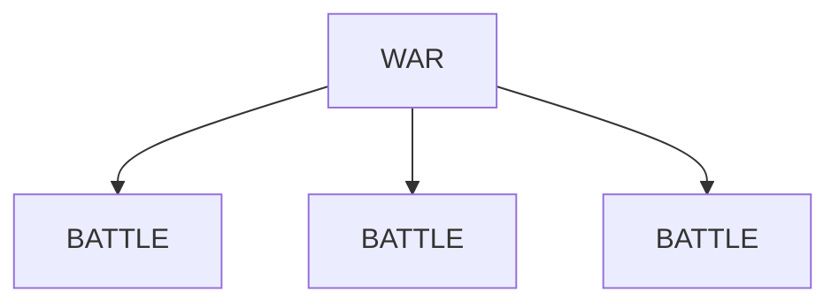
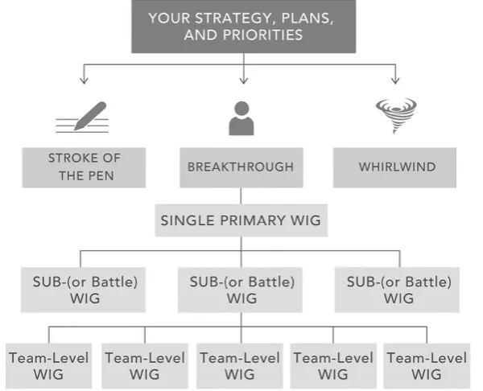

[4 Disciplines of Execution]()

[Summary](https://theprocesshacker.com/blog/4-disciplines-of-execution-book-summary/)

There are many books about planning and strategy.  This defines how to actually get things done.

### The Real Problem With Execution

Leaders produce 2 types of strategies

1. **Stroke-of-the-pen strategy** - a strategy that leaders execute just by ordering or authorizing it to be done and that generally does not require a lot of people to do things differently
2. **Breakthrough strategy** - a strategy that requires people—sometimes many people—to do things that are new and different

The business of changing behavior requires that we fight through the **whirlwind**

**Whirlwind** - the enormous amount of time and energy required to keep the organization at its current level of performance

The struggle is distinguishing the whirlwind from the "day-to-day"

**4 Disciplines of Execution (4DX)** – “an orderly pattern of conduct that leads to the achievement of an organizational goal with excellence; the 4 Disciplines are based on deep research and fieldwork, as well as fundamental principles of human behavior:”

1. Focus on the Wildly Important
2. Act on the Lead Measures
3. Keep a Compelling Scoreboard
4. Create a Cadence of Accountability

When using the behavioral change strategy, people typically fall into one of these groups:

**Models** – the people that are open to new ideas and actively adapt the new behaviors
**Not Yets** – the largest group that appears supportive but does not engage immediately
**Nevers** – the people that do not partake and engage in the required behavior changes

There are three things to be aware of when learning the Four Disciplines:

**4DX says easy, does hard.** The disciplines seem simple but require work to implement.
**4DX is counterintuitive.** The disciplines are paradigm shifts going against your intuition.
**4DX is an operating system.** The disciplines work together sequentially to be effective.

---
## Discipline 1 - Focus on the Wildly Important

> There will always be more good ideas than there is capacity to execute

The first discipline is about *focus*.  Too many goals dilute the effort and outcomes to where nothing is accomplished well.  

**Example:** 
*Air traffic controllers have many planes to manage, but only one matters at the time... only 1 is wildly important*.  

> Prioritization requires us not to simply put goals in "priority order", but to actively say **no** to many things to focus on the few.

**Example:**
*Apple had great success reducing their product line to just a few items and executing extremely well on those.*

#### Definitions

**Wildly Important Goal (WIG)** – “a goal essential to carrying out the organization’s mission or strategy; failure to achieve this goal will render all other achievements secondary”

After defining the WIG, work should be sorted into these two categories using the 80/20 Rule:

**Whirlwind** – the day-to-day needed to be done, which requires 80% of time and energy
**WIG** – the one outcome to achieve the breakthrough, which requires the remaining 20%

The **whirlwind** is the day job... the day to day priorities that must be done to sustain the business.  WIGs **are not** an extension of the *whirlwind*.  

Leaders are under pressure to create more goals instead of narrowing their focus. Thus, their most significant challenge is saying no to many good ideas. Therefore, when defining a Team WIG, leaders face one of two scenarios:

- **You have goal-setting autonomy.**  
Ask yourself, “If every other aspect of our team’s performance remained at its current level, what is one area where significant improvement would have the greatest impact?”

- **You do not have goal-setting autonomy.** 
Ask yourself, “What improved outcome would represent our team’s greatest contribution to the overall strategy?”

### Rules to focus the organization

**Rule #1 - No team focuses on more than two WIGs at the same time.**
This prevents overloading any single leader, team, or individual

**Rule #2 - The battles you choose must win the war**
Identify the fewest battles to win the war
- Battle - “an enabling or supporting WIG owned by a lower-level team”
- War - the Primary WIG or “highest-level organizational WIG”

**Rule #3 - Senior leaders can veto, but not dictate**
Senior leaders pick the WIGs, but they must allow front-line leaders to primarily define their Team WIGs

**Rule #4 - All WIGs mut have a finish line in the form of *"from X to Y by when"***
This framework defines every WIG into a measurable result that must be achieved by a specific date.

This diagram shows how teams can align their team WIGs to a Sub-WIG (Battle) at an intermediate level or the Primary WIG at the highest level:

---
## Discipline 2 - Act on the Lead Measures
> “The practice of consistently carrying out and tracking results on those high-leverage activities that will lead to the achievement of WIGs. Work teams who practice Discipline 2 are clear on the lead measures of their goals and track them carefully.”

#### Definitions
**Lag Measures** - the measure of a goal or WIG achievement
    - easy to measure but  cannot be easily influenced or directed by an individual or team
    - 

**Lead Measure** - .the measure of an action planned and taken as a means to achieving a WIG
- **Predictive** - measures something that leads to the goal
- **Influencable** - actions that you have ownership of 
- **Leverage** - acting on the highest-impact activities to achieve the WIG

Choosing good lead measures should consider level of impact, ownership, and predictive capabilities that address the WIG.  The measures should have a disproportionate impact (80/20) to influence success.

#### Example:
WIG - to lose 30 lbs in 6 months
**Lag measure** - current weight
- nothing can be done to directly influence the weight

Measurement progress is in the past

**Lead measure**
- calories taken in per week
- hours of intensse exercise

These are measurements of activities that impact make significant impact toward the WIG.  They are predictive, influencable, and are the highest leverage activities.

