<style>
  img {width: 600px;}
</style>
# [Designing Data-Intensive Applications: The Big Ideas Behind Reliable, Scalable, and Maintainable Systems](https://www.amazon.com/Designing-Data-Intensive-Applications-Reliable-Maintainable/dp/1449373321)


# Part 1. Foundations of Data Systems

---

## Chapter 1 - Reliable, Scalable, and Maintainable Systems

#### Terms

Data-Intensive 
: deals with amount of data, complexity of data, how fast the data is changing

Compute intensive
: CPU bound


### Applications of Data-intensive applications
- store data so that it can be found and used later (*databases*)
- remember the result of an expensive operation to speed up reads (*caches*)
- allow users to search data by keywords or filter it in various ways (*search indexes*)
- send a message to another process to be handled asynchronously (*stream processing*)
- periodically crunch a large amount of accumulated data (*batch processing*)

Prior abstractions had neat categories for different types of data-systems.  The lines are however being blurred.

Modern systems may take different data solutions and combine them to make a composite system.  Consumers of the data shouldn't have to worry about the implementation details so abstractions are built that hide the complexity behind a simpler facade.  This requires application level code which provides the linkage between the different types to provide the necessary guarantees (e.g. cache-update or invalidation so that consumers see correct results)


Three main concerns
#### *Reliability*
> The system should continue to work *correctly* even in the face of *adversity*

#### *Scalability*
> As the system grows (in data volume, traffic volume, or complexity), there should be reasonable ways of dealing with that growth

#### "Maintainability"
> Over time, many different people will work on the system (engineering and operations, both maintaing current behavior while also adapting to new use-cases).  They should be able to do so productively.

---
### Reliability

#### Terms

Fault
: things that can go wrong

Fault-tolerant or resilient
: ability to anticipate and cope with faults

Failure
: system as a whole stops providing the required service


#### Hardware Faults
Failure of hardware components due to wear over time.

These are typically addressed through redundant hardware (e.g. RAID, dual power supplies, etc)

With the advent of the cloud, using software fault-tolerance techniques, losing a VM or a container should be expected and anticipated.  The impact of such failures is much lower.

#### Software Errors
Examples: 
- Software bugs that cause every instance of an application to crash
- A runaway processes that takes away from shared resources
- A service that the system depends on becomes unresponsive or returns corrupted responses
- Cascading failures - where a small fault in one component triggers faults in other components in a chain reaction


#### Human Errors
Humans are inherently unreliable.  Most errors are caused by configuration errors made by operators.

How to address this? 
- Design systems in a way that minimizes opportunity for errors (simplified APIs and interfaces).  **Path of success**
- Decouple (*separate*) the places where people make the most mistakes from the places where they can cause failure.   Also provide sandbox environments.
- Test thoroughly at all levels (unit-tests, integration tests, manual tests)
- Allow for quick rollback from user-errors
- Setup detailed and clear monitoring
- Provide good training

> Reliability is one dimension.  At times, we may choose to sacrifice some reliability in order to reduce development costs (e.g. prototypes, testing unknown markets) or operational costs (for a service with very low profit margins)

---

### Scalability
Scalability
: a system's ability to cope with increased load

*Note*: Scalability is not a one-dimensional label.  

##### Questions we can ask are 
-  If the system grows in a particular way, what are our options for coping with the growth?
- How can we add computing resources to handle the additional load?

##### Describing Load
Load can be described with *load parameters*.  Examples of load parameters are: 
1. request per second to a web server
2. ratio of reads to writes in a database
3. the number of simultaneously active users in a chat room
4. the hit rate on a cache

**Latency** and **response time** are NOT the same.  

Response time
: is what the client sees from end-to-end.
*this includes network delays, queueing delays, response processing and other factors*

Latency
: however is how long the request was *latent* (waiting to be processed).

##### Measuring response times
There is always a level of randomness and variability in each request, even if it's the same request over and over, often due to factors outside our control.  *(TCP retransmission, garbage collection, page fault, etc.)*

It's common for people to see the average response time.  This is generally not a good metric.  

It's usually better to use percentiles.  
- Take your list of response times and sort it from fastest to slowest. 
- Take the median.  
- This means half of the requests are faster than the median, and half are slowest.
- You can take this further by taking higher percentiles (95%, 99%, 99.99%).

Tail latencies
: high percentiles of response times (e.g. 99th percentile)

Sometimes you have to pay attention to the tail latencies because they can be driven by your most valued consumers (highest paying consumer may have the most data or requests).

Service level objectives (SLOs) and service level agreements (SLAs) are contracts that define the expected performance and availability of a service.

An end-user request that requires multiple back-end calls, even if run in parallel, will be bottlenecked by the slowest request.  

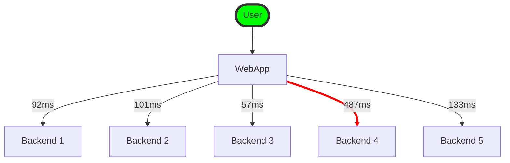
*It takes just a single slow backend request to slow down the entire end-user request*


#### Approaches for Coping with Load

Scaling-up
: vertical scaling, moving to a more powerful machine

Scaling-out
: horizontal scaling, distributing the load across multiple smaller machines (a.k.a. *shared-nothing* architecture)

Elastic
: systems that can automatically add computing resources when they detect a load increase (whereas other systems are scaled manually)


> Horizontal scaling on a stateful system brings in lots of complexity.  This is why until recently, the common practice was to keep the state in one location and scale that up until the scalability requirements forces you to distribute.

*There is no magic architecture.*  The way one application scales can be vastly different from another.  
For example: Designing a system that handles 100,000 requests per second with requests of 1kb in size is vastly different than designing a system that handles 3 requests per minute, each 2 GB in size.  It's the same data-throughput but vastly different use-cases.


Operability
: Make it easy for operations teams to keep the system running smoothly

Simplicity
: Make it easy for new engineers to understand the system, by removing as much complexity as possible from the system.

Evolvability
: Make it easy for engineers to make changes to the system in the future, adapting it for unanticipated use cases as requirements change.  *(a.k.a. extensibility, modifiability, or plasticity)*


#### Operability: Making Life Easy for Operations

Operations teams are responsible for the following, and more: 
- monitoring the health of the system and quickly restoring service if it goes into a bad state
- tracking down the cause of problems, such as system failures or degraded performance
- keeping software and platforms up to date, including security patches
- keeping tabs on how different system affect each other, so that a problematic change can be avoided before it causes damage
- anticipating future problems and solving them before they occur
- establishing good practices and tools for deployment, configuration management, etc
- performing complex maintenance tasks, such as moving an application from one platform to another
- maintaining the security of the system as configuration changes are made
- defining processes that make operations predictable and help keep the production environment stable
- preserving the organization's knowledge about the system, even as individual people come and go

Good operability means making these routine tasks easy and allowing the operations team to focus their efforts on high-value activities.  We can do this by: 
- providing visibility into the runtime behavior with good monitoring
- providing good support for automation and integration with standard tools
- avoiding dependency on individual machines (allow machines to be taken down for maintenances while the system continues to operate uninterrupted)
- providing good documentation and an easy-to-understand operational model
- providing good default behavior, but also giving administrators the freedom to override defaults when needed
- self-healing where appropriate, but also giving admins manual control over the system state when needed
- exhibiting predictable behavior, minimizing surprises


#### Simplicity: Managing Complexity

Symptoms of complexity
- explosion of the state space
- tight coupling of modules
- tangled dependencies
- inconsistent naming and terminology
- hacks aimed at solving performance problems
- special-casing to work around issues elsewhere
- etc

Complex software introduces room for bugs because it is hard to reason about and understand the consequences, hidden assumptions, unexpected interactions, etc.

Best tool for removing accidental complexity is **abstraction**

#### Evolvability: Making Change Easy

System requirements will almost always change over time.  This is due to new facts, new and unanticipated use-cases, business priority changes, market changes, platform and technology changes, legal or regulatory requirements, etc.  

The *Agile* process is a good methodology for managing change.  Coupled with TDD, this becomes a great asset.  However, when dealing with distributed systems, we aren't changing one application.


---
## Chapter 2 - Data Models and Query Languages

> Data models are perhaps the most important part of developing software, because they ahve such a profound effect: not only on how the software is written, but also on how we *think about the problem* that we are solving.

Applications are built by layering one data model on top of another (abstractions).
    1. Objects and data-structures
    2. How to store the data structures - JSON, XML, relational, graph?
    3. How to store the data in terms of bytes in memory, on disk, or on a network
    4. Electrical currents, pulses of light, magnetic fields, etc.

Each data-model carries with it assumption on how it will be used.  Some models fit specific use-cases better than others.

The *Relational Model* became the defacto general purpose model and has stayed that way for a long time.  This model worked well for transaction processing, batch processing, etc.  

As computers became more powerful and networked, the types of workloads became increasingly diverse.  Relational databases generalized very well and so have been applied to many modern workloads.

Driving forces for NoSQL
- A need for greater scalability than relational databases can achieve easily (e.g. very large data-sets or high write througput)
- A preference for free and open-source software over commercial products
- Specialized query operations that aren't well supported in the relational model
- Frustration with restrictiveness of relational schemas


### Object-relational mismatch
- application objects and their representation do not match completely with the relational model.  
- tools have been developed to reduce the amount of boilerplate code required to address the mismatch, but there is still an **impedance mismatch**

[Impedance Mismatch](https://www.geeksforgeeks.org/impedance-mismatch-in-dbms/)
: when two systems or components that are supposed to work together have different data models, structures, or interfaces that make communication difficult or inefficient

Storing complex object structures in relational vs document styles has pros and cons.
- Relational style spreads the data across various tables through normalization.  Query operations become more complex
- Document style keeps the data together in one record.  Limited query options are available here however but much simpler to retrieve and update.

Shredding
: the relational technique of splitting a document-like structure into multiple tables


#### Access patterns in document databases
Accessing data in a document-model has caveats.  You can't directly access a nested item within a document.  You have to refer to it through the parent.  This may not be a problem is the document isn't deeply nested.

If using a document database, you can reduce the number of joins by denormalizing the data.  However this can increase application complexity because the application now has to do extra work to keep the denormalized data consistent.

If using a document database, you can emulate joins in the application code.  This however requires more queries, more complexity in the application, and is slower since the specialized code within the a database can handle join operations much faster.


#### Schema
Document databases do not enforce any schema on the data in the documents.  This leads people to think that they are *schemaless*, but this is misleading because the application that reads and works with the data would have a schema.  The more accurate term would be *schema-on-read*.  

Schema-on-read
: schema is implicitly enforced by the application that reads the data

Schema-on-write
: schema is explicit and enforce on write (database ensures all data written conforms to the schema).  Most commonly seen in relational style databases

Schema-on-read approach may be advantageous if the items in the collection don't all have the same schema.
1. if there are many different types of objects and it isn't practical to put each in their own tables
2. the structure of the data is determined by external systems over which you have no control


#### Data locality for queries
If your application often requires access to the entire document, there is a performance advantage in document style databases due to *storage locality*.  A relational model may not work well due to the number of seeks it requires on disk to retrieve it.  This only really applies if you need large parts of the document at the same time.

Keeping documents small is the recommendation here.  

#### Convergence of relational and document models

Many popular relational databases also have support for document style data stored in columns (XML or JSON).


### Query Languages for Data

[Imperative language](https://en.wikipedia.org/wiki/Imperative_programming)
: uses statements that change a program's state

[Declarative language](https://en.wikipedia.org/wiki/Declarative_programming)
: express the logic of a computation without describing its control flow

SQL is a declarative language because we're defining patterns as opposed to specific steps.  

Declarative languages are typically better suited for parallel execution.  This is because imperative code specifies steps to be executed in a particular order whereas declarative languages only specificy the pattern of the results, not the algorithm that is used to determine the results.


### Graph-Like Data Models

Used when there are many-to-many relationships are common in the system.

Vertices
: nodes or entities

Edges
: relationships or arcs

There are declarative query languages for graph databases such as: 
- [Cypher query language](https://neo4j.com/developer/cypher/)
- [SPARQL](https://en.wikipedia.org/wiki/SPARQL) - an [RDF](https://en.wikipedia.org/wiki/Resource_Description_Framework) query language
- [Datalog](https://en.wikipedia.org/wiki/Datalog) - a subset of Prolog.  Has a functional feel to it where queries can be composed from other parts.

In the **triple-store** model, data is stored in a simple three-part statement (*subject, predicate, object*)

NoSQL comes in multiple flavors
 - Document style databases - store a complex structure within the same database.  Relationships are self-contained within the document
 - Graph database - opposite direction of document style.  Everything can be related to anything else.

There are other data models not covered as well.  Examples are full-text search and Big Data-style large-scale analytics like used at LHC

---

## Chapter 3 - Storage and Retrieval

#### Terms

log
: an append-only data file (*not to be confused with application log, which outputs text describing what is happening*)

index
: an additional structure that is derived from the primary data.  Used for speeding up reads (efficient lookup) at the cost of additional writes

compaction
: discard duplicate keys in a log.  Often performed with merging

merging
: bringing together multiple segments.  Often performed with compaction

tombstone
: a special entry in a log that signifies deletion of data

### Hash Indexes

Hash indexes are similar to dictionary types or hashmaps.  They often store the key and a byte offset like below.

|key|byte offset|
|---|---|
|123|0|
|456|64|

Some database engines store these indexes in memory while the actual data resides on disk.

When using a log-structure for writes, we can run out of space very quickly.  A common solution to this problem is breaking the log into segments of a certain size.  When a segment fills up, we close it and start a new one.  We then perform *merging and compaction*.

When performing a merge and compaction, the newly merged segment is written as a new segment in the log and the older entries are then deleted.

When merging, the a *tombstone* record signifies that all previous values for the deleted key can be discared.

##### Crash recovery
> when a database is restarted, all in-memory hash maps are lost (volatile memory).  You can restore the hashmap by reading all of the segments and keeping track of the most recent value.  This can be sped up however by maintaining *snapshots*.

##### Partially written records
> a database may crash at any time, including while writing a record to the log.  In this case, checksums are used to detect and ignore corrupted portions

##### Concurrency control
> writes are appended in a strict sequential order.  This often means that writes are done by one thread but reads may be done by many.

#### Append-only design
Pros
- generally much faster than random writes, especially on magnetic disks
- concurrency and crash recovery are much simpler
- segments are immutable
- merging old segments avoids the problem of data files getting fragmented over time

Cons
- the hash table must fit in memory.  It's must tricker to get a performant hash map on disk which requires lots of random I/O
- range queries are not efficient


### SSTables and LSM-Trees

SSTable (sorted string table)
: key-sorted append-only key-value storage

LSM-tree
: a layered data structure based on a balanced tree that allows SStables to exist without the controvery of both being sorted and append-only

Similar to hash indexes but the key-value pairs are *sorted by key*.  

Merging segments is simple and efficient and uses an approach similar to the [*merge-sort* algorithm](https://www.youtube.com/watch?v=4VqmGXwpLqc).

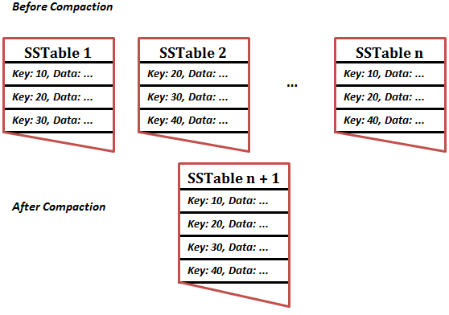

With an SSTable, we don't have to store the whole hashmap in-memory.  Because the keys are sorted, we can lookup values *between* other values.  This means the in-memory index can be sparse.  Simply lookup the closest values and scan from there.

##### Constructing and maintaining SSTables

When a write comes in, add it to a balanced B-Tree like an AVL or Red-Black tree.  This in-memory tree is also called a *memtable*

When a memtable gets past a threshold, write it to disk as an SStable. It's already sorted so this write is efficient.  If new writes are coming in during this operation, they can write to a new memtable instance.

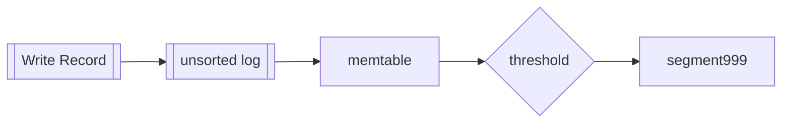

The unsorted log is used simply for crash recovery.  Once the memtable is written to disk, the associated log is deleted.


Read requests will start at the memtable, then work their way backwards through the most recent on-disk segments and work their way to older segments.

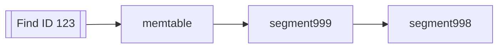

A background thread may combine segment files and discard overwritten or deleted values.

Note: Lucene, an indexing engine for full-text search (used by ElasticSearch and Solr), uses a similar method.  The key in this case is the search term, and the value would be the IDs of the documents that contains these terms.

##### Performance implications

Read requests in an LSM can be slow if the key does not exist in the database, especially if there are many/large segments.  

One solution to this is to use [bloom filters](https://en.wikipedia.org/wiki/Bloom_filter) which excel at telling you if the key exists in the db.  

Another solution is to tune how the SSTables are compacted and merged.  

Because LSM trees are written sequentially, they support high write throughput.


### B-Trees

leaf-page
: final page where the individual keys and values (or reference to the values) are stored

branching factor
: the number of references to child pages in one page

B-trees are the most widely used indexing structure.

B-trees break the database down into fixed-size blocks or pages as opposed to log-structured indexes which are variable-size segments.
- this aligns closer to the underlying hardware as disks are also arranged in fixed-size blocks


- Search starts at the *root* of the B-tree.  
- Each child is responsible for a continuous range of keys.  The keys between the references indicate where the boundaries between those ranges lie.
- The page containing the individual keys (*leaf page*), are where the values (or at least references to the pages) are found

Updating a value for an existing key consists of
1. searching for the leaf page containing the key
2. changing the value in that page
3. writing the page back to disk

Adding a new key consists of
1. Find the page whose range encompasses the new key and add it to that page
2. If there isn't enough free space in the page to accommodate the new key, split it into two half-full pages
   1. then update the parent page with the new subdivision of ranges


This algorithm ensures a balanced tree with a depth of O(log *n*)

#### Making B-trees reliable

B-tree write operations happen directly on the pages themselves.  Some operations (as mentioned above), require updates to multiple pages.  These can potentially be dangerous operations if the database crashes during the operation.  

To make this more reliable, an additional data structure is used called a Write-Ahead-Log (WAL).  The operations are first written to the WAL so that in-case there is a failure, the log is used to bring the database back up to a consistent state.

Concurrent read operations however require careful concurrency control.  Multiple threads accessing the B-tree means there may be an inconsistent read.  *Latches* are typically used to protect this from happening.

#### B-tree optimizations

Instead of WAL for crash recovery, some databases use a *copy-on-write* scheme.  This means a modified page is first copied to a new location, and the parent is updated pointing at the new location.

Having a higher *branching factor* means that there are fewer levels.

B-tree implementations try to layout the tree so that leaf pages appear in sequential order on disk.  LSM-trees do this by design.


### Comparing B-Trees and LSM-Trees

LSM-trees are typically faster for writes whereas B-trees are typically faster for reads.  These are general statements and actually depend on the workload.

#### Advantages of LSM trees

Write-amplication
: the effect of one write to the database resulting in multiple writes tot he disk over the course of the database's lifetime

In write-heavy applications, the more writes to disk, the fewer writes per second it can handle within the available disk bandwidth

- LSM generally have fewer write operations overall compared to B-tree.  
  - This is because B-tree has to write to the WAL first, then update the page, and maybe even create new pages

- LSM writes out data sequentially and compactly whereas B-tree can get fragmented on disk over time.

- LSM has lower write amplication, especially on SSDs because the SSD firmware uses a log-structured algorithm to turn random writes into sequential writes.

#### Downsides of LSM trees
- The compaction process can sometimes interfere with ongoing reads and writes
  - at higher percentiles, response times can be quite high due to the impact of compaction

- As the database grows in size, more disk bandwidth is required for compaction

- If write throughput is high and compaction is not configured properly, compaction may not keep up with the rate of writes
  - this means you'll run out of disk space and also have many unmerged segments

- A log-structured storage engine may have multiple copies of the same key in different segments.  This affects transactional semantics.


### Other Indexing Structures

Clustered Index
: when an indexed row is stored directly within an index.  These are stored in a specific order

[Secondary index](https://www.geeksforgeeks.org/secondary-indexing-in-databases/#)
: Secondary indexing is a database management technique used to create additional indexes on data stored in a database. The main purpose of secondary indexing is to improve the performance of queries and to simplify the search for specific records within a database. A secondary index provides an alternate means of accessing data in a database, in addition to the primary index.

Heap-file
: location where row content is stored if apart from the document or vertex.  Data is not stored in any particular order

#### Storing values within the index

The main difference between a primary index and secondary is that a secondary does not have to be unique.

Updating data in a *heap-file* can be more complicated if the new data is bigger than the old.  New space will have to be allocated and after the update, the references will have to point to the new location.  

A compromise between clustered (storing all row data within the index) and non-clustered indexes (storing only references to the data) is a *covering index* or *index with included columns*.

#### Multi-column indexes

concatenated index
: combines several fields into one key by appending one column to another (in a specific order)

> multi-dimensional indexes are a more general way of querying several columns at once

They are particularly useful for geospatial data.  

``` sql
SELECT * FROM restaurants WHERE latitude > 51.238 AND latitude < 51.439
  AND longitude > 12.381 AND longitude < 12.670
``` 
*this query would perform poorly on a B-tree or LSM structure.  They can query on a range of latitudes OR longitudes, but not both simultaneously.

Options for geospatial data are 
- combine the latitude and longitude values to a single value using a space-filling curve and using that value in a B-tree index
- use [R-tree](https://en.wikipedia.org/wiki/R-tree)

#### Full-text search and fuzzy indexes

Indexes of this sort have to consider *similar* keys.  Some examples would be: 
- misspelling
- synonyms
- root or derived words (e.g. calculation -> calculate)

#### Keeping everything in memory

As RAM has become cheaper over time and many datasets are not that big, some solutions have been to put all the data in memory.

There are products that are simply key-value (Memcachedd) and others that implement a relational model (VoltDB and MemSQL).

In-memory is volatile but there are solutions for this as well such as battery-powered RAM.

Other solutions include use an *anti-caching* approach, which is to use LRU data on disk, similar to how OS manage virtual memory.

The performance of in-memory actually comes from not having to encode in-memory data structures to disk.

### Transaction Processing or Analytics

OLTP (*online transaction processing*)
: type of processing that consists of executing a number of transactions occurring concurrently.  typically small number of records per transaction and used for interactive patterns

OLAP (*online analytic processing*)
: type of processing that is used for analytical purposes.  typically querying large amounts of data to perform analytics to inform business decisions

*Characteristics of OLTP vs OLAP*
|Property|OLTP|OLAP|
|---|---|---|
|Main read pattern|Small number of records per query, fetched by key|Aggregate over large number of records|
|Main write pattern|Random-access, low-latency writes from user input|Bulk import (ETL) or event stream|
|Primarily used by|End user/customer, via web application|Internal analyst, for decision support|
|What data represents|Latest state of data (current point in time)|History of events that happened over time|
|Dataset size|Gigabytes to terabytes|Terabytes to petabytes|

#### Data Warehousing

Data-warehouse
: a separate database that analysts can query

These databases are full of historic data from various OLTP systems and loaded via ETL (*Extract-Transform-Load*) processes.

Analytics queries can be quite performance heavy due to the number of records and adhoc nature of the queries.  If these queries were executed against OLTP systems, they could potentially fail.

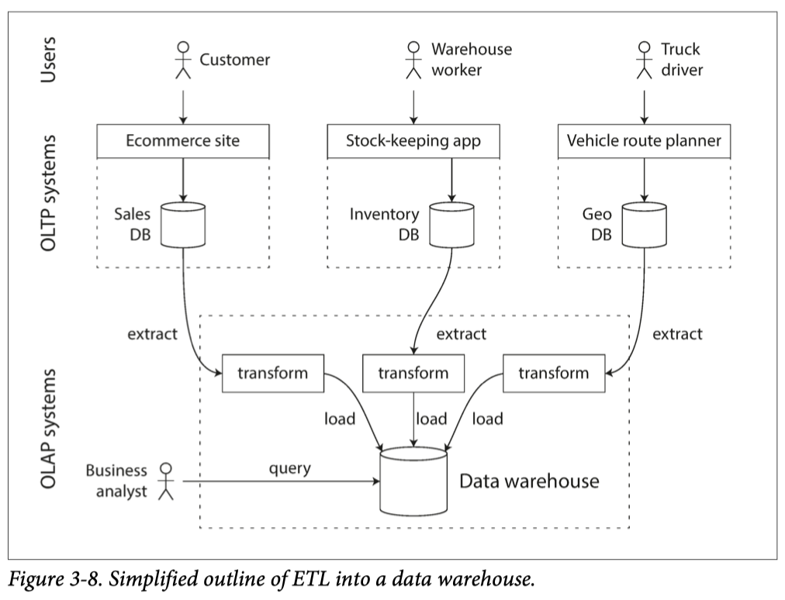

This is even more true with distributed systems such as microservices where each service has its own database.

The internals of OLAP systems are optimized for analytical query patterns.  Some databases like SQL server may support both transactional and analytical models, they are increasingly diverging paths.  Most database vendors focus on supporting either transaction processing OR analytical workloads.

### Stars and Snowflakes: Schemas for Analytics

star schema
: denormalized business data into facts and dimensions.  the fact table is at the center

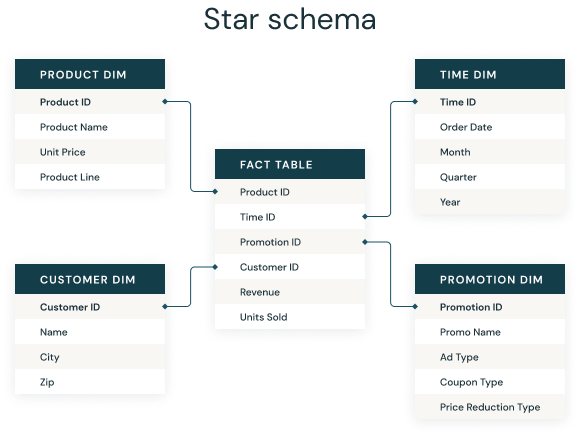

Facts are captured as individual events.  These allows maximum flexibility when doing analysis.

Typically in a data warehouse, tables are often very wide.  Fact tables can have over 100 columns, sometimes several hundred.  

### Column-Oriented Storage

In most OLTP databases, storage is laid out in a *row-oriented* fashion.  This means that all data on disk is stored next to each other.
This is also true for document databases as an entire document is stored as one contiguous sequence of bytes.

This can be problematic when querying data where you're only interested in parts of the data.  If you're interested in 3 or 4 columns but are querying against a table that has 100+ columns, the row-oriented store will have to load all columns from disk into memory, parse them, and filter out those that don't apply to the query.  This can take a long time and is resource intensive.

In column-oriented storage, the data for each column is stored together.  

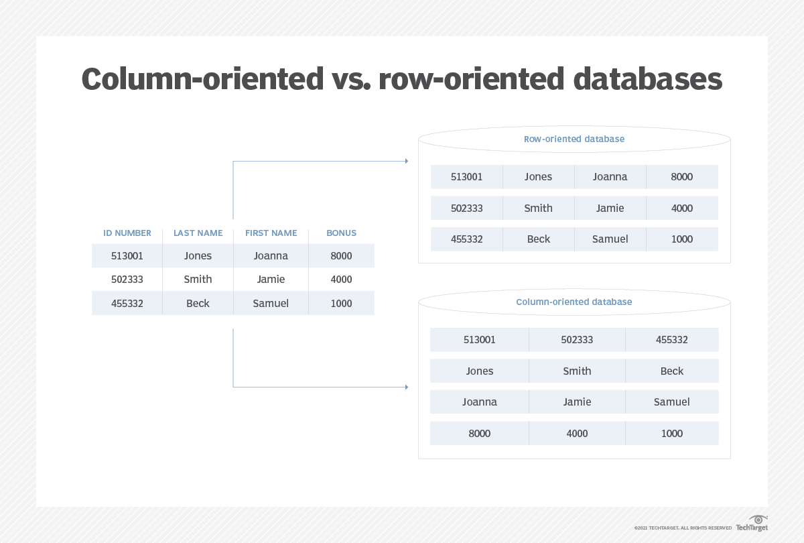

#### Column Compression

Column-oriented storage lends itself very well to compression.  
[Compression Techniques for Column Oriented Databases](https://chistadata.com/compression-techniques-for-column-oriented-databases/)

You can use bitmap-indexed storage or dictionary based encoding.
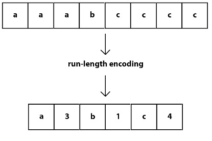

Another alternative is run-length encoding (applicable to sorted data)
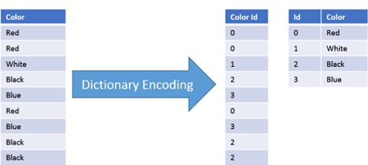


Sort-order for column-oriented storage must be the same across all tables, otherwise there would be no way to correlate the data between tables.

Column-oriented storage has many optimizations available to make reads very performant.  
Writes on the other hand are more difficult.
- you can't update-in-place like B-trees with compressed columns
- you can't insert into the middle of a sorted table (if would affect ALL other tables)

LSM-trees however are suitable for this type of store.


### Aggregation: Data Cubes and Materialized Views

If aggregate functions such as COUNT, SUM, AVG, MIN, or MAX are used often, it may make sense to cache this data to avoid wasteful crunching of these values.

materialized view
: copy of the query results written to disk

Materialized views are not often used in OLTP systems because they need to be updated per transaction.

data cube (a.k.a. OLAP cube)
: a data structure that can store data in more than 2 dimensions

Data-cubes are essentially a grid of aggregates grouped by different dimensions.

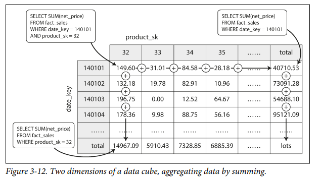

Advantages of datacubes are that they are pre-computed to make reads very quick and efficient.  
Disadvantages is that there is no way to break the data down further than the aggregates without referring to the raw-data.

---

## Chapter 4 - Encoding and Evolution

An evolving system by its definition changes over time.  In large applications, change typically does not happen all at once because it would cause downtime.

- Server-side applications typically go through a *rolling upgrade* where a few nodes have the newly updated code (and schema).  This is so that the application can be tested and verified and then deployed to more nodes until all the nodes have been updated.  This allows new versions to be deployed without downtime.

- Client-side applications however, it is up to the user to install the update and therefore, may not update the install for some time.

The above scenarios means that new and old version of the code will run simultaneously and must continue to run smoothly.

Backward compatibility
: newer code can read data that was written by older code

Forward compatibility
: older code can read data that was written by newer code

### Formats for Encoding Data

Data is represented in one of two ways:

1. In-memory - these are data-structures like lists, arrays, objects, trees, etc.  To be used by the CPU
2. Serialized - data stored on disk or sent over the network must be encoded as a sequence of bytes

There needs to be translation between the 2 general forms

encoding
: translating an in-memory representation to a byte sequence (a.k.a. *serialization* or *marshalling*)

decoding
: translating a byte sequence into an in-memory representation (a.k.a. *deserialization*, *parsing*, or *unmarshalling*)

### Consideration to language-specific formats
It's generally a bad idea to use a specific language's built-in encoding because you are implicitly locking yourself into a specific language.

In order to restore data to the same object types, the decoding process needs to be able to instantiate arbitrary classes.  An attacker can use this vector to instantiate arbitrary classes and execute malware

The language provided methods may not be efficient.  

### JSON, XML, and Binary Variants

These are more standard formats that can be used by many programming languages and applications.  

There are downsides however
- there is ambiguity around encoding of numbers.  
  - how to tell the difference between a number and a string composed of numeric digits?
    - often you will need some sort of external schema
    - JSON can distinguish between numbers and strings, but not between integer and floating point
    - there are numeric range limitations with JSON
- many tools that use JSON don't respect the schema (not as much a problem for XML however)
- CSV does not have any schema so the complexity lies inthe application
  - what about escaping characters?  not all parsers do this well
- JSON and XML increase the payload size (especially XML with its verbosity)


#### Binary Encoding

Binary encoding is much more compact than JSON and XML.  

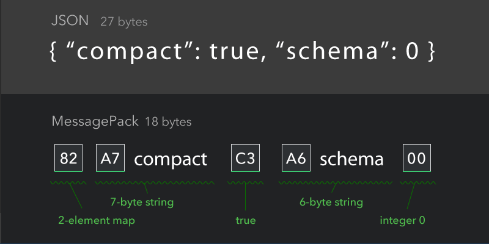

[Apache Thrift](https://thrift.apache.org/), [Protocol Buffers (protobuf)](https://protobuf.dev/), and [Apache Avro](https://avro.apache.org/) are all schema-based binary encoding libraries.  Each have their own implementation but in general solve for the same problem of encoding and decoding an evolving data contract.

Similarities
- rather than having the schema field names in the message itself (like JSON), the schema is used at encoding/decoding.  This means the sender and receiver have the schema information and the document can point to references in the schema
- the binary data sent over is comprised of lengths, types, and field tags (though Avro does not use field-tags)

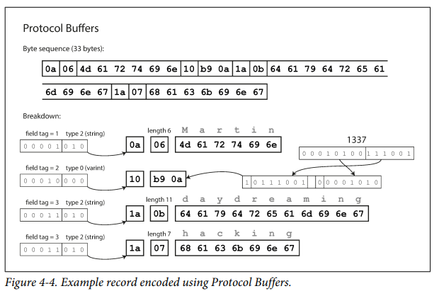

Differences
- Avro has the concept of reader and writer schemas
- Avro supports dynamically generated schemas because it doesn't contain field-tags like Protobuf and Thrift


#### Benefits of Schemas
- they are more compact since they can omit field names from the encoded data
- the schema can serve as a valuable form of documentation (source code)
- keeping a database of schemas allow you to check forward and backwards compatibility of schema changes
- allows for compile time checking in statically typed programming languages


### Modes of Dataflow

When sending data to another process which doesn't share the same memory space, the data must be encoded to be sent.  This can happen either over a network or to a file.

The most common ways of data flow are: 
1. Via databases
2. Via service calls
3. Via asynchronous message passing

#### Dataflow Through Databases

A process that writes to the database encodes the data.  The process that reads the data decodes it.  

Even in a single process scenario, where both writing and reading is done by the same application, the reader should still be considered as a later version of the same process.
Another way to think of it is *sending a message to your future self*.

**Data outlives code** and therefore we should be aware of how the data will be handled in its lifetime.


#### Dataflow Through Services: REST and RPC

The most common configuration for network communication is having two roles: *clients* and *servers*
The API implementation is application specific though the protocols and technologies (HTTP, JSON, XML) are ubiquitous.  
The client and the server must agree on the specifics for communication to happen

Two common protocols are SOAP and REST.
- SOAP is an xml-based protocol for making network API requests, most commonly used over HTTP
  - SOAP uses a Web Services Description Language (WSDL) to describe the API
  - Code generation tools allow for creation of clients using local classes and simulates method calls (RPC)
- REST is not really a protocol but a design philosophy.  
  - emphasizes simple data formats using URLs to identify resources
  - uses HTTP features for cache control, authentication, content-type negotation, etc
  - tools like OpenAPI ([Swagger](https://swagger.io/specification/)) help to describe RESTful APIs

##### Remote-Procedure Calls (RPCs)

The concept of RPC is to make calls to a service seem as if it were local.  
- this makes it very convenient to develop against as it abstracts away the details of making the service call
- this abstraction is called *location transparency*

**RPCs have many problems however**
1. a local function call is predictable because it is all in the same process and accesses the same memory space.  RPC however has a network hop to make, which can fail for any number of reasons. 
2. a local function will return a result, throw an exception, or get stuck in a loop.  RPC however may succeed but fail on the response back.  
3. retrying a failed network request may actually be succeeding on the receiver, but the response back could be failing.  In this case, you would be duplicating requests.  You would have to consider deduplication of these requests.  Local functions do not have this issue
4. local functions are much more predictable in the amount of time it takes to execute.  RPC is not.  In the case of a slow network or network congestion, it can take many seconds or even timeout
5. local functions are efficient because you can pass references to points in memory. RPC has to be encoded into a sequence of bytes and read on the other end.  The larger the payload, the longer this may take
6. local functions will always work with the same datatypes.  RPC however has to worry about translating data-types.  
    - an example of this is JavaScripts inability to handle numbers greater than 2<sup>53</sup>

Despite the problems above, RPC isn't going away and has made some positive progress
- newer generations of RPC frameworks are more explicit that it is a remote request
  - the concept of [*futures* (promises)](https://en.wikipedia.org/wiki/Futures_and_promises) makes this explicit
- gRPC supports streams where a call consists of not just one request and response, but many over time
- some of the frameworks support *service discovery*, which allows a client to find out which IP address and port a service is running

If supporting RPC across organizational boundaries, the provider of the service often has no control over its clients and can't force clients to upgrade.  This forces the service provider to consider backwards compatibility.


#### Message-Passing Dataflow

- using a message-broker has several advantages
  - it can act as a buffer if the recipient is unavailable or overloaded and thus improve reliability
  - it can autoamatically redeliver messages to a process that has crashed, preventing message loss
  - avoids the sender needing to know the IP address and port of the receipient
  - allows messages to be sent to several recipients
  - logically decouples sender and receiver (sender doesn't care who consumes the message)

The main difference with message driven systems is that the communication is typically one-way.  
- the sender doesn't wait for a response
- If a response is required, it is sent on a different channel. 

##### Actor frameworks
- designed for concurrency in a single process
- message delivery is not guaranteed
  - what does guaranteed mean?
  - message was sent out on the network?
  - message is received by the other host?
  - message is put into the target actor's mailbox?
  - message is starting to be processed by target actor?
  - message is processed successfully by the target actor?

A distributed actor framework essentially integrations a message broker and the actor programming model into a single framework.
You will still need to consider forward and backwards compatibility as message versions may have evolved.

3 popular actor frameworks
1. Akka - uses the JVM serializer by default which does not provide forward or backward compatibility.  Can be configured to use another serializer however.
  - [Akka.NET](https://getakka.net/index.html) uses protobuf by default
2. Orleans - uses a custom data encoding format which does not provide forward or backward compatibility which prevents rolling upgrades.  
  - typically you have to setup a new cluster, configure traffic to it, and take down the old one
  - can be configured to use a different serializer
3. Erlang OTP

---

# Part 2 - Distributed Data

Part 1 discussed aspects of data systems that apply when data is stored on a single machine.  Part 2 will focus on when the data is distributed among multiple machines.

Reasons to distribute data across multiple machines
Scalability
: to be able to read/write data beyond what a single machine can handle

Fault tolerance/high availability
: to continue working even when a machine goes down via redundancy

Latency
: to be geographically closer to users to reduce time in network hops

###Two styles of scaling

####Scaling-up (vertical scaling)
- making the machine more powerful
- simpler to reason about
- much more expensive to scale

####Scaling-out (horizontal scaling)
- adding more nodes 
- (a.k.a. shared-nothing architecture)
- harder to reason about as its more complex


Replication
: keeping a copy of the same data on separate nodes to provide redundancy in case of failure

Partioning
: splitting up the data into smaller subsets called partitions (a.k.a. *sharding*)

Replication and partitioning is often used together to both achieve scaling, fault tolerance, and latency needs

---
## Chapter 5 - Replication

Common reasons to replicate data
1. keep data geographically close to the client (to reduce latency)
2. allow the system to continue functioning even when some of its parts fail (increase availability)
3. to scale the number of machines that can serve read requests (increase read throughput)

Three popular algorithms for replicating changes between nodes
1. single-leader
2. multi-leader
3. leaderless


### Leaders and followers

The goal is to ensure all replicas get a copy of the changeset.  The most common method of doing this is by designating one of the replicas as the *leader*.  
- the leader's responsibility is to serve write requests.  Once the leader has processed the write request, the follower nodes receive a copy of the change and processes it
- the *follower*'s responsibility is to read from replication log or change stream and process it locally to stay in sync with the leader.  

When a client wants to read from the database, it can query the leader or any of the followers.

Replication can be done synchronously or asynchronously.  With a synchronous model, data may be more consistent however at the cost of availability if the replicating system goes down.  With an asynchronous model, availability is higher but at the cost of data consistency.  It is possible to mix these models as well with some nodes being synchronous while others being asynchronous.  This mixed model is called *semi-synchronous*.

Failover
: changing one of the followers to be promoted as the new leader


#### Setting up new followers

Setting up a new follower without downtime is fairly straight forward.  The typical process is as follows: 
1. Take a consistent snapshot of the leader (if possible, without locking the entire database)
2. Copy the snapshot to the new follower
3. Follower connects to leader and asks for data since the snapshot.  
    - Most databases have some sort of method to identify the exact position of the leader's replication log
4. Follower "catches up" to the leader and then can continue processing writes going forward


#### Handling Node Outages

##### Follower failure
  - the followers have their own log which can be used to recover
  - they simply have to start at the end of the log and request all changes from the leader since the last entry in the follower's log

##### Leader failure

Failure of the leader is trickier as there are a number of steps involved.
- One of the followers needs to be promoted to the new leader
- clients need to be reconfigured to send their writes to the new leader
- other followers need to start consuming data changes from teh new leader

Automatic failure processes consist of the following steps: 
1. Determining there is a failure
    - there are many reasons why a leader can fail including hardware failure, network partitions, power outages, etc
    - there is no foolproof way to determine a failure has happened.  
    - the most common method is simple timeouts between leader and followers
2. Choosing a new leader
    - this can be done algorithmically or by a previously elected *controller node*
    - the best candidate would be the one with the most up-to-date data changes from the old leader
3. Reconfiguring the system to use the new leader
    - something to consider is if an old leader comes back online, it has to recognize that it is now a follower


Things that can go wrong in a failover
- The new leader may have not received all the writes from the old leader.  When the old leader comes back online, what should happen with those writes?  Does this violate the clients' durability expectations?

- If other storage systems outside of the database need to be coordinated with the database contents, this is especially dangerous.  
    - GitHub suffered this very thing when an out-of-date follower was promoted to leader.  The MySql database used an auto-incrementing index which was also used in an external Redis store.  When the follower was promoted, some of the keys ended up being re-used in Redis.  This caused some user-data to be leaked to the wrong users.

- Two nodes think they are the leader (a.k.a. *split-brain*).  There is no good way to resolve conflicts and data may be lost or corrupted.

- Timeout durations are not configured well.  
    - A longer timeout means longer time to recovery and more lost data.  
    - A shorter duration may cause unnecessary failovers.  A system under high-load will undergo further complications with an unnecessary failover.

There are no silver bullets to these problems.  This is why some operations teams may prefer manual failover processes rather than automatic, even if the software supports automatic failover.

### Implementation of Replication Logs

**Statement-based replication** - forwarding the SQL statements to the followers 

There are problems with this approach: 
- statements can include non-deterministic functions such as ```NOW()``` or ```RAND()```.  These are likely to generate different values on each replica
- if the statement uses an auto-incrementing column or if they depend on existing data, then statements must be executed in the exact order on each replica.  This can be problematic when there are multiple concurrently executing transactions
- statements that have side effects (e.g. triggers, stored procs, UDFs) may result in different side-effects in each replica

**Write-ahead log (WAL) shipping** - using the built-in append-only logs used by SSTables and B-Trees (different implementation details)

Challenges with this approach
- These details are very low level.  They include details regarding which bytes changed on which disk blocks.  
- This means that these details are very tightly-coupled with the storage engine
- It's common that if the database changes its storage format from one version to another, the logs are unable to be processed in the new format
- This is particularly important regarding operational impact.  It essentially means the replication protocol may not support zero-downtime upgrade of the database software.

**Logical (row-based) log replication** - a decoupled implementation separate from the internal storage engine that represents data at the row-level
- An *inserted row*, the log contains the new values for all columns
- A *deleted row*, the log contains enough information to uniquely identify the row that was deleted (usually by primary key).  If there is no primary key, then all the column values may be used.
- An *updated row*, the log can contain as little info it needs to identify the unique record and the new values for the affected columns
- Also called *change data capture* (CDC)

**Trigger-based replication**
- This can be used when you want finer-grained controls over what is replicated

Advantages with this approach
- greater flexibility and control, especially if you want to consider conflict resolution

Disadvantages with this approach
- has greater overhead
- is typically tied to the transaction and is prone to bugs (since code is written)
  - if something fails in the trigger, the transaction will roll-back

### Problems with Replication Lag


replication lag
: the delay between the time when data is written to the leader and when it is replicated on the follower

eventual consistency
: the guarantee that when an update is made to the leader, that the update will eventually be reflected in all the follower nodes

Leader-based replication requires all writes to go through a single node.  Read queries however can be scaled out to many nodes.

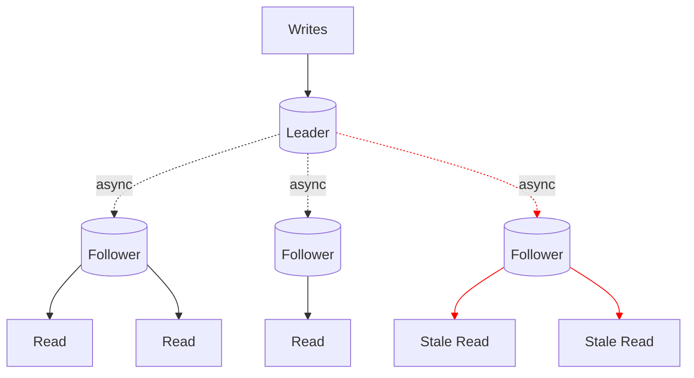
*An application that reads from an asynchronous follower may see outdated information*

For read-heavy workloads, the simple formula is to add more follower nodes to distribute the read load.

It isn't practical to add more followers in a synchronous replication however.  The more follower nodes you have, it takes longer to write and increases chance of failure.

This leaves us with asynchronous replication.  Asynchronous replication means that the data will be inconsistent with the leader for a period of time.  This inconsistency is temporary and will eventually catch up.  This is called *eventual consistency*.

> The term *eventual consistency* however is vague.  There is no limit on how far behind a replica can fall behind.  For this reason, it's important to take measurements and be aware of the *replication lag*.

### Reading Your Own Writes

read-after-write consistency
: guarantee that a user's writes will be available to be read by the same user (*a.k.a. read-your-writes consistency*)

Many applications will let the user submit some data and view what they have submitted immediately.  With asynchronous replication, this can pose a challenge as the writes may not have yet propogated to the follower nodes.  To counteract this, we need *read-after-write consistency*.

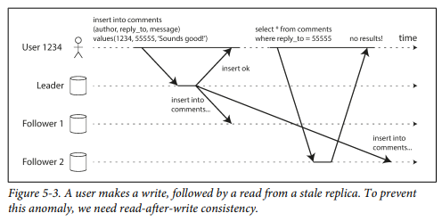

Techniques for implementing read-after-write consistency
- Read from the leader.  For data that may have changed, read from the leader, otherwise a follower.  A simple example would be to load the user's profile from the leader, but others' profiles from followers.
- Track the last time of update and for a period of time, make all reads from the leader, and then after, from the followers.
- Have the client remember the timestamp of its most recent write.  The system can then ensure that the replica for that user reflects updates at least until that timestamp.

A complication to the above techniques is if you have to consider cross-device read-after-write consistency.  If posting on desktop but then the user switches to mobile, approaches where the client tracks timestamps will not work.  That data will need to be centralized.
- If your approach requires reading from the leader, you may first have to route ALL of the user's requests (from all devices) to the same datacenter.

### Monotonic Reads

monotonic read
: a read consistency guarantee that promises after a process reads a result, it will never see an older value of the same result

It's possible when making several reads from different replicas, that the results may seem as if things are moving *backward in time*.  

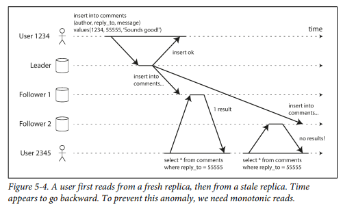

One way of achieving this is by ensuring each user always makes their reads from the same replica.


### Consistent Prefix Reads

consistent prefix reads
: guarantee that if a sequence of writes happens in a certain order, then anyone reading those writes will see them appear in the same order

Asynchronous replication can lead to violations of causality.  In a distributed and partitioned database, each partition operates independently and therefore there is no global ordering of writes.

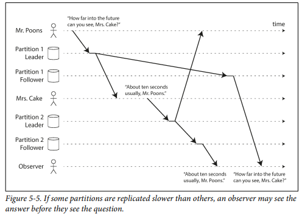

One solution to this is to ensure that writes that are causally related are written to the same partition.

### Solutions for Replication Lag

It's important to design solutions with replication lag in mind.  A simple question to ask is: "If the replication lag increases to several minutes or hours, does that cause a problem for the users?"

It would be a big mistake to pretend that replication is synchronous.


### Multi-Leader Replication

Leader-based replication has one major downside, that all writes must go through the leader.  An extension of this design is to allow for multiple leaders.  

Normal leader-based replication is configured to have the leader in *one* of the datacenters.  

Multi-leader configuration however allows you to have a leader in *each* datacenter.  The leaders also act as followers to the other leaders.

Advantages
- Performance - rather than routing all write traffic to one datacenter, write traffic can be routed to the one with the lowest latency and then replicated to the others
- Tolerance of datacenter outages - each data center can operate independently of the others
- Tolerance of network problems - single-leader configuration is very sensitive to network outages between data-centers because writes are made synchronously over this link.  Multi-leader configuration allows writes to continue even in the case of network interruption.

Disadvantages
- the biggest downside is conflicts

#### Other types of multi-leader replication
- Clients with offline operation, like mobile calendar, email, etc, are considered a type of multi-leader configuration.  
- Collaborative editing like Google Docs shares many of the same aspects of multi-leader configuration.  

### Handling Write Conflicts

It wouldn't make sense to have write-conflicts handled synchronously in a multi-leader configuration.  If synchronous write-conflict handling was required, then single-leader is the only viable option.

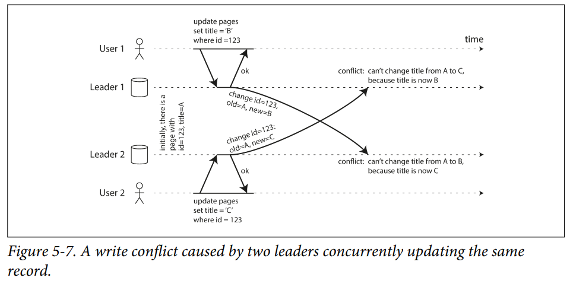

Avoiding conflicts is the simplest strategy.  This is typically done by routing all user-traffic to the same datacenter.  In the case of a datacenter outage, this may break down.

The database must resolve conflicts in a *convergent* way, which means that all replicas arrive at the same final value when all the changes have been replicated.  This can be achieved by the following: 
1. Assign every write a unique ID and pick the write with the highest ID as the *winner*.  This is called *last write wins (LWW)*
2. Give each replica a unique ID and let writes that have the higher replica number take precedence.  This implies data loss
3. Merge the values together (concatenate them)
4. Record the conflict in an explicit data structure and write application code that resolves the conflict later

##### Custom conflict resolution logic

*On write* - when the database detects a conflict in the log of replicated changes, it calls a conflict handler (custom piece of code)

*On read* - when a conflict is detected, all the conflicting values are stored.  On read, the conflict is raised to the application.

##### Automatic Conflict Resolution

Some research has been done into automatically resolving conflicts caused by concurrent data modifications.  Of note are: 
- *Conflict-free replicated datatypes (CRDTs)* - a family of data structures for sets, maps, ordered lists, and counters that can be concurrently edited by multiple users which automatically resolve conflicts in sensible ways
- *Mergeable persistent data structures* - similar to Git and uses a three-way merge function
- *Operational transformation* - used for concurrent editing of an ordered list of items (like characters that constitute a text document)

### Multi-Leader Replication Topologies

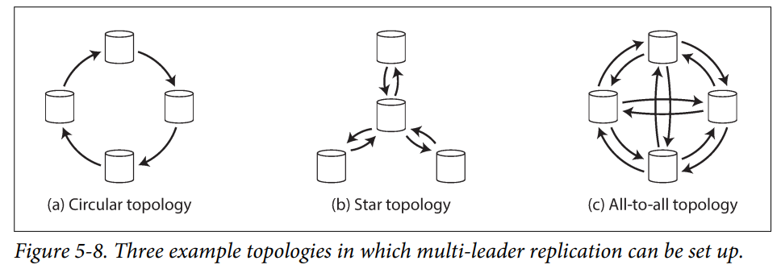

The main problem with circular and star topologies is that replicated data may have to travel through multiple nodes before reaching all destinations.  If one of the nodes is down, the replication will fail.

All-to-all topologies have their own downside which is some replication messages may overtake others.  This is a problem of causality.
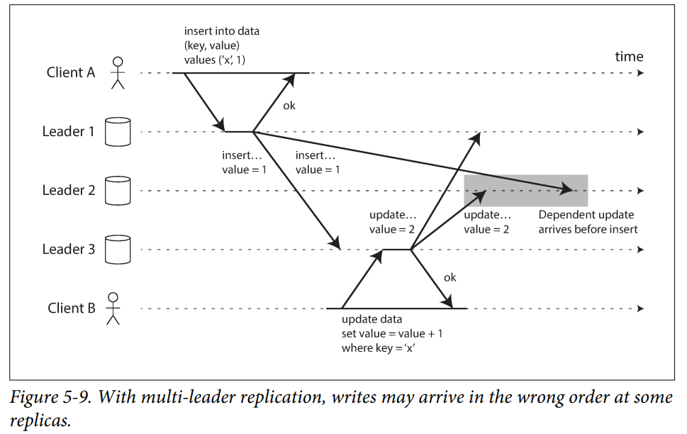

### Leaderless Replication

Single and multi-leader replication is based on the idea that writes are sent through a leader which are then replicated to the followers.

In leaderless replication, there is no *failover* of the leader.  Clients simultaneously send write and read requests multiple replicas.  These are *dynamo* style databases.

> Dynamo style databases include Dynamo, Riak, Cassandra, and Voldemort.

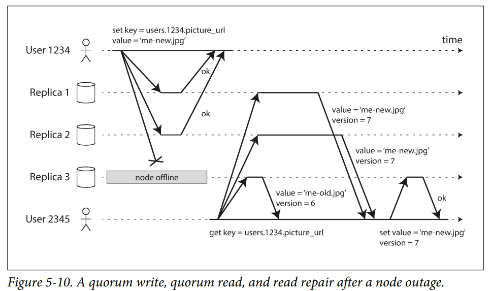

On reads, the client may get different versions of data.  Version numbers are used to determine which value is newer.

To ensure eventual consistency, Dynamo-style databases use two common mechanisms, read repair and anti-entropy.

Read repair
: the client, upon identifying an older version of data from a replica in a read operation, will write the newer value back to the outdated replica

Anti-entropy process
: a background process that looks for differences between replicas and copies any missing data from one replica to another.  

> **Important Note**: the anti-entropy process does not copy writes in any particular order and there may be a significant delay before data is copied

##### Quorums for reading and writing

Formula for quorum
:  ```w + r > n```

**n** = number of nodes a given value is stored on
**w** = number of write nodes
**r** = number of read nodes

When the formula is satisfied, we can expect to have received the most up-to-date value or that a write was successful.

The n, w, and r values are configurable and can be tuned to specific workloads.  For high-read and low-write, a good option is to keep the w value high and the r value low.  

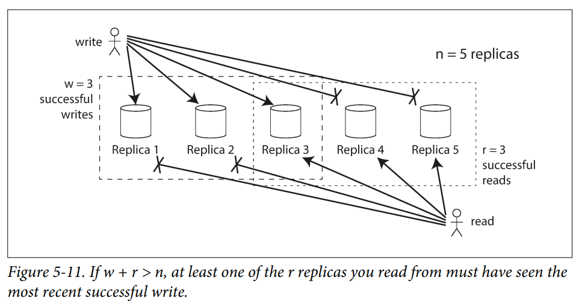

There are limitations to quorum consistency
- If using sloppy quorums, there is no guaranteed overlap between *r* nodes and the *w* nodes
- In the case of concurrent writes, it isn't clear which happened first.  The only safe option is to merge the values.  If picking a winner based on timestamp, writes can be lost due to clock skew
- There is no guarantee on which value you receive in concurrent read and write operations

##### Monitoring staleness

Monitoring staleness in a leaderless system is more complicated because there is no fixed order in which writes are applied.  
If only using *read repair* (with no anti-entropy), there is no limit how old a value may be if the values are infrequently read.

##### Sloppy Quorum

Quorums are not fault tolerant!  Network interruptions can cut off a client from a large number of database nodes.

A tradeoff that needs to be considered when considering fault-tolerance
- is it better to return errors when a quorum can't be reached?
- or should we accept writes anyway and write them to some nodes (that are reachable) but aren't among the *n* nodes on which the value usually lives?

Writes and reads still require *w* and *r* successful responses, however the responses may come from nodes that are not the designated *n* nodes for a value.  

When the network partition resolves, the database can move the writes to their appropriate home *n* nodes.  This is called **hinted handoff**.

Sloppy quorums are useful when you want to increase write availability but at the cost of reliably retrieving the latest value when reading.


#### Concurrent Writes

Dynamo-style databases allow several clients to write to the same key concurrently.  This means where will be conflicts, especially as there is no well-defined ordering.

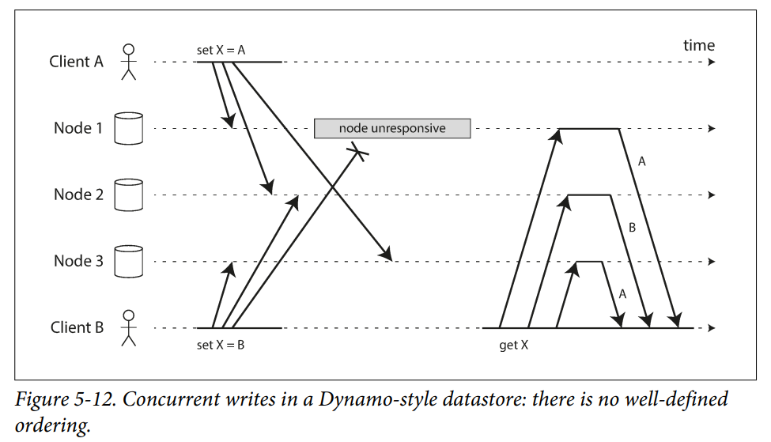

To become eventually consistent, the replicas need to converge to the same value however the db may not do this automatically.  There are some approaches to address this.

##### Last-write wins
Last-write wins (LWW) - apply a timestamp to all writes and pick the largest timestamp.  This is at the cost of durability however.  When a client writes data, it will receive a successful response, but ultimately the write may be thrown away due to not having the latest timestamp.  **You can lose data**.

The only real way to address this is by giving each write a unique key such as a UUID in LWW. 

##### Causality

In Figure 5-9, we can determine that A's insert happens before B's update.  This means it is causally dependent.
In Figure 5-12 however the operations are concurrent because A and B do not know of each other's write operations.

> Concurrent sounds like things happening *at the same time*, but it doesn't really have to do with time.  It has more to do with if the operations are unaware of each other.  

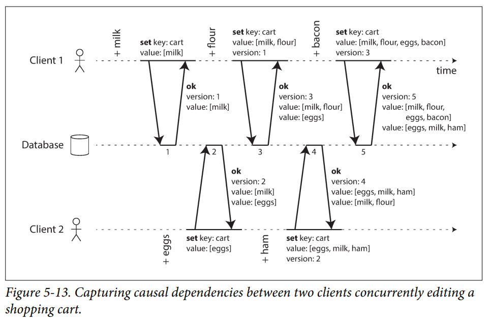

To capture causality, in Figure 5-13, each client is stating what it is aware of when sending a write along with version # info provided by the database.  The database also responds with the data and version it currently has.  This process creates multiple "value" entries which eventually have to be merged to get the final value.  These value entries signify concurrent write operations.  Riak calls these *siblings*.

To remove values, it's not enough to delete an item from a value because a sibling may have the same value.  When merging the dataset, the item will then reappear in the value.  To address this problem, you have to add a *tombstone* marker.


##### Version Vectors

Figure 5.13 only shows how things would work in a single replica.  When moving to a leaderless multi-replica configuration, then each replica must keep track of its own version number per key.  This is called a [*version vector*](https://martinfowler.com/articles/patterns-of-distributed-systems/version-vector.html).