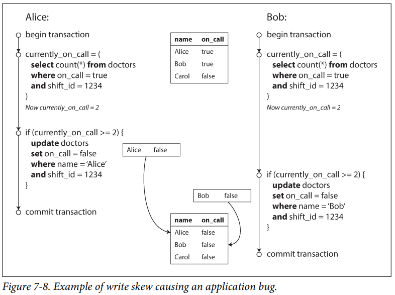

# [Designing Data-Intensive Applications: The Big Ideas Behind Reliable, Scalable, and Maintainable Systems](https://www.amazon.com/Designing-Data-Intensive-Applications-Reliable-Maintainable/dp/1449373321)


# Part 1. Foundations of Data Systems

---

## Chapter 1 - Reliable, Scalable, and Maintainable Systems

#### Terms

<dl>
  <dt>Data-Intensive</dt>
  <dd>deals with amount of data, complexity of data, how fast the data is changing</dd>
  <dt>Compute intensive</dt>
  <dd>CPU bound</dd>
</dl>


### Applications of Data-intensive applications
- store data so that it can be found and used later (*databases*)
- remember the result of an expensive operation to speed up reads (*caches*)
- allow users to search data by keywords or filter it in various ways (*search indexes*)
- send a message to another process to be handled asynchronously (*stream processing*)
- periodically crunch a large amount of accumulated data (*batch processing*)

Prior abstractions had neat categories for different types of data-systems.  The lines are however being blurred.

Modern systems may take different data solutions and combine them to make a composite system.  Consumers of the data shouldn't have to worry about the implementation details so abstractions are built that hide the complexity behind a simpler facade.  This requires application level code which provides the linkage between the different types to provide the necessary guarantees (e.g. cache-update or invalidation so that consumers see correct results)


Three main concerns
#### *Reliability*
> The system should continue to work *correctly* even in the face of *adversity*

#### *Scalability*
> As the system grows (in data volume, traffic volume, or complexity), there should be reasonable ways of dealing with that growth

#### "Maintainability"
> Over time, many different people will work on the system (engineering and operations, both maintaing current behavior while also adapting to new use-cases).  They should be able to do so productively.

---
### Reliability

#### Terms

<dl>
  <dt>Fault</dt>
  <dd>things that can go wrong</dd>
  <dt>Fault-tolerant or resilient</dt>
  <dd>ability to anticipate and cope with faults</dd>
  <dt>Failure</dt>
  <dd>system as a whole stops providing the required service</dd>
</dl>


#### Hardware Faults
Failure of hardware components due to wear over time.

These are typically addressed through redundant hardware (e.g. RAID, dual power supplies, etc)

With the advent of the cloud, using software fault-tolerance techniques, losing a VM or a container should be expected and anticipated.  The impact of such failures is much lower.

#### Software Errors
Examples: 
- Software bugs that cause every instance of an application to crash
- A runaway processes that takes away from shared resources
- A service that the system depends on becomes unresponsive or returns corrupted responses
- Cascading failures - where a small fault in one component triggers faults in other components in a chain reaction


#### Human Errors
Humans are inherently unreliable.  Most errors are caused by configuration errors made by operators.

How to address this? 
- Design systems in a way that minimizes opportunity for errors (simplified APIs and interfaces).  **Path of success**
- Decouple (*separate*) the places where people make the most mistakes from the places where they can cause failure.   Also provide sandbox environments.
- Test thoroughly at all levels (unit-tests, integration tests, manual tests)
- Allow for quick rollback from user-errors
- Setup detailed and clear monitoring
- Provide good training

> Reliability is one dimension.  At times, we may choose to sacrifice some reliability in order to reduce development costs (e.g. prototypes, testing unknown markets) or operational costs (for a service with very low profit margins)

---

### Scalability

<dl>
  <dt>Scalability</dt>
  <dd>a system's ability to cope with increased load</dd>
</dl>

*Note*: Scalability is not a one-dimensional label.  

##### Questions we can ask are 
-  If the system grows in a particular way, what are our options for coping with the growth?
- How can we add computing resources to handle the additional load?

##### Describing Load
Load can be described with *load parameters*.  Examples of load parameters are: 
1. request per second to a web server
2. ratio of reads to writes in a database
3. the number of simultaneously active users in a chat room
4. the hit rate on a cache

**Latency** and **response time** are NOT the same.  

<dl>
  <dt>Response time</dt>
  <dd>is what the client sees from end-to-end</dd>
</dl>
*this includes network delays, queueing delays, response processing and other factors*

<dl>
  <dt>Latency</dt>
  <dd>however is how long the request was *latent* (waiting to be processed).</dd>
</dl>


##### Measuring response times
There is always a level of randomness and variability in each request, even if it's the same request over and over, often due to factors outside our control.  *(TCP retransmission, garbage collection, page fault, etc.)*

It's common for people to see the average response time.  This is generally not a good metric.  

It's usually better to use percentiles.  
- Take your list of response times and sort it from fastest to slowest. 
- Take the median.  
- This means half of the requests are faster than the median, and half are slowest.
- You can take this further by taking higher percentiles (95%, 99%, 99.99%).

##### Tail latencies
: high percentiles of response times (e.g. 99th percentile)

Sometimes you have to pay attention to the tail latencies because they can be driven by your most valued consumers (highest paying consumer may have the most data or requests).

Service level objectives (SLOs) and service level agreements (SLAs) are contracts that define the expected performance and availability of a service.

An end-user request that requires multiple back-end calls, even if run in parallel, will be bottlenecked by the slowest request.  


*It takes just a single slow backend request to slow down the entire end-user request*


#### Approaches for Coping with Load

<dl>
  <dt>Scaling-up</dt>
  <dd>vertical scaling, moving to a more powerful machine</dd>
  <dt>Scaling-out<dt>
  <dd>horizontal scaling, distributing the load across multiple smaller machines (a.k.a. *shared-nothing* architecture)</dd>
  <dt>Elastic</dt>
  <dd>systems that can automatically add computing resources when they detect a load increase (whereas other systems are scaled manually)</dd>
</dl>


> Horizontal scaling on a stateful system brings in lots of complexity.  This is why until recently, the common practice was to keep the state in one location and scale that up until the scalability requirements forces you to distribute.

*There is no magic architecture.*  The way one application scales can be vastly different from another.  
For example: Designing a system that handles 100,000 requests per second with requests of 1kb in size is vastly different than designing a system that handles 3 requests per minute, each 2 GB in size.  It's the same data-throughput but vastly different use-cases.

<dl>
  <dt>Operability</dt>
  <dd>Make it easy for operations teams to keep the system running smoothly</dd>
  <dt>Simplicity</dt>
  <dd>Make it easy for new engineers to understand the system, by removing as much complexity as possible from the system.</dd>
  <dt>Evolvability</dt>
  <dd>Make it easy for engineers to make changes to the system in the future, adapting it for unanticipated use cases as requirements change.  *(a.k.a. extensibility, modifiability, or plasticity)*</dd>
</dl>


#### Operability: Making Life Easy for Operations

Operations teams are responsible for the following, and more: 
- monitoring the health of the system and quickly restoring service if it goes into a bad state
- tracking down the cause of problems, such as system failures or degraded performance
- keeping software and platforms up to date, including security patches
- keeping tabs on how different system affect each other, so that a problematic change can be avoided before it causes damage
- anticipating future problems and solving them before they occur
- establishing good practices and tools for deployment, configuration management, etc
- performing complex maintenance tasks, such as moving an application from one platform to another
- maintaining the security of the system as configuration changes are made
- defining processes that make operations predictable and help keep the production environment stable
- preserving the organization's knowledge about the system, even as individual people come and go

Good operability means making these routine tasks easy and allowing the operations team to focus their efforts on high-value activities.  We can do this by: 
- providing visibility into the runtime behavior with good monitoring
- providing good support for automation and integration with standard tools
- avoiding dependency on individual machines (allow machines to be taken down for maintenances while the system continues to operate uninterrupted)
- providing good documentation and an easy-to-understand operational model
- providing good default behavior, but also giving administrators the freedom to override defaults when needed
- self-healing where appropriate, but also giving admins manual control over the system state when needed
- exhibiting predictable behavior, minimizing surprises


#### Simplicity: Managing Complexity

Symptoms of complexity
- explosion of the state space
- tight coupling of modules
- tangled dependencies
- inconsistent naming and terminology
- hacks aimed at solving performance problems
- special-casing to work around issues elsewhere
- etc

Complex software introduces room for bugs because it is hard to reason about and understand the consequences, hidden assumptions, unexpected interactions, etc.

Best tool for removing accidental complexity is **abstraction**

#### Evolvability: Making Change Easy

System requirements will almost always change over time.  This is due to new facts, new and unanticipated use-cases, business priority changes, market changes, platform and technology changes, legal or regulatory requirements, etc.  

The *Agile* process is a good methodology for managing change.  Coupled with TDD, this becomes a great asset.  However, when dealing with distributed systems, we aren't changing one application.


---
## Chapter 2 - Data Models and Query Languages

> Data models are perhaps the most important part of developing software, because they ahve such a profound effect: not only on how the software is written, but also on how we *think about the problem* that we are solving.

Applications are built by layering one data model on top of another (abstractions).
    1. Objects and data-structures
    2. How to store the data structures - JSON, XML, relational, graph?
    3. How to store the data in terms of bytes in memory, on disk, or on a network
    4. Electrical currents, pulses of light, magnetic fields, etc.

Each data-model carries with it assumption on how it will be used.  Some models fit specific use-cases better than others.

The *Relational Model* became the defacto general purpose model and has stayed that way for a long time.  This model worked well for transaction processing, batch processing, etc.  

As computers became more powerful and networked, the types of workloads became increasingly diverse.  Relational databases generalized very well and so have been applied to many modern workloads.

Driving forces for NoSQL
- A need for greater scalability than relational databases can achieve easily (e.g. very large data-sets or high write througput)
- A preference for free and open-source software over commercial products
- Specialized query operations that aren't well supported in the relational model
- Frustration with restrictiveness of relational schemas


### Object-relational mismatch
- application objects and their representation do not match completely with the relational model.  
- tools have been developed to reduce the amount of boilerplate code required to address the mismatch, but there is still an **impedance mismatch**

<dl>
  <dt><a href="https://www.geeksforgeeks.org/impedance-mismatch-in-dbms/">Impedance Mismatch</a></dt>
  <dd>when two systems or components that are supposed to work together have different data models, structures, or interfaces that make communication difficult or inefficient</dd>
  <dt>Shredding</dt>
  <dd>the relational technique of splitting a document-like structure into multiple tables</dd>
</dl>

Storing complex object structures in relational vs document styles has pros and cons.
- Relational style spreads the data across various tables through normalization.  Query operations become more complex
- Document style keeps the data together in one record.  Limited query options are available here however but much simpler to retrieve and update.


#### Access patterns in document databases
Accessing data in a document-model has caveats.  You can't directly access a nested item within a document.  You have to refer to it through the parent.  This may not be a problem is the document isn't deeply nested.

If using a document database, you can reduce the number of joins by denormalizing the data.  However this can increase application complexity because the application now has to do extra work to keep the denormalized data consistent.

If using a document database, you can emulate joins in the application code.  This however requires more queries, more complexity in the application, and is slower since the specialized code within the a database can handle join operations much faster.


#### Schema
Document databases do not enforce any schema on the data in the documents.  This leads people to think that they are *schemaless*, but this is misleading because the application that reads and works with the data would have a schema.  The more accurate term would be *schema-on-read*.  

<dl>
  <dt>Schema-on-read</dt>
  <dd>schema is implicitly enforced by the application that reads the data</dd>
  <dt>Schema-on-write</dt>
  <dd>schema is explicit and enforce on write (database ensures all data written conforms to the schema).  Most commonly seen in relational style databases</dd>
</dl>

Schema-on-read approach may be advantageous if the items in the collection don't all have the same schema.
1. if there are many different types of objects and it isn't practical to put each in their own tables
2. the structure of the data is determined by external systems over which you have no control


#### Data locality for queries
If your application often requires access to the entire document, there is a performance advantage in document style databases due to *storage locality*.  A relational model may not work well due to the number of seeks it requires on disk to retrieve it.  This only really applies if you need large parts of the document at the same time.

Keeping documents small is the recommendation here.  

#### Convergence of relational and document models

Many popular relational databases also have support for document style data stored in columns (XML or JSON).


### Query Languages for Data

<dl>
  <dt><a href="https://en.wikipedia.org/wiki/Imperative_programming">Imperative language</a></dt>
  <dd>uses statements that change a program's state</dd>
  <dt><a href="https://en.wikipedia.org/wiki/Declarative_programming">Declarative language</a></dt>
  <dd>express the logic of a computation without describing its control flow</dd>
</dl>

SQL is a declarative language because we're defining patterns as opposed to specific steps.  

Declarative languages are typically better suited for parallel execution.  This is because imperative code specifies steps to be executed in a particular order whereas declarative languages only specificy the pattern of the results, not the algorithm that is used to determine the results.


### Graph-Like Data Models

Used when there are many-to-many relationships are common in the system.

<dl>
  <dt>Vertices</dt>
  <dd>nodes or entities</dd>
  <dt>Edges</dt>
  <dd>relationships or arcs</dd>
</dl>

There are declarative query languages for graph databases such as: 
- [Cypher query language](https://neo4j.com/developer/cypher/)
- [SPARQL](https://en.wikipedia.org/wiki/SPARQL) - an [RDF](https://en.wikipedia.org/wiki/Resource_Description_Framework) query language
- [Datalog](https://en.wikipedia.org/wiki/Datalog) - a subset of Prolog.  Has a functional feel to it where queries can be composed from other parts.

In the **triple-store** model, data is stored in a simple three-part statement (*subject, predicate, object*)

NoSQL comes in multiple flavors
 - Document style databases - store a complex structure within the same database.  Relationships are self-contained within the document
 - Graph database - opposite direction of document style.  Everything can be related to anything else.

There are other data models not covered as well.  Examples are full-text search and Big Data-style large-scale analytics like used at LHC

---

## Chapter 3 - Storage and Retrieval

#### Terms

<dl>
  <dt>log</dt>
  <dd>an append-only data file (*not to be confused with application log, which outputs text describing what is happening*)</dd>
  <dt>index</dt>
  <dd>an additional structure that is derived from the primary data.  Used for speeding up reads (efficient lookup) at the cost of additional writes</dd>
  <dt>compaction</dt>
  <dd>discard duplicate keys in a log.  Often performed with merging</dd>
  <dt>merging</dt>
  <dd>bringing together multiple segments.  Often performed with compaction</dd>
  <dt>tombstone</dt>
  <dd>a special entry in a log that signifies deletion of data</dd>
</dl>

### Hash Indexes

Hash indexes are similar to dictionary types or hashmaps.  They often store the key and a byte offset like below.

|key|byte offset|
|---|---|
|123|0|
|456|64|

Some database engines store these indexes in memory while the actual data resides on disk.

When using a log-structure for writes, we can run out of space very quickly.  A common solution to this problem is breaking the log into segments of a certain size.  When a segment fills up, we close it and start a new one.  We then perform *merging and compaction*.

When performing a merge and compaction, the newly merged segment is written as a new segment in the log and the older entries are then deleted.

When merging, the a *tombstone* record signifies that all previous values for the deleted key can be discared.

##### Crash recovery
> when a database is restarted, all in-memory hash maps are lost (volatile memory).  You can restore the hashmap by reading all of the segments and keeping track of the most recent value.  This can be sped up however by maintaining *snapshots*.

##### Partially written records
> a database may crash at any time, including while writing a record to the log.  In this case, checksums are used to detect and ignore corrupted portions

##### Concurrency control
> writes are appended in a strict sequential order.  This often means that writes are done by one thread but reads may be done by many.

#### Append-only design
Pros
- generally much faster than random writes, especially on magnetic disks
- concurrency and crash recovery are much simpler
- segments are immutable
- merging old segments avoids the problem of data files getting fragmented over time

Cons
- the hash table must fit in memory.  It's must tricker to get a performant hash map on disk which requires lots of random I/O
- range queries are not efficient


### SSTables and LSM-Trees

SSTable (sorted string table)
: key-sorted append-only key-value storage

LSM-tree
: a layered data structure based on a balanced tree that allows SStables to exist without the controvery of both being sorted and append-only

Similar to hash indexes but the key-value pairs are *sorted by key*.  

Merging segments is simple and efficient and uses an approach similar to the [*merge-sort* algorithm](https://www.youtube.com/watch?v=4VqmGXwpLqc).


With an SSTable, we don't have to store the whole hashmap in-memory.  Because the keys are sorted, we can lookup values *between* other values.  This means the in-memory index can be sparse.  Simply lookup the closest values and scan from there.

##### Constructing and maintaining SSTables

When a write comes in, add it to a balanced B-Tree like an AVL or Red-Black tree.  This in-memory tree is also called a *memtable*

When a memtable gets past a threshold, write it to disk as an SStable. It's already sorted so this write is efficient.  If new writes are coming in during this operation, they can write to a new memtable instance.


The unsorted log is used simply for crash recovery.  Once the memtable is written to disk, the associated log is deleted.


Read requests will start at the memtable, then work their way backwards through the most recent on-disk segments and work their way to older segments.


A background thread may combine segment files and discard overwritten or deleted values.

Note: Lucene, an indexing engine for full-text search (used by ElasticSearch and Solr), uses a similar method.  The key in this case is the search term, and the value would be the IDs of the documents that contains these terms.

##### Performance implications

Read requests in an LSM can be slow if the key does not exist in the database, especially if there are many/large segments.  

One solution to this is to use [bloom filters](https://en.wikipedia.org/wiki/Bloom_filter) which excel at telling you if the key exists in the db.  

Another solution is to tune how the SSTables are compacted and merged.  

Because LSM trees are written sequentially, they support high write throughput.


### B-Trees

<dl>
  <dt>leaf-page</dt>
  <dd>final page where the individual keys and values (or reference to the values) are stored</dd>
  <dt>branching factor</dt>
  <dd>the number of references to child pages in one page</dd>
</dl>

B-trees are the most widely used indexing structure.

B-trees break the database down into fixed-size blocks or pages as opposed to log-structured indexes which are variable-size segments.
- this aligns closer to the underlying hardware as disks are also arranged in fixed-size blocks


- Search starts at the *root* of the B-tree.  
- Each child is responsible for a continuous range of keys.  The keys between the references indicate where the boundaries between those ranges lie.
- The page containing the individual keys (*leaf page*), are where the values (or at least references to the pages) are found

Updating a value for an existing key consists of
1. searching for the leaf page containing the key
2. changing the value in that page
3. writing the page back to disk

Adding a new key consists of
1. Find the page whose range encompasses the new key and add it to that page
2. If there isn't enough free space in the page to accommodate the new key, split it into two half-full pages
   1. then update the parent page with the new subdivision of ranges


This algorithm ensures a balanced tree with a depth of O(log *n*)

#### Making B-trees reliable

B-tree write operations happen directly on the pages themselves.  Some operations (as mentioned above), require updates to multiple pages.  These can potentially be dangerous operations if the database crashes during the operation.  

To make this more reliable, an additional data structure is used called a Write-Ahead-Log (WAL).  The operations are first written to the WAL so that in-case there is a failure, the log is used to bring the database back up to a consistent state.

Concurrent read operations however require careful concurrency control.  Multiple threads accessing the B-tree means there may be an inconsistent read.  *Latches* are typically used to protect this from happening.

#### B-tree optimizations

Instead of WAL for crash recovery, some databases use a *copy-on-write* scheme.  This means a modified page is first copied to a new location, and the parent is updated pointing at the new location.

Having a higher *branching factor* means that there are fewer levels.

B-tree implementations try to layout the tree so that leaf pages appear in sequential order on disk.  LSM-trees do this by design.


### Comparing B-Trees and LSM-Trees

LSM-trees are typically faster for writes whereas B-trees are typically faster for reads.  These are general statements and actually depend on the workload.

#### Advantages of LSM trees

Write-amplication
: the effect of one write to the database resulting in multiple writes tot he disk over the course of the database's lifetime

In write-heavy applications, the more writes to disk, the fewer writes per second it can handle within the available disk bandwidth

- LSM generally have fewer write operations overall compared to B-tree.  
  - This is because B-tree has to write to the WAL first, then update the page, and maybe even create new pages

- LSM writes out data sequentially and compactly whereas B-tree can get fragmented on disk over time.

- LSM has lower write amplication, especially on SSDs because the SSD firmware uses a log-structured algorithm to turn random writes into sequential writes.

#### Downsides of LSM trees
- The compaction process can sometimes interfere with ongoing reads and writes
  - at higher percentiles, response times can be quite high due to the impact of compaction

- As the database grows in size, more disk bandwidth is required for compaction

- If write throughput is high and compaction is not configured properly, compaction may not keep up with the rate of writes
  - this means you'll run out of disk space and also have many unmerged segments

- A log-structured storage engine may have multiple copies of the same key in different segments.  This affects transactional semantics.


### Other Indexing Structures

<dl>
  <dt>Clustered Index</dt>
  <dd>when an indexed row is stored directly within an index.  These are stored in a specific order</dd>
  <dt><a href="https://www.geeksforgeeks.org/secondary-indexing-in-databases/">Secondary index</a></dt>
  <dd>Secondary indexing is a database management technique used to create additional indexes on data stored in a database. The main purpose of secondary indexing is to improve the performance of queries and to simplify the search for specific records within a database. A secondary index provides an alternate means of accessing data in a database, in addition to the primary index.</dd>
  <dt>Heap-file</dt>
  <dd>location where row content is stored if apart from the document or vertex.  Data is not stored in any particular order</dd>
</dl>


#### Storing values within the index

The main difference between a primary index and secondary is that a secondary does not have to be unique.

Updating data in a *heap-file* can be more complicated if the new data is bigger than the old.  New space will have to be allocated and after the update, the references will have to point to the new location.  

A compromise between clustered (storing all row data within the index) and non-clustered indexes (storing only references to the data) is a *covering index* or *index with included columns*.

#### Multi-column indexes

<dl>
  <dt>concatenated index</dt>
  <dd>combines several fields into one key by appending one column to another (in a specific order)</dd>
</dl>

> multi-dimensional indexes are a more general way of querying several columns at once

They are particularly useful for geospatial data.  

``` sql
SELECT * FROM restaurants WHERE latitude > 51.238 AND latitude < 51.439
  AND longitude > 12.381 AND longitude < 12.670
``` 
*this query would perform poorly on a B-tree or LSM structure.  They can query on a range of latitudes OR longitudes, but not both simultaneously.

Options for geospatial data are 
- combine the latitude and longitude values to a single value using a space-filling curve and using that value in a B-tree index
- use [R-tree](https://en.wikipedia.org/wiki/R-tree)

#### Full-text search and fuzzy indexes

Indexes of this sort have to consider *similar* keys.  Some examples would be: 
- misspelling
- synonyms
- root or derived words (e.g. calculation -> calculate)

#### Keeping everything in memory

As RAM has become cheaper over time and many datasets are not that big, some solutions have been to put all the data in memory.

There are products that are simply key-value (Memcachedd) and others that implement a relational model (VoltDB and MemSQL).

In-memory is volatile but there are solutions for this as well such as battery-powered RAM.

Other solutions include use an *anti-caching* approach, which is to use LRU data on disk, similar to how OS manage virtual memory.

The performance of in-memory actually comes from not having to encode in-memory data structures to disk.

### Transaction Processing or Analytics

<dl>
  <dt>OLTP (*online transaction processing*)</dt>
  <dd>type of processing that consists of executing a number of transactions occurring concurrently.  typically small number of records per transaction and used for interactive patterns</dd>
  <dt>OLAP (*online analytic processing*)</dt>
  <dd>type of processing that is used for analytical purposes.  typically querying large amounts of data to perform analytics to inform business decisions</dd>
</dl>


*Characteristics of OLTP vs OLAP*
|Property|OLTP|OLAP|
|---|---|---|
|Main read pattern|Small number of records per query, fetched by key|Aggregate over large number of records|
|Main write pattern|Random-access, low-latency writes from user input|Bulk import (ETL) or event stream|
|Primarily used by|End user/customer, via web application|Internal analyst, for decision support|
|What data represents|Latest state of data (current point in time)|History of events that happened over time|
|Dataset size|Gigabytes to terabytes|Terabytes to petabytes|

#### Data Warehousing

<dl>
  <dt>Data-warehouse</dt>
  <dd>a separate database that analysts can query</dd>
</dl>


These databases are full of historic data from various OLTP systems and loaded via ETL (*Extract-Transform-Load*) processes.

Analytics queries can be quite performance heavy due to the number of records and adhoc nature of the queries.  If these queries were executed against OLTP systems, they could potentially fail.


This is even more true with distributed systems such as microservices where each service has its own database.

The internals of OLAP systems are optimized for analytical query patterns.  Some databases like SQL server may support both transactional and analytical models, they are increasingly diverging paths.  Most database vendors focus on supporting either transaction processing OR analytical workloads.

### Stars and Snowflakes: Schemas for Analytics

star schema
: denormalized business data into facts and dimensions.  the fact table is at the center


Facts are captured as individual events.  These allows maximum flexibility when doing analysis.

Typically in a data warehouse, tables are often very wide.  Fact tables can have over 100 columns, sometimes several hundred.  

### Column-Oriented Storage

In most OLTP databases, storage is laid out in a *row-oriented* fashion.  This means that all data on disk is stored next to each other.
This is also true for document databases as an entire document is stored as one contiguous sequence of bytes.

This can be problematic when querying data where you're only interested in parts of the data.  If you're interested in 3 or 4 columns but are querying against a table that has 100+ columns, the row-oriented store will have to load all columns from disk into memory, parse them, and filter out those that don't apply to the query.  This can take a long time and is resource intensive.

In column-oriented storage, the data for each column is stored together.  


#### Column Compression

Column-oriented storage lends itself very well to compression.  
[Compression Techniques for Column Oriented Databases](https://chistadata.com/compression-techniques-for-column-oriented-databases/)

You can use bitmap-indexed storage or dictionary based encoding.


Another alternative is run-length encoding (applicable to sorted data)


Sort-order for column-oriented storage must be the same across all tables, otherwise there would be no way to correlate the data between tables.

Column-oriented storage has many optimizations available to make reads very performant.  
Writes on the other hand are more difficult.
- you can't update-in-place like B-trees with compressed columns
- you can't insert into the middle of a sorted table (if would affect ALL other tables)

LSM-trees however are suitable for this type of store.


### Aggregation: Data Cubes and Materialized Views

If aggregate functions such as COUNT, SUM, AVG, MIN, or MAX are used often, it may make sense to cache this data to avoid wasteful crunching of these values.

materialized view
: copy of the query results written to disk

Materialized views are not often used in OLTP systems because they need to be updated per transaction.

data cube (a.k.a. OLAP cube)
: a data structure that can store data in more than 2 dimensions

Data-cubes are essentially a grid of aggregates grouped by different dimensions.


Advantages of datacubes are that they are pre-computed to make reads very quick and efficient.  
Disadvantages is that there is no way to break the data down further than the aggregates without referring to the raw-data.

---

## Chapter 4 - Encoding and Evolution

An evolving system by its definition changes over time.  In large applications, change typically does not happen all at once because it would cause downtime.

- Server-side applications typically go through a *rolling upgrade* where a few nodes have the newly updated code (and schema).  This is so that the application can be tested and verified and then deployed to more nodes until all the nodes have been updated.  This allows new versions to be deployed without downtime.

- Client-side applications however, it is up to the user to install the update and therefore, may not update the install for some time.

The above scenarios means that new and old version of the code will run simultaneously and must continue to run smoothly.

Backward compatibility
: newer code can read data that was written by older code

Forward compatibility
: older code can read data that was written by newer code

### Formats for Encoding Data

Data is represented in one of two ways:

1. In-memory - these are data-structures like lists, arrays, objects, trees, etc.  To be used by the CPU
2. Serialized - data stored on disk or sent over the network must be encoded as a sequence of bytes

There needs to be translation between the 2 general forms

encoding
: translating an in-memory representation to a byte sequence (a.k.a. *serialization* or *marshalling*)

decoding
: translating a byte sequence into an in-memory representation (a.k.a. *deserialization*, *parsing*, or *unmarshalling*)

### Consideration to language-specific formats
It's generally a bad idea to use a specific language's built-in encoding because you are implicitly locking yourself into a specific language.

In order to restore data to the same object types, the decoding process needs to be able to instantiate arbitrary classes.  An attacker can use this vector to instantiate arbitrary classes and execute malware

The language provided methods may not be efficient.  

### JSON, XML, and Binary Variants

These are more standard formats that can be used by many programming languages and applications.  

There are downsides however
- there is ambiguity around encoding of numbers.  
  - how to tell the difference between a number and a string composed of numeric digits?
    - often you will need some sort of external schema
    - JSON can distinguish between numbers and strings, but not between integer and floating point
    - there are numeric range limitations with JSON
- many tools that use JSON don't respect the schema (not as much a problem for XML however)
- CSV does not have any schema so the complexity lies inthe application
  - what about escaping characters?  not all parsers do this well
- JSON and XML increase the payload size (especially XML with its verbosity)


#### Binary Encoding

Binary encoding is much more compact than JSON and XML.  


[Apache Thrift](https://thrift.apache.org/), [Protocol Buffers (protobuf)](https://protobuf.dev/), and [Apache Avro](https://avro.apache.org/) are all schema-based binary encoding libraries.  Each have their own implementation but in general solve for the same problem of encoding and decoding an evolving data contract.

Similarities
- rather than having the schema field names in the message itself (like JSON), the schema is used at encoding/decoding.  This means the sender and receiver have the schema information and the document can point to references in the schema
- the binary data sent over is comprised of lengths, types, and field tags (though Avro does not use field-tags)


Differences
- Avro has the concept of reader and writer schemas
- Avro supports dynamically generated schemas because it doesn't contain field-tags like Protobuf and Thrift


#### Benefits of Schemas
- they are more compact since they can omit field names from the encoded data
- the schema can serve as a valuable form of documentation (source code)
- keeping a database of schemas allow you to check forward and backwards compatibility of schema changes
- allows for compile time checking in statically typed programming languages


### Modes of Dataflow

When sending data to another process which doesn't share the same memory space, the data must be encoded to be sent.  This can happen either over a network or to a file.

The most common ways of data flow are: 
1. Via databases
2. Via service calls
3. Via asynchronous message passing

#### Dataflow Through Databases

A process that writes to the database encodes the data.  The process that reads the data decodes it.  

Even in a single process scenario, where both writing and reading is done by the same application, the reader should still be considered as a later version of the same process.
Another way to think of it is *sending a message to your future self*.

**Data outlives code** and therefore we should be aware of how the data will be handled in its lifetime.


#### Dataflow Through Services: REST and RPC

The most common configuration for network communication is having two roles: *clients* and *servers*
The API implementation is application specific though the protocols and technologies (HTTP, JSON, XML) are ubiquitous.  
The client and the server must agree on the specifics for communication to happen

Two common protocols are SOAP and REST.
- SOAP is an xml-based protocol for making network API requests, most commonly used over HTTP
  - SOAP uses a Web Services Description Language (WSDL) to describe the API
  - Code generation tools allow for creation of clients using local classes and simulates method calls (RPC)
- REST is not really a protocol but a design philosophy.  
  - emphasizes simple data formats using URLs to identify resources
  - uses HTTP features for cache control, authentication, content-type negotation, etc
  - tools like OpenAPI ([Swagger](https://swagger.io/specification/)) help to describe RESTful APIs

##### Remote-Procedure Calls (RPCs)

The concept of RPC is to make calls to a service seem as if it were local.  
- this makes it very convenient to develop against as it abstracts away the details of making the service call
- this abstraction is called *location transparency*

**RPCs have many problems however**
1. a local function call is predictable because it is all in the same process and accesses the same memory space.  RPC however has a network hop to make, which can fail for any number of reasons. 
2. a local function will return a result, throw an exception, or get stuck in a loop.  RPC however may succeed but fail on the response back.  
3. retrying a failed network request may actually be succeeding on the receiver, but the response back could be failing.  In this case, you would be duplicating requests.  You would have to consider deduplication of these requests.  Local functions do not have this issue
4. local functions are much more predictable in the amount of time it takes to execute.  RPC is not.  In the case of a slow network or network congestion, it can take many seconds or even timeout
5. local functions are efficient because you can pass references to points in memory. RPC has to be encoded into a sequence of bytes and read on the other end.  The larger the payload, the longer this may take
6. local functions will always work with the same datatypes.  RPC however has to worry about translating data-types.  
    - an example of this is JavaScripts inability to handle numbers greater than 2<sup>53</sup>

Despite the problems above, RPC isn't going away and has made some positive progress
- newer generations of RPC frameworks are more explicit that it is a remote request
  - the concept of [*futures* (promises)](https://en.wikipedia.org/wiki/Futures_and_promises) makes this explicit
- gRPC supports streams where a call consists of not just one request and response, but many over time
- some of the frameworks support *service discovery*, which allows a client to find out which IP address and port a service is running

If supporting RPC across organizational boundaries, the provider of the service often has no control over its clients and can't force clients to upgrade.  This forces the service provider to consider backwards compatibility.


#### Message-Passing Dataflow

- using a message-broker has several advantages
  - it can act as a buffer if the recipient is unavailable or overloaded and thus improve reliability
  - it can autoamatically redeliver messages to a process that has crashed, preventing message loss
  - avoids the sender needing to know the IP address and port of the receipient
  - allows messages to be sent to several recipients
  - logically decouples sender and receiver (sender doesn't care who consumes the message)

The main difference with message driven systems is that the communication is typically one-way.  
- the sender doesn't wait for a response
- If a response is required, it is sent on a different channel. 

##### Actor frameworks
- designed for concurrency in a single process
- message delivery is not guaranteed
  - what does guaranteed mean?
  - message was sent out on the network?
  - message is received by the other host?
  - message is put into the target actor's mailbox?
  - message is starting to be processed by target actor?
  - message is processed successfully by the target actor?

A distributed actor framework essentially integrations a message broker and the actor programming model into a single framework.
You will still need to consider forward and backwards compatibility as message versions may have evolved.

3 popular actor frameworks
1. Akka - uses the JVM serializer by default which does not provide forward or backward compatibility.  Can be configured to use another serializer however.
  - [Akka.NET](https://getakka.net/index.html) uses protobuf by default
2. Orleans - uses a custom data encoding format which does not provide forward or backward compatibility which prevents rolling upgrades.  
  - typically you have to setup a new cluster, configure traffic to it, and take down the old one
  - can be configured to use a different serializer
3. Erlang OTP

---

# Part 2 - Distributed Data

Part 1 discussed aspects of data systems that apply when data is stored on a single machine.  Part 2 will focus on when the data is distributed among multiple machines.

Reasons to distribute data across multiple machines
Scalability
: to be able to read/write data beyond what a single machine can handle

Fault tolerance/high availability
: to continue working even when a machine goes down via redundancy

Latency
: to be geographically closer to users to reduce time in network hops

###Two styles of scaling

####Scaling-up (vertical scaling)
- making the machine more powerful
- simpler to reason about
- much more expensive to scale

####Scaling-out (horizontal scaling)
- adding more nodes 
- (a.k.a. shared-nothing architecture)
- harder to reason about as its more complex


Replication
: keeping a copy of the same data on separate nodes to provide redundancy in case of failure

Partioning
: splitting up the data into smaller subsets called partitions (a.k.a. *sharding*)

Replication and partitioning is often used together to both achieve scaling, fault tolerance, and latency needs

---
## Chapter 5 - Replication

Common reasons to replicate data
1. keep data geographically close to the client (to reduce latency)
2. allow the system to continue functioning even when some of its parts fail (increase availability)
3. to scale the number of machines that can serve read requests (increase read throughput)

Three popular algorithms for replicating changes between nodes
1. single-leader
2. multi-leader
3. leaderless


### Leaders and followers

The goal is to ensure all replicas get a copy of the changeset.  The most common method of doing this is by designating one of the replicas as the *leader*.  
- the leader's responsibility is to serve write requests.  Once the leader has processed the write request, the follower nodes receive a copy of the change and processes it
- the *follower*'s responsibility is to read from replication log or change stream and process it locally to stay in sync with the leader.  

When a client wants to read from the database, it can query the leader or any of the followers.

Replication can be done synchronously or asynchronously.  With a synchronous model, data may be more consistent however at the cost of availability if the replicating system goes down.  With an asynchronous model, availability is higher but at the cost of data consistency.  It is possible to mix these models as well with some nodes being synchronous while others being asynchronous.  This mixed model is called *semi-synchronous*.

Failover
: changing one of the followers to be promoted as the new leader


#### Setting up new followers

Setting up a new follower without downtime is fairly straight forward.  The typical process is as follows: 
1. Take a consistent snapshot of the leader (if possible, without locking the entire database)
2. Copy the snapshot to the new follower
3. Follower connects to leader and asks for data since the snapshot.  
    - Most databases have some sort of method to identify the exact position of the leader's replication log
4. Follower "catches up" to the leader and then can continue processing writes going forward


#### Handling Node Outages

##### Follower failure
  - the followers have their own log which can be used to recover
  - they simply have to start at the end of the log and request all changes from the leader since the last entry in the follower's log

##### Leader failure

Failure of the leader is trickier as there are a number of steps involved.
- One of the followers needs to be promoted to the new leader
- clients need to be reconfigured to send their writes to the new leader
- other followers need to start consuming data changes from teh new leader

Automatic failure processes consist of the following steps: 
1. Determining there is a failure
    - there are many reasons why a leader can fail including hardware failure, network partitions, power outages, etc
    - there is no foolproof way to determine a failure has happened.  
    - the most common method is simple timeouts between leader and followers
2. Choosing a new leader
    - this can be done algorithmically or by a previously elected *controller node*
    - the best candidate would be the one with the most up-to-date data changes from the old leader
3. Reconfiguring the system to use the new leader
    - something to consider is if an old leader comes back online, it has to recognize that it is now a follower


Things that can go wrong in a failover
- The new leader may have not received all the writes from the old leader.  When the old leader comes back online, what should happen with those writes?  Does this violate the clients' durability expectations?

- If other storage systems outside of the database need to be coordinated with the database contents, this is especially dangerous.  
    - GitHub suffered this very thing when an out-of-date follower was promoted to leader.  The MySql database used an auto-incrementing index which was also used in an external Redis store.  When the follower was promoted, some of the keys ended up being re-used in Redis.  This caused some user-data to be leaked to the wrong users.

- Two nodes think they are the leader (a.k.a. *split-brain*).  There is no good way to resolve conflicts and data may be lost or corrupted.

- Timeout durations are not configured well.  
    - A longer timeout means longer time to recovery and more lost data.  
    - A shorter duration may cause unnecessary failovers.  A system under high-load will undergo further complications with an unnecessary failover.

There are no silver bullets to these problems.  This is why some operations teams may prefer manual failover processes rather than automatic, even if the software supports automatic failover.

### Implementation of Replication Logs

**Statement-based replication** - forwarding the SQL statements to the followers 

There are problems with this approach: 
- statements can include non-deterministic functions such as ```NOW()``` or ```RAND()```.  These are likely to generate different values on each replica
- if the statement uses an auto-incrementing column or if they depend on existing data, then statements must be executed in the exact order on each replica.  This can be problematic when there are multiple concurrently executing transactions
- statements that have side effects (e.g. triggers, stored procs, UDFs) may result in different side-effects in each replica

**Write-ahead log (WAL) shipping** - using the built-in append-only logs used by SSTables and B-Trees (different implementation details)

Challenges with this approach
- These details are very low level.  They include details regarding which bytes changed on which disk blocks.  
- This means that these details are very tightly-coupled with the storage engine
- It's common that if the database changes its storage format from one version to another, the logs are unable to be processed in the new format
- This is particularly important regarding operational impact.  It essentially means the replication protocol may not support zero-downtime upgrade of the database software.

**Logical (row-based) log replication** - a decoupled implementation separate from the internal storage engine that represents data at the row-level
- An *inserted row*, the log contains the new values for all columns
- A *deleted row*, the log contains enough information to uniquely identify the row that was deleted (usually by primary key).  If there is no primary key, then all the column values may be used.
- An *updated row*, the log can contain as little info it needs to identify the unique record and the new values for the affected columns
- Also called *change data capture* (CDC)

**Trigger-based replication**
- This can be used when you want finer-grained controls over what is replicated

Advantages with this approach
- greater flexibility and control, especially if you want to consider conflict resolution

Disadvantages with this approach
- has greater overhead
- is typically tied to the transaction and is prone to bugs (since code is written)
  - if something fails in the trigger, the transaction will roll-back

### Problems with Replication Lag


replication lag
: the delay between the time when data is written to the leader and when it is replicated on the follower

eventual consistency
: the guarantee that when an update is made to the leader, that the update will eventually be reflected in all the follower nodes

Leader-based replication requires all writes to go through a single node.  Read queries however can be scaled out to many nodes.


*An application that reads from an asynchronous follower may see outdated information*

For read-heavy workloads, the simple formula is to add more follower nodes to distribute the read load.

It isn't practical to add more followers in a synchronous replication however.  The more follower nodes you have, it takes longer to write and increases chance of failure.

This leaves us with asynchronous replication.  Asynchronous replication means that the data will be inconsistent with the leader for a period of time.  This inconsistency is temporary and will eventually catch up.  This is called *eventual consistency*.

> The term *eventual consistency* however is vague.  There is no limit on how far behind a replica can fall behind.  For this reason, it's important to take measurements and be aware of the *replication lag*.

### Reading Your Own Writes

read-after-write consistency
: guarantee that a user's writes will be available to be read by the same user (*a.k.a. read-your-writes consistency*)

Many applications will let the user submit some data and view what they have submitted immediately.  With asynchronous replication, this can pose a challenge as the writes may not have yet propogated to the follower nodes.  To counteract this, we need *read-after-write consistency*.


Techniques for implementing read-after-write consistency
- Read from the leader.  For data that may have changed, read from the leader, otherwise a follower.  A simple example would be to load the user's profile from the leader, but others' profiles from followers.
- Track the last time of update and for a period of time, make all reads from the leader, and then after, from the followers.
- Have the client remember the timestamp of its most recent write.  The system can then ensure that the replica for that user reflects updates at least until that timestamp.

A complication to the above techniques is if you have to consider cross-device read-after-write consistency.  If posting on desktop but then the user switches to mobile, approaches where the client tracks timestamps will not work.  That data will need to be centralized.
- If your approach requires reading from the leader, you may first have to route ALL of the user's requests (from all devices) to the same datacenter.

### Monotonic Reads

monotonic read
: a read consistency guarantee that promises after a process reads a result, it will never see an older value of the same result

It's possible when making several reads from different replicas, that the results may seem as if things are moving *backward in time*.  


One way of achieving this is by ensuring each user always makes their reads from the same replica.


### Consistent Prefix Reads

consistent prefix reads
: guarantee that if a sequence of writes happens in a certain order, then anyone reading those writes will see them appear in the same order

Asynchronous replication can lead to violations of causality.  In a distributed and partitioned database, each partition operates independently and therefore there is no global ordering of writes.


One solution to this is to ensure that writes that are causally related are written to the same partition.

### Solutions for Replication Lag

It's important to design solutions with replication lag in mind.  A simple question to ask is: "If the replication lag increases to several minutes or hours, does that cause a problem for the users?"

It would be a big mistake to pretend that replication is synchronous.


### Multi-Leader Replication

Leader-based replication has one major downside, that all writes must go through the leader.  An extension of this design is to allow for multiple leaders.  

Normal leader-based replication is configured to have the leader in *one* of the datacenters.  

Multi-leader configuration however allows you to have a leader in *each* datacenter.  The leaders also act as followers to the other leaders.

Advantages
- Performance - rather than routing all write traffic to one datacenter, write traffic can be routed to the one with the lowest latency and then replicated to the others
- Tolerance of datacenter outages - each data center can operate independently of the others
- Tolerance of network problems - single-leader configuration is very sensitive to network outages between data-centers because writes are made synchronously over this link.  Multi-leader configuration allows writes to continue even in the case of network interruption.

Disadvantages
- the biggest downside is conflicts

#### Other types of multi-leader replication
- Clients with offline operation, like mobile calendar, email, etc, are considered a type of multi-leader configuration.  
- Collaborative editing like Google Docs shares many of the same aspects of multi-leader configuration.  

### Handling Write Conflicts

It wouldn't make sense to have write-conflicts handled synchronously in a multi-leader configuration.  If synchronous write-conflict handling was required, then single-leader is the only viable option.


Avoiding conflicts is the simplest strategy.  This is typically done by routing all user-traffic to the same datacenter.  In the case of a datacenter outage, this may break down.

The database must resolve conflicts in a *convergent* way, which means that all replicas arrive at the same final value when all the changes have been replicated.  This can be achieved by the following: 
1. Assign every write a unique ID and pick the write with the highest ID as the *winner*.  This is called *last write wins (LWW)*
2. Give each replica a unique ID and let writes that have the higher replica number take precedence.  This implies data loss
3. Merge the values together (concatenate them)
4. Record the conflict in an explicit data structure and write application code that resolves the conflict later

##### Custom conflict resolution logic

*On write* - when the database detects a conflict in the log of replicated changes, it calls a conflict handler (custom piece of code)

*On read* - when a conflict is detected, all the conflicting values are stored.  On read, the conflict is raised to the application.

##### Automatic Conflict Resolution

Some research has been done into automatically resolving conflicts caused by concurrent data modifications.  Of note are: 
- *Conflict-free replicated datatypes (CRDTs)* - a family of data structures for sets, maps, ordered lists, and counters that can be concurrently edited by multiple users which automatically resolve conflicts in sensible ways
- *Mergeable persistent data structures* - similar to Git and uses a three-way merge function
- *Operational transformation* - used for concurrent editing of an ordered list of items (like characters that constitute a text document)

### Multi-Leader Replication Topologies


The main problem with circular and star topologies is that replicated data may have to travel through multiple nodes before reaching all destinations.  If one of the nodes is down, the replication will fail.

All-to-all topologies have their own downside which is some replication messages may overtake others.  This is a problem of causality.


### Leaderless Replication

Single and multi-leader replication is based on the idea that writes are sent through a leader which are then replicated to the followers.

In leaderless replication, there is no *failover* of the leader.  Clients simultaneously send write and read requests multiple replicas.  These are *dynamo* style databases.

> Dynamo style databases include Dynamo, Riak, Cassandra, and Voldemort.


On reads, the client may get different versions of data.  Version numbers are used to determine which value is newer.

To ensure eventual consistency, Dynamo-style databases use two common mechanisms, read repair and anti-entropy.

Read repair
: the client, upon identifying an older version of data from a replica in a read operation, will write the newer value back to the outdated replica

Anti-entropy process
: a background process that looks for differences between replicas and copies any missing data from one replica to another.  

> **Important Note**: the anti-entropy process does not copy writes in any particular order and there may be a significant delay before data is copied

##### Quorums for reading and writing

Formula for quorum
:  ```w + r > n```

**n** = number of nodes a given value is stored on
**w** = number of write nodes
**r** = number of read nodes

When the formula is satisfied, we can expect to have received the most up-to-date value or that a write was successful.

The n, w, and r values are configurable and can be tuned to specific workloads.  For high-read and low-write, a good option is to keep the w value high and the r value low.  

<a name="figure5-11"></a>

There are limitations to quorum consistency
- If using sloppy quorums, there is no guaranteed overlap between *r* nodes and the *w* nodes
- In the case of concurrent writes, it isn't clear which happened first.  The only safe option is to merge the values.  If picking a winner based on timestamp, writes can be lost due to clock skew
- There is no guarantee on which value you receive in concurrent read and write operations

##### Monitoring staleness

Monitoring staleness in a leaderless system is more complicated because there is no fixed order in which writes are applied.  
If only using *read repair* (with no anti-entropy), there is no limit how old a value may be if the values are infrequently read.

##### Sloppy Quorum

Quorums are not fault tolerant!  Network interruptions can cut off a client from a large number of database nodes.

A tradeoff that needs to be considered when considering fault-tolerance
- is it better to return errors when a quorum can't be reached?
- or should we accept writes anyway and write them to some nodes (that are reachable) but aren't among the *n* nodes on which the value usually lives?

Writes and reads still require *w* and *r* successful responses, however the responses may come from nodes that are not the designated *n* nodes for a value.  

When the network partition resolves, the database can move the writes to their appropriate home *n* nodes.  This is called **hinted handoff**.

Sloppy quorums are useful when you want to increase write availability but at the cost of reliably retrieving the latest value when reading.


#### Concurrent Writes

Dynamo-style databases allow several clients to write to the same key concurrently.  This means where will be conflicts, especially as there is no well-defined ordering.


To become eventually consistent, the replicas need to converge to the same value however the db may not do this automatically.  There are some approaches to address this.

##### Last-write wins
Last-write wins (LWW) - apply a timestamp to all writes and pick the largest timestamp.  This is at the cost of durability however.  When a client writes data, it will receive a successful response, but ultimately the write may be thrown away due to not having the latest timestamp.  **You can lose data**.

The only real way to address this is by giving each write a unique key such as a UUID in LWW. 

##### Causality

In Figure 5-9, we can determine that A's insert happens before B's update.  This means it is causally dependent.
In Figure 5-12 however the operations are concurrent because A and B do not know of each other's write operations.

> Concurrent sounds like things happening *at the same time*, but it doesn't really have to do with time.  It has more to do with if the operations are unaware of each other.  

<a name="figure5-13"></a>

To capture causality, in [Figure 5-13](#figure5-13), each client is stating what it is aware of when sending a write along with version # info provided by the database.  The database also responds with the data and version it currently has.  This process creates multiple "value" entries which eventually have to be merged to get the final value.  These value entries signify concurrent write operations.  Riak calls these *siblings*.

To remove values, it's not enough to delete an item from a value because a sibling may have the same value.  When merging the dataset, the item will then reappear in the value.  To address this problem, you have to add a *tombstone* marker.


##### Version Vectors

[Figure 5-13](#figure5-13) only shows how things would work in a single replica.  When moving to a leaderless multi-replica configuration, then each replica must keep track of its own version number per key.  This is called a [*version vector*](https://martinfowler.com/articles/patterns-of-distributed-systems/version-vector.html).

---

## Chapter 6 - Partionining

partition
: dividing your tables and indexes into smaller pieces

In terms of a distributed database, partitions would be spread between nodes.

Partitioning and replication are often combined for scalability and availability needs.


The goal of partitioning is to spread the data and the query load evenly across the nodes.  
- this isn't as easy as taking all data and splitting them up at random
  - consider looking for an item, how do you know which partition it's on?  You'd have to query all partitions
- if some partitions have more data or query load, then it is *skewed*, which makes the partioning less effective
- you have to consider the write/query patterns

### Partition by key range

A real-world example of partioning by key range are encyclopedias, which are partioned alphabetically by term.


Within each partition, we can keep the keys in sorted order which allows for fast range scans.


A downside of key range partitioning is that certain access patterns can lead to hotspots.  
For example: 
- consider collecting sensor data from many sensors which are written to timestamp partitions
- if a partition is by day, that means that all writes will go to the same partition on the same day
- this means that the day's partition can be overloaded while the other partitions remain idle


One way to address the above issue is to use a different value than the timestamp as the first element in the key.  If it's partitioned first by the sensor name and then by time, the write-load can be evenly distributed.


### Partition by Hash of Key

hashing
: the deterministic process of mapping a key to an index where the distribution of keys is uniform

[consistent hashing](https://en.wikipedia.org/wiki/Consistent_hashing)
: a hashing technique such that when a hash table is resized, only *n*/*m* keys need to be remapped on average where *n* is the number of keys and *m* is the number of slots

Hash algorithms do not have to be cryptographically strong but they have to be deterministic and fast.

The down-side of using the hash of a key is that you lose the ability to do efficient range queries because the keys are spread across different partitions.

Range queries are not supported by many distributed databases like Riak, Couchbase, and Voldemort.

Cassandra has a compromise where combination of key range and hash is combined using a *compound primary key* (combining multiple columns).
- the first part of the key is used to determine the partition
- the rest of the keys are used for range scans
- this means the first part of the key cannot be used for range, but the others can

##### A note on skewed workloads and hotspots

Even if all keys were partitioned evenly across the database, there may still be hotspots due to the type of workload.  An example would be social media.  Most user workloads can be partitioned fairly evenly but a celebrity has orders of magnitude more activity (followers).  

Most data systems are unable to automatically compensate for such a highly skewed workload.  This makes handling such a scenario a responsibility of the application.

One simple way to address the celebrity scenario is to append a 2-digit random number to the key.  This can split the load across different partitions.  This however comes with the complexity of having to stitch the data back together when querying.  There is also the overhead of keeping track of which keys are being split.


### Partitioning and Secondary Indexes

All the partitioning schemes discussed so far rely on key-value data model where the key uniquely identifies a record.  Things become more complicated when a secondary index is involved because that does not uniquely identify a record.

The main problem with secondary indexes is that they don't map neatly into partitions.  There are two main approaches, document-based and term-based partitioning.

#### Document-based secondary index


In a document-based secondary index partition, each partition manages indexes on its own partitioned data.  This means each partition has its own *local index*.  

To query the database in this approach, a *scatter-gather* has to be used.  The reason is that there is no global way of knowing where the data resides and so all partitions must be queried.

The scatter-gather approach can make read operations quite expensive due to [tail latency amplification](#tail-latencies).

> Most database vendors recommend that you structure your partitioning scheme so that secondary index queries can be served from a single partition

#### Term-based secondary index


In a term-based secondary index partition, a *global* index is used.  The secondary indexes are partitioned differently than the primary.

The advantage in this approach is that querying the data can be much more efficient.  
- We can partition by the term itself, or by a hash.
- partition by the term gives access to range queries but potentially hotspots
- partition by hash removes hotspots but lost efficiency for range-based queries

The downside of global (term-partitioned) indexes is that writes are slower and more complicated.  
- A write to a single document may now affect multiple partitions of the index.  
- To do this synchronously, it would require some distributed transaction across all partitions affected by a write
- It's recommended to do this asynchronously and accept that the index will be eventually consistent

### Rebalancing Partitions

rebalancing
: moving data from one node to another as part of increasing or reducing the number of machines

Over time, things change and for various needs, you will need to add or remove machines.  As this is done, the data will also need to be rebalanced (move data from one node in the cluster to another)

Expected requirements after rebalancing
1. the load of storage, request, and write should be fair across all nodes
2. while rebalancing is occurring, the database should continue to serve read and write requests
3. no more data than necessary should be moved between nodes to minimize network and disk I/O

#### Strategies for Rebalancing

##### What not to do
```hash mod N``` is definitely not the way to do it.  This approach moves way too much data around

##### Fixed number of partitions
At the outset, plan for a large # of partitions.  Entire partitions are moved between nodes.


Advantage is that this is operationally simpler.
Disadvantage is that the # of partitions is fairly static and not easy to change.

The higher the # of partitions, the more management overhead there is.

Determining the right # of partitions may be challenging.

##### Dynamic partitioning

Databases that use key range partitioning would struggle with fixed partitioning.  If the boundaries were set wrong, there's a chance for an imbalanced distribution.

Key range-partitioned databases handle this by creating partitions dynamically.  

An advantage of dynamic partitioning is that the partitions adapt to the total data volume.

This method works well with both key-range and hash-partitioned data.

You can keep the # of partitions proportional to the size of the dataset. 

Another option is to make the number of partitions proportional to the # of nodes.  This means a fixed number of partitions per node.

##### Operations: Automatic or Manual Rebalancing

This is not necessarily a binary choice.  Some database technologies generate a suggested partition assignment but require an administrator to commit it.

Fully automated can be convenient, but can be unpredictable.  It's easy to overload the network or the nodes, or harm the performance of the system while rebalancing is in progress.

It's suggested to have a human in the loop for rebalancing.

### Request Routing

How does a client know which node to connect to?

3 options
1. allow clients to contact any node and allow the node to redirect them to the appropriate node
2. send requests to a routing tier
3. require the clients to be aware of the partitioning and assignment


Zookeeper is a common solution for a routing tier.

Each database has its own method of handling request routing.

### Parallel Query Execution

massively parallel processing (MPP)
: disconnected and distributed nodes are coordinated to handle complex query logic

So far we've only discussed simple queries that are usually looked up by primary or secondary indexes.  

Data warehouse queries are a different style of querying used for analytics.  Data is joined, filtered, grouped, and aggregated in complex says.  MPP does this by breaking these needs into discrete stages and partitions.  

---
## Chapter 7 - Transactions

Reasons why things can fail in a data system
- database software or hardware may fail, even in the middle of a write
- the application may crash, even halfway through a series of operations
- interruptions in the network
- several clients write at the same time to the database, overwriting each other's changes
- a client may read data that doesn't make sense because it's only been partially updated
- race conditions between clients 

To be reliable, the systems need to deal with these faults and avoid catastrophic failure.

*[Transactions](https://en.wikipedia.org/wiki/Database_transaction)* are an abstraction that deals with these kinds of failures.  Rather than the application having to deal with all of the failure scenarios, the database takes on the responsibility of ensuring that all the related writes and reads execute all together.  If not, then it aborts or rolls back the transaction.

Although transactions guarantees safety of the data (*safety guarantees*), not all workloads require them and use them.  There is a performance and availability cost to using transactions.

As NoSQL databases gained popularity, new data models were introduced which included replication and partitioning.  Transactions as a concept were discarded in favor of a weaker set of guarantees.

Popular belief is that transactions are the antithesis of scalability.  The flip-side of this belief is that only valuable data is stored transactionally.

### The meaning of ACID

ACID
: *Atomicity, Consistency, Isolation, and Durability*

BASE
: *Basically Available, Soft state, and Eventual consistency*

#### Atomicity

- Atomicity is NOT about concurrency and what happens when multiple processes try to access the same data
> Atomicity describes what happens if a client wants to make several writes but a fault occurs after some of the writes have been processed

In an atomic transaction, all the writes grouped under that transaction are **committed** together or the transaction is **aborted** and all the writes are discarded.

When an application uses a transaction, the application can trust that either the changes were made, or that they were aborted.

#### Consistency

- *consistency* is a terribly overloaded term which has multiple meanings depending on the context used. 

> In the context of ACID, consistency refers to an application-specific notion of the database being in a good state.

Consistency deals with *invariants* (statements about your data that must always be true).  These invariants are application-specific and may use database-specific concepts like constraints to ensure that the data is in a good state.

According to Kleppman, *consistency* is not necessarily a property of the database because the *invariants* come from the application.

#### Isolation

Isolation is about *concurrency*, and another word for this is *serializability*.  
- essentially this means that each transaction pretends as if it's the only one running in the entire database
- this means that when the transactions has committed, the database ensured that the results had run *serially* (one after the other)

> ...concurrently executing transactions are isolated from each other: they cannot step on each other's toes

<a name="figure7-1"></a>

Serializable isolation is rarely ever used however because it carries a performance penalty.

#### Durability

> Durability is the promise that once a transaction has committed successfully, any data it has written will not be forgotten, even if there is a hardware fault or the database crashes.

Durability is handled using something like a write-ahead log or replicating the data.  

Durability is not guaranteed, no matter the marketing material
  - if writing to a disk and the machine dies, the data may not be lost but is inaccessible until the machine is repaired
  - a power outage can knock out all replicas losing any data that is only in memory (which is why writing to disk is still relevant)
  - asynchronously replicated systems may lose recent writes when the leader is unavailable
  - subtle interactions between the storage engine and file-system implementations can lead to bugs
  - data can gradually become corrupted over time
  - SSDs are prone to bad blocks.  Magnetic HDDs have lower rates of bad sectors, but higher rate of complete failure.


### Single and Multi-Object Operations

<a name="figure7-2"></a>

<a name="figure7-3"></a>

Multi-object transactions require some way of determining which read and write belongs to the same transaction.  In typical RDBMS, it's usually done with the client's TCP connection to the db server.

#### Single-object writes

Even single-object writes need to consider transactionality.  A large record may only be partially transmitted or written.  

Most storage engines almost universally aim to provide atomicity and isolation on the level of a single object.  
- Although this guarantee may exist, some vendors may market their product as "light-weight transactions" or ACID, but it's misleading.
- *transaction* means multi-object in common parlance


#### The need for multi-object transactions

> Many distributed datastores have abandoned multi-object transactions because they are difficult to implement across partitions

We can model the data in which single-object operations are sufficient, but there are many cases this isn't possible.

- Consider referencing other data.  
  - in a relational db, foreign keys refer to other records
  - in a graph db, the edges refer to other vertices
- In document databases, fields that need to be updated together is usually modeled within the same document
  - however because they lack join functionality, denormalization is encouraged
  - denormalized data also needs to be updated
- secondary indexes are different database objects from a transaction point of view
  - without atomicity and isolation, it's possible for a record to appear in one index but not another

Many distributed database systems actually do away with transactional guarantees and approach it as a "best-effort" model.
  - this means that they expect errors to happen and it is up to the application to address this
  - leaderless datastores do not undo work that it has already done (i.e. does not abort and retry a transaction in case of a failure)

> Such applications can still be implemented without transactions.  However, error handling becomes much more complicated without atomicity, and the lack of isolation can cause concurrency problems...

#### Handling errors and aborts

The whole point of an abort is to enable safe retries.  Retrying an aborted transaction is a simple and effective error handling mechanism however: 
- If a transaction succeeded but the network failed while the server was acknowledging the successful commit, the client may retry the transaction.  This means a deduplication mechanism should exist.
- If the error is due to overload, retrying the transaction can make the situation worse instead of better as the retries will pile on.
  - One option is to use exponential backoff, limited # of retries, or handling over-loaded scenarios differently
- Retrying is only worth doing when it's a transient error, not a permanent one.  (e.g. deadlock vs constraint violation)
- Transactions that have side-effects outside of the database may happen even if the transaction is aborted (e.g. sending an email as part of the transaction)
  - you can implement a two-phase commit to ensure all systems commit at the same time
  - another option is to model the system so that side-effects are not part of the same transaction
- If the client process fails while retrying, any data it was trying to write to the database is lost

### Weak Isolation Levels

Concurrency issues arise when multiple clients are trying to interact with the same data simultaneously.

Concurrency bugs are hard to find and test for because it is based on timing, not the state of the data.

Databases try to hide concurrency issues from application developers by providing *transaction isolation*, which helps us pretend that no concurrency is happening.

The *serializable* isolation level guarantees that the transactions will have the same effect as if they ran *serially*.  It is the strongest isolation level.

Serializable isolation however has a large performance cost and most databases don't encourage or support that level of isolation.  Therefore, there are other weaker levels of isolation to protect from some levels of concurrency.

#### Read Committed

Makes 2 guarantees
1. You will only see data that has been committed (no *dirty reads*)
2. When writing to the database, you will only overwrite data that has been committed (no *dirty writes*)

##### No dirty reads

<a name="figure7-4"></a>

Reasons why to prevent dirty reads
- If a transaction needs to update several objects, a dirty read means that another transaction can read some of the updates but not others.  This can be confusing to the users and may cause them to take improper action
- If a transaction is rolled back, a dirty read means another transaction can read the uncommitted data, which is later rolled back.  This can be very confusing to reason about.

##### No dirty writes

When two transactions concurrently try to update the same object, we normally assume that the later write overwrites the earlier write.

However, what if the earlier write was part of a transaction that hasn't yet been committed.  This is a *dirty write*.

<a name="figure7-5"></a>

In [Figure 7.5](#figure7-5), the data from two different transactions are updated to an inconsistent state with one user having purchased an item but the other getting the invoice.  Read-committed prevents such mishaps.

Read-committed does not prevent the race condition between two counter increments as found in [Figure 7.1](#figure7-1)


#### Implementing read committed

Most databases prevent dirty writes by using row-level locks.  When a transaction wants to write, it must first acquire a lock on that object.  Other transactions have to wait for the transaction to abort or commit before acquiring the lock.

Preventing dirty-reads means using the same lock functionality to execute the read.  This ensures a read can't happen while an object has a dirty, uncommitted value (because the lock would be held by the writing transaction).  

The process of acquiring a read-lock however has serious performance implications if there are many read-only transactions.  Response-times can get very slow.  For this reason, the database remembers the old committed value and new uncommitted value.  While the write transaction is continuing execution, read transactions are served the old committed value as illustrated in [Figure 7.4](#figure7-4)


### Snapshot Isolation and Repeatable Read

<a name="figure7-6"></a>

[Figure 7.6](#figure7-6) illustrates an issue called *read skew* (a.k.a. *nonrepeatable read*).  There is a moment in time where Alice can see \$900 in her balance instead of \$1000.  Reading the data afterwards would show the right amount, however in some cases, such temprary inconsistency cannot be tolerated.

##### Backups
Taking a backup of the entire database, which is a long-running operation, will likely overlap with continued writes to the database.  You could end up with some parts of the backup containing an older version of the data, and other parts containing the newer version.  

##### Analytics queries and integrity checks
A long-running query like an analytics query can scan over large parts of the database.  These queries can likely return nonsensical results because they will return values at different points in time.

*Snapshot isolation* is the most common solution to this problem.  In snapshot isolation, each transaction reads from a *consistent snapshot* of the database, that is, the transaction sees the committed data at the start of the transaction.  

#### Implementing snapshot isolation

A key principle of snapshot isolation is *readers never block writers*, and *writers never block readers*.  

The database must potentially keep several different committed versions of an object, because various in-progress transactions may need to see the state of the database at different points in time.  This technique is known as *multi-version concurrency control* (MVCC).

<a name="figure7-7"></a>

[Figure 7.7](#figure7-7) shows how snapshot isolation is implemented in PostgreSQL.  Each row has a ```created_by``` field and a ```deleted_by``` field (which is initially empty).  If a transaction deletes a row, it is marked for deletion by setting the ```deleted_by``` field to the transaction Id that requested it.  At a later time, after the transaction is completed and when it is certain that no transaction can access the deleted data, a garbage collection process removes the rows marked for deletion and frees up the space.

An update translates to a delete and a create.

##### Visibility rules

> When a transaction reads from the database, transaction IDs are used to decide which objects it can see and which are invisible.  

The following are the visibility rules.
1. At the start of each transaction, the database makes a list of all the other transactions that are in progress.  All writes made by those transactions are ignored
2. Any writes made by aborted transactions are ignored
3. Any writes made by transactions with a later transaction ID is ignored, regardless of whether they have committed
4. All other writes are visible to the application's queries

A long-running transaction can continue to use the snapshot, continuing to read values as if the data has not been overwritten or deleted.  The database can provide a consistent snapshot while incurring only a small overhead.

##### Indexes and snapshot isolation

Indexing in an *MVCC database* requires that the database point to multiple versions of the data.  There are multiple ways of doing this however and they almost always require some sort of garbage collection.

- PostgreSQL for example has optimizations for avoiding index updates if different versions of the same object can fit on the same page
- CouchDB, Datomic, and LMDB use a different approach.  Although they use B-Trees, they use an append-only/copy-on-write variant that creates a new copy of each modified page.  Parent pages, up to the root of the tree, are copied and updated to point to the new versions of the data.  
  - In essence, every write transaction is immutable.  Subsequent writes can't update existing B-trees, so there's no need to filter out objects based on transaction IDs in this model.

##### Repeatable read naming confusion

Many databases call snapshot isolation by different names.  In Oracle, it is called *serializable*, and in PostgreSQL and MySQL, it's called *repeatable read*.

There is no SQL standard for the concept of snapshot isolation because it actually comes from System R's 1975 definition of isolation levels.  Snapshot isolation wasn't yet invented.

Many databases implement "repeatable read" but there are big differences between the guarantees they actually provide.

> As a result, nobody really knows what repeatable read means.

### Preventing Lost Updates

All discussion up until now was regarding read-only transactions.  [Figure 7.1](#figure7-1) briefly touched on concurrent writes.

There are several kinds of conflicts that can occur between concurrent write transactions. The best known of these is called the *lost update* problem.

The *lost update* problem occurs when an application reads a value from the database, modifies it, and writes the modified value back to the database (*read-modify-write cycle*).  Another term for this is that the later write *clobbers* the earlier write.

This pattern occurs in various scenarios: 
- incrementing a counter or updating an account balance
- making a local change to a complex value (e.g. adding an element to a list in a JSON document)
- two users editing a wiki page at the same time

Because this is such a common problem, a variety of solutions have been developed.

#### Atomic write operations

Many databases provide atomic update operations, which remove the need for read-modify-write cycles.  If you can express the operation in those terms like below, then you can avoid a lost update.

``` sql
UPDATE counters SET value = value + 1 WHERE key = 'foo'
```

Atomic operations are usually implemented by taking an exclusive lock on the object when it is read so that no other transaction can read it until the update has been completed.  This is also called *cursor stability*.

Object-relational mapping frameworks make it easy to accidentally write code that performs unsafe read-modify-write cycles instead of using atomic operations provided by the database.  This is the source of some subtle bugs which would be difficult to find.


#### Explicit locking

The application can acquire an explicit lock.  In this method, a read-modify-write cycle can occur safely as it prevents other transactions from accessing the object.  
<a name="example7-1">Example 7.1</a>
``` sql
BEGIN TRANSACTION;

SELECT * FROM figures
WHERE name = 'robot' and game_id = 222
FOR UPDATE;

-- Check whether move is valid, then update the position
-- of the piece that was returned by the previous SELECT.
UPDATE figures SET position = 'c4' WHERE id = 1234;

COMMIT;
```

In the above code, the database prevents two users from concurrently moving the same piece.  The main problem with this approach is that you have to carefully think about your application logic.  It's easy to get wrong and introduce a race condition.  Another issue is that the application logic is now coupled to your database implementation.  

#### Automatically detecting lost updates

Many databases can prevent lost updates automatically.  If the transaction manager detects a lost update, it can abort the transaction and force it to retry its read-modify-write cycle.  

Databases can perform this check efficiently in conjunction with snapshot isolation.  

This means that the application code doesn't have to use any special database features (like explicit locking) and therefore is less error-prone.

#### Compare-and-set

This method only allows updates if the value has changed ```new value != old value```

``` sql
UPDATE wiki_pages SET content = 'new content'
WHERE id = 1234 and content = 'old content'
```

This is a good method in general however is prone to a subtle bug.  If the database allows reads from an old snapshot, then the above ```WHERE``` clause will be true and therefore successfully update, which can cause a lost update.

You must be aware of the database's compare-and-set operation and ensure that it is safe for use.

#### Conflict resolution and replication

In replicated databases, this problem is much more complex since there are multiple copies of the data on multiple nodes, and the data can potentially be modified concurrently on different nodes.

> Locks and compare-and-set operations assume that there is a single up-to-date copy of the data.  However, databases with multi-leader or leaderless replication usually allow several writes to happen concurrently and replicate them asynchronously, so they cannot guarantee that there is a single up-to-date copy of the data.

As discussed in [Concurrent Writes](#concurrent-writes), a common approach is to allow conflicting versions (a.k.a. *siblings*), and use application code or special data structures to resolve and merge these versions after the fact.

[Commutative](https://en.wikipedia.org/wiki/Commutative_property) operations can work well in a replicated context.  In comparison, [*last write wins* (LWW)](#last-write-wins) conflict resolution is prone to lost updates.

### Write Skew and Phantoms

Dirty writes and lost updates are two kinds of race conditions when different transactions are concurrently writing to the same objects.  Write-skew and phantoms are other kinds of race conditions.

<a name="figure7-8"></a>

In [Figure 7.8](#figure7-8), the business rule is that at least one doctor must be on-call.  The application checks for a value and then decides to make an update based on the value returned.  This is different from the *read-modify-write* cycle mentioned earlier because different records are being affected.  This anomaly is called *write skew*.

<dl>
  <dt>write skew</dt>
  <dd>when an update is made within a transaction based on stale data</dd>
</dl>

The solutions for addressing lost update may not be available for write skew.
- atomic single-object operations don't work as multiple objects are involved
- write skew is not automatically detected in many database engines
- contraints across multiple objects may not be supported

One solution option for [Figure 7.8](#figure7-8) is to explicitly lock the rows as follows:

``` sql
BEGIN TRANSACTION;
SELECT * FROM doctors 
  WHERE on_call = true
  AND shift_id = 1234 FOR UPDATE; -- the FOR UPDATE locks all the rows returned

UPDATE doctors 
  SET on_call = false
  WHERE name = 'Alice'
  AND shift_id = 1234;

COMMIT;
```

Other examples of write-skew:

***Meeting room booking system***
You want to enforce that there cannot be two bookings for the same meeting room within the same timeslot.
<a name="example7-2">Example 7.2</a>
```sql 
BEGIN TRANSACTION;

-- Check for any existing bookings
SELECT COUNT(*) FROM bookings
  WHERE room_id = 123 AND
  end_time > '2015-01-01 12:00' and start_time < '2015-01-01 13:00';

-- If the previous query returned zero;
INSERT INTO bookings
  (room_id, start_time, end_time, user_id)
  VALUES (123, '2015-01-01 12:00', '2015-01-01 13:00', 1874)
```

Snapshot isolation doesn't prevent another user from concurrently inserting data.  There's no record here to which we can apply a lock.

***Multiplayer game***
In [Example 7.1](#example7-1), the multiplayer game used a lock to prevent lost updates.  This means that 2 different users can't move the same piece.  What if there was an additional logic constraint that says that 2 different users can't move 2 *different* pieces to the same location?

***Claiming a username***
Two users may try to create the same unique username.  The application may check if the username is taken and if not, create an account with that name.  The problem here is that the operation makes a decision based on *stale data*.  A simple solution here is to add a unique-constraint in the database.  The second transaction will fail due to violating the unique constraint.

***Preventing double-spending***
A service that allows users to spend currency needs to check that a user doesn't spend more than they have.  With write skew, it's possible to have 2 items added simultaneously and have the balance go negative.


##### Phantoms causing write skew

The above examples follow a similar pattern.

1. ***Read*** - a select query checks whether some requirement is satisfied
2. ***Decision*** - a decision made based on what is returned in step 1
3. ***Write*** - the effect of this write changes the precondition of the decision in step 2

<dl>
  <dt>phantom</dt>
  <dd>a write in one transaction changes the result of a search query in another transaction</dd>
</dl>

Snapshot isolation avoids phantoms in read-only queries, but in read-write transactions, phantoms lead to write skew.

One point to consider is that for transactions that involve updates, it may be possible to avoid write skew by applying locks in the appropriate place (as in the on-call doctor's example).  However, for scenarios that check for the *absence* of rows, if the write *adds* a row matching the same condition, the ```SELECT FOR UPDATE``` lock has nothing to attach to.

##### Materializing conflicts

In [Example 7.2](#example7-2), one option is to artifically create rows to which we can apply locks.  In this example, we could create a table consisting of timeslots and rooms.  This table isn't used for entering data, but simply to apply locks.  This approach is called *materializing conflicts*.

<dl>
  <dt>Materializing conflicts</dt>
  <dd>the approach of taking a phantom and turning it into a lock conflict on a concrete set of rows</dd>
</dl>

### Serializability

It's not easy to deal with race conditions.  Write skew and phantoms are some examples of race conditions that are difficult to code for.  This is especially difficult because: 
- isolation levels are hard to understand (e.g. definitions of "repeatable read" vary greatly)
- it's difficult to tell what application code is safe to run at a particular isolation level, especially in a large application where you may not be aware of what is happening concurrently
- there aren't good tools to detect race conditions

The serializable isolation level is the strongest isolation level that seems to answer all of these tricky concurrency issues.  

Most databases employ one of three techniques to implement serializable isolation.
1. literally executing transactions in a serial order
2. two-phase locking
3. optimistic concurrency control techniques such as serializable snapshot isolation

#### Actual Serial Execution

> The simplest way of avoiding concurrency problems is to remove concurrency entirely.

A single-threaded loop for executing transactions is now a feasible option, especially because of two developments: 
1. RAM is much cheaper now.  Many workloads can keep the [entire active dataset in memory](#keeping-everything-in-memory)
2. Database designers realized that OLTP transactions are usually short and make a small number of reads and writes

It's possible that a single-threaded execution model can sometimes perform better than a system that supports concurrency because it avoids the coordination overhead of locking.

Throughput however is limited to that of a single CPU core.  In order to optimize for the single thread, transactions have to be structured differently than their traditional form.

##### Encapsulating transactions in stored procedures

Early database design would encompass an entire flow of user activity through a single database transaction.  This doesn't map well to real life however.

There are many real-life scenarios where many users want to interact with the data at the same time.  Imagine the flow of booking an airline ticket (searching for routes, fares, deciding on an itinerary, booking seats, entering passenger details, and making payment).
- Humans are very slow in this process
- OLTP databases are designed to keep transactions short
- Databases cannot keep concurrent transactions open for a long period of time efficiently
- This means that on the web, each HTTP call will translate to one transaction.  

Even if we were to take humans out of the equation, applications still have to query, read the results, make decisions on that result, and potentially execute another query.  These queries and results are sent over the network between the application and the database server.

Disallowing concurrency in this model would make transaction time ***extremely*** slow.

For this reason, single-threaded serial transaction processing doesn't allow for interactive multi-statement transactions.  The application must submit everything at once so that the database can execute very fast without having to wait for network or disk I/O.


##### Pros and cons of stored procedures

- Each database has its own language for stored procedures which haven't kept up with the general-purpose programming languages
- Code running in a database is difficult to manage (harder to debug, keep in version control, deploy, test, and monitor)
- Databases are much more performance-sensitive than application servers.  A badly written stored proc can cause much more trouble than badly written application code

These issues can be overcome however as modern databases have addressed these.  Some databases support Java, Clojure, Lua, and other languages.

Stored procedures and in-memory data can achieve alot of throughput.

##### Partitioning

Forcing all writes to go through a single CPU can be a serious bottleneck.  

In order to scale, you have to partition across multiple nodes.  This only works however if the data can be modeled so that all data that needs to be read and written can isolated to a single partition. 

Transactions that cross multiple partitions must coordinate across all the affected partitions.  This is orders of magnitude slower.

##### Summary of serial execution
- every transaction must be small and fast because one slow transaction can slow all processing
- limited to use-cases where the entire active dataset can fit in memory
- write throughput must be low enough to be handled by a single CPU
- cross-partition transactions are possible but at the cost of a serious performance penalty

### Two-Phase Locking (2PL)

**Note**: two-phase locking (2PL) is not the same as two-phase commit (2PC)
  - 2PL - mechanism used for a single database instance to ensure serializability
  - 2PC - used for distributed transactions across multiple database instances

For decades 2PL was a widely used algorithm for serializability.

2PL has even stronger lock requirements than locks that prevent dirty writes.  2PL allows several transactions to concurrently read the same object, but if any transaction wants to write, it has to acquire an exclusive access.
- if transactionA has read an object and transactionB wants to write to that object, B must wait until A commits or aborts before it can continue
- if transactionA has written an object and transactionB wants to read that object, B must wait until A commits or aborts before it can continue ([Figure 7.1](#figure7-1) can't happen)

2PL blocks not only other writers but also readers, and vice-versa.  In comparison, snapshot isolation has the mantra *readers never block writers, and writers never block readers*.

##### Implementation of two-phase locking

> The blocking of readers and writers is implemented by having a lock on each object in the database.  The lock can be in *shared mode* or in *exclusive mode*.  The lock is used as follows: 
- If a transaction wants to read an object, it must first acquire the lock in shared mode.  Many transactions can hold a shared lock.  If another transaction has an exclusive lock however, these transactions must  wait
- If a transaction wants to write to an object, it must first acquire an exclusive lock.  If any other transaction holds an exclusive lock, the transaction must wait
- If a transaction first reads and then writes an object, it may upgrade its shared lock to an exclusive lock
- After a transaction has acquired the lock, it must continue to hold the lock until the end of the transaction.  

**Note**: this is where the name 2 phase comes from.  Phase 1 is acquiring the lock, and the second phase (at the end of the transaction) is when all the locks are released

A *deadlock* is when two transactions are waiting for the other to release a lock.  The database automatically detects deadlocks and will abort one of them so that the other can continue.  The aborted transaction must be retried.

##### Performance of two-phase locking

Two-phase locking is rarely used nowadays because of heavy performance implications.  These are primarily due to: 
1. The overhead of acquiring and releasing the locks
2. **More importantly**: reduced concurrency

Databases running two-phase locking can have very unstable latencies, especially at [high percentiles](#tail-latencies).

##### Predicate locks

<dl>
  <dt>predicate lock</dt>
  <dd>a type of lock that locks all objects that satisfy some particular condition(s)</dd>
</dl>

Rather than locking on specific objects in the database, a [predicate lock](https://www.geeksforgeeks.org/predicate-locking/) locks against a search condition.

``` sql
SELECT * FROM bookings
  WHERE room_id = 123 AND
    end_time > '2018-01-01 12:00' AND
    start_time < '2018-01-01 13:00
```
If transaction A (the above select statement) wants to read data matching the above condition, it must first acquire a shared-lock on the condition.
  - If however there is an exclusive lock by another transaction (transaction B), then transaction A must wait until B releases its lock
  - If transaction A wants to write (insert, update, or delete any object), it must first check whether the old or new value matches any existing predicate lock (in transaction B).  If so, it must wait until transaction B releases the lock.

> The key idea here is that a predicate lock applies even to objects that do not yet exist in the database, but which might be added in the future (phantoms).  
If 2PL includes predicate locks, the database will prevent all forms of write skew and other race conditions, which effectively means the isolation is serializable.

##### Index-range locks

Predicate locks do not perform well, especially in databases that have many active transactions.

Most databases use a simplified locking strategy called *index-range locking*, which is an approximation of predicate locking.  Although not as precise as predicate locks (they may lock a bigger range of objects than is strictly necessary), the overhead of managing the lock is much lower and so is a compromise.

### Serializable Snapshot Isolation (SSI)

This is a fairly new algorithm that provides full serializability, but only a small performance penalty (as compared to two-phase locking and serial execution).

##### Pessimistic vs optimistic concurrency control

2PL is a *pessimistic* concurrency control mechanism.  It's based on the principle that if something can go wrong, it's better to wait until the situation is safe again before doing anything.  

Serial execution is pessimistic to the extreme.  Generally we compensate for the pessimism by making transactions small and fast so that the locks are only held for a short time.

SSI is an *optimistic* concurrency control technique.  This means that transactions are allowed to go through, and if something bad happened, then the transaction is aborted and must be retried.

There are advantages and disadvantages to using optimistic concurrency and it doesn't apply to all workloads.
- If there is high contention, it will perform badly because many transaction will need to abort and retry
- If there is enough spare capacity however, and the contention is not high, it may be a good fit.
- Contention can also be reduced with commutative atomic operations

SSI is based on [snapshot isolation](#snapshot-isolation-and-repeatable-read).  

> On top of snapshot isolation, SSI adds an algorithm for detecting serialization conflicts among writes and determining which transactions to abort.

When discussing [write skew](#write-skew-and-phantoms), we found that transactions could act on stale data.  This means the *premise* of the write (from a previous query) was used to make a decision on what to write.  The database must detect when an outdated premise was used and abort the transaction.

There are two ways to consider this: 
1. Detecting reads of a stale MVCC object version (uncommitted write occurred before the read)
2. Detecting writes that affect prior reads (the write occurs after the read)

##### Detecting stale MVCC reads

<a name="figure7-10"></a>

The decision on whether or not to abort a transaction happens on commit.  In [Figure 7-10](#figure7-10), transaction 43 is allowed to read the data, but at commit time, it is aborted because the transaction manager keeps track that the data has become stale.  

In pessimistic control, transaction 43 would have been unable to even do a read.

##### Detecting writes that affect prior reads

<a name="figure7-11"></a>

In [Figure 7-11](#figure7-11), the transaction manager tracks which transactions have read the data.  When transaction 42 makes the write, transaction 43 is notified that its prior read is outdated.  Because transaction 42 commits first it is successful, but transaction 43 is aborted because the conflicting write has already been committed.

##### Performance of serializable snapshot isolation

One important trade-off made is the granularity at which transaction reads and writes are tracked.  
- The greater the granularity, the greater the accuracy of which transactions need to be aborted, but at the cost of increased overhead
- The lower the granularity, the faster the transactions, but potentially at the cost of more transactions being aborted than necessary

Compared to 2PL, the big advantage is that SSI doesn't block other transactions waiting for locks.  

Like [snapshot isolation](#snapshot-isolation-and-repeatable-read), writers don't block readers, and vice-versa.
  - This means that read-only query latency is much more predictable and less variable.  

Compared to serial execution, SSI is not limited to the throughput of a single CPU core.  

The rate of aborts significantly affects the overall performance of SSI.  

---
## Chapter 8 - The Trouble with Distributed Systems

> Working with distributed systems is fundamentally different from writing software on a simple computer -- and the main difference is that there are lots of new and exciting ways for things to go wrong

### Faults and Partial Failures

Failures on a single computer tend to be *deterministic* in that it is either fully functional or entirely broken.  
- Software bugs are generally deterministic since the same inputs can result in the same outputs (even if incorrect)

The intentional design is to have the computer crash rather than returning the wrong result.   Rebooting the computer is usually enough to deal with anomalies.

Contrast this with distributed systems where multiple computers connected over a network are working together.  In a distributed system, it's reasonable to assume that some systems will run perfectly fine while other systems will fail in often unpredictable ways.  This is called a *partial failure*.

Partial failures are *non-deterministic*.

#### Cloud Computing and Supercomputing

Large-scale systems can be scaled in two primary ways
1. *High-performance computing* - which are super computers with thousands of CPUs for computationally intensive scientific computing tasks (e.g. weather, molecular dynamics)
2. *Cloud computing* - typically multi-tenant datacenters using commmodity computers connected over an IP network

Traditional enterprise datacenters lie somewhere between the two.

Super-computing workloads are more similar to a single computer workloads because partial failures are treated as total failures.  
  - To address some of the recoverability issues here, the workloads may take snapshots to be able to restart from a checkpoint.

Super-computers are also built on more reliable and specialized hardware and network topologies.

#### Building a Reliable System from Unreliable Components
Examples of this are: 
- [Error-Correcting Codes](https://en.wikipedia.org/wiki/Error_correction_code) - allows for accurate transmission across a communication channel that occasionally gets some data bits wrong
- TCP/IP - ensures missing packets are retransmitted, duplicates are eliminated, and packets are reassembled into the order in which they were sent

There are limits to the effectiveness however.  
- ECC can solve for a small number of errors, but loses effectiveness with large amounts of interference.
- TCP can hide many network issues, but it can't remove delays in the network

### Unreliable Networks

*Shared-nothing* systems are the predominant way of building cloud-based systems due to cost and availability of commodity hardware.

Due to this, most internet and internal networks communicate via *asynchronous packet networks*.  


In this type of network, it is impossible to why a sender never received a response.
- Typically this is handled by a *timeout*, however even this doesn't tell us if the receiver got the request, or if it's queued on the receiving end.


<dl>
  <dt>network partition</dt>
  <dd>when one part of the network is cut off from the rest due to a network fault</dd>
</dl>


### Detecting Faults

Because of network uncertainty, it is difficult to tell whether a node is working or not.  This makes automatic fault detection challenging.  

Some common scenarios are: 
- a load balancer needs to stop sending requests to a node that is dead
- promoting a follower to a leader when the single-leader has failed

Rapid feedback about a remote node being down is very useful, but you can't count on it.

The only way to be sure that a request was successful is to receive a positive response from the application.

### Timeouts and Unbounded Delays

> If a timeout is the only sure way of detecting a fault, then how long should the timeout be? There is unfortunately no simple answer

A longer timeout means having to wait longer before a node is declared dead.  This means higher chance of users having to wait or seeing error messages.

A shorter timeout detects faults faster, but increases the chance of incorrectly declaring a node dead.

Asynchronous networks have *unbounded* delays.  This means there is no upper limit on the time it takes to deliver a packet.

#### Network congestion and queueing

Variability of packet delays on a computer network is most often due to queueing.
- A network switch must queue up requests coming in from different nodes simultaneously 
- If all CPU cores are busy, then the OS will queue up the request until the application is ready to handle it
- In a virtualized environment, the virtualized instances are paused temporarily while other virtualized instances use the compute resources
- TCP *flow control* (where a sender limits its own rate of sending in order to avoid overloading a network link).  This happens before it even hits the network.

> **TCP vs UDP**
>
>Latency-sensitive applications such as VOIP use UDP.  This is a trade-off between reliability and variability of delays.  UDP does not provide flow control and doesn't retransmit lost packets.  UDP assumes that delayed data is worthless.


### Synchronous Versus Asynchronous Networks

Telephone networks function differently because they establish a circuit.  This is a fixed, guaranteed amount of bandwidth that is allocated for the call, along the entire route between the two callers.

An ISDN network runs at a fixed rate.  When a call is established, space is allocated for the duration of the call.  Even if the data passes through several routers, there is no queueing because the space has already been allocated.  This results in a *bounded delay*.

Telephone networks are very different from a TCP connection.  
- a telephone connection reserves bandwidth and may only be used by that connection
- a TCP connection uses whatever network bandwidth is available

Ethernet and IP are *packet-switched* protocols.

*Asynchronous Transfer Mode (ATM)* is a hybrid network that supports both circuit and packet switching.  It didn't gain much adoption outside of telephone network core switches.


#### Latency and Resource Utilization

- Statically resourcing is predictable however it comes at the cost of under-utilization if the other resources are not used.
- Dynamic resources are unpredictable however maximizes resource utilization.

This applies to many things (e.g. networks or CPU threads).

> Variable delays in networks are not a law of nature, but simply the result of a cost/benefit trade-off.

### Unreliable Clocks

Clocks and time are important in distributed systems.  Their main functions are to measure *duration* and to describe *points in time*.

Because time is not instantaneous in a distributed system (it takes time for a message to travel across the network), the time when a message is received is later than the time it is sent.  Due to the variability of network traffic however, how much later is in question.  When more than 2 operations are involved, it can make determining order of operations difficult.

Each machine will have its own clock but they can be imprecise, where some are slightly slower or faster than the others.  Synchronizing the clocks is possible to a degree and the Network Time Protocol (NTP) is commonly used to do so.

#### Monotonic Versus Time-of-Day Clocks

There are two types of clocks on modern computers.

**Time-of-day clock** - returns the current date and time according to some calendar.  
  - This is usually synchronized with NTP.  
  - Tended to be more coarse grained, though not as much in modern systems (in ms)
  - Can have weird bugs if too far from the NTP server.  When synching it can look as if the server went back in time

**Monotonic clocks** - used to measure a duration (time interval)
  - much more fine-grained (in the microseconds or less)
  - NTP can influence the speed of the CPU clock by *slewing*
    - NTP does not actually set the monotonic clock back or forward however
  - In a distributed system, this isn't used for any sort of synchronization between nodes

#### Clock Synchronization and Accuracy

Time-of-day clocks need to be set according to an NTP server or other external time source for it to be useful, but these types of clocks are fickle.
  - the quartz clock in a computer is not very accurate and so can *drift* (run faster or slower than it should)
  - if a computer's clock differs too much from an NTP server, it may refuse to synchronize or the local clock will be forcibly reset
  - if a node can't reach an NTP server, it may not be noticed for some time
  - NTP synchronization is only as good as the network delay
  - leap seconds result in a minute that is 1 second more or less than the assumed 60.  
  - In virtual machines, the hardware clock is virtualized.  When a VM is paused to give resources to another instance, when it resumes, the clock may look like it jumped forward suddenly

#### Relying on Synchronized Clocks

Clocks seem simple and easy to use, however there are a number of pitfalls.
- a day may not have exactly 86,400 seconds
- time-of-day clocks may move backward in time
- the time on one node may be very different from the time on another node

You must assume that clocks need the same care and attention that networks do.  We can't assume that the network will always be available or reliable and must craft software to account for this... the same goes for clocks.

<a name="figure8-3"></a>

> In [Figure 8.3](#figure8-3), node 2 receives the writes out of causal order because of network delays.  If using the timestamps for ordering, node 2 would overwrite Client B's operation with Client A's operation leaving and the resulting value would be 1.  This is the [LWW](#last-write-wins) conflict resolution strategy.

Resolving by whatever the most "recent" value is oversimplifying.  We have to understand what "recent" means.  

Using time-of-day clocks is problematic as network delays, delays in NTP clock sync, and local clock drift all contribute to inaccurate assessments of what is the most recent value.  

*Logical-clocks* are a safer alternative [see Concurrent writes](#concurrent-writes).  

#### Synchronized clocks for global snapshots

In [snapshot isolation](#snapshot-isolation-and-repeatable-read), we have a method of allowing read-only transactions to see the database in a consistent state a particular point in time without interfering with write transactions.

The most common implementation of SSI is by using a monotonically increasing transaction ID.  This works for a single-node database.

Things get complicated for a distributed database.  There isn't a good way to have a global, monotonically increasing transaction ID.  It requires coordination.  

> Google's Spanner database uses their [TrueTime API](https://cloud.google.com/spanner/docs/true-time-external-consistency) to determine causality.  The TrueTime API uses a confidence interval to determine the earliest and latest time the actual time could be.  


### Process Pauses

A process can be paused for any number of reasons in a distributed system.  

Although there are a number of primitives used for multi-threaded applications such as mutexes, semaphores, blocking queues, etc... they are all used within the same process and memory space.  These do not work in a distributed application.

``` csharp

  while (true)
  {
    request = getIncomingRequest();

    // ensure that the lease has at least 10 seconds remaining
    if (lease.expiryTimeMillis - System.currentTimeMillis() < 10000) {
      lease = lease.renew();
    }

    if (lease.isValid()) {
      process(request);
    }
  }
```

Process pauses can cause problems for distributed databases.  As an example, the above code may represent what the leader for a single-leader replicated system must do before processing a request.  It acquires a lease on being the leader from the other nodes before processing a request.

However, the code above can be paused after the lease is renewed but before the check for a lease is valid.  If the pause is long enough, the lease could have expired and another node could have taken over as the leader.  What is supposed to be done with this request then?

Pauses can happen for many reasons
- garbage collection in specific runtimes
- VM resource allocation
- OS context-switches
- heavy disk access by a therad
- disk paging

> A node in a distributed system must assume that its execution can be paused for a significant length of time at any point, even in the middle of a function


#### Response time guarantees

There are systems that actually do employ real-time guarantees.  These are typically found in systems that MUST respond quickly and predictably above all else.  This class of systems are called *hard real-time systems*.  

These are typically found in sensors, aircrafts, rockets, robots, and cars where safety is of primary concern.  

##### Limiting the impact of garbage collection

Some developing solutions to addressing pauses like GC is to pre-emptively address them.  One option is to redirecting traffic to another nodes before a GC cycle.  Another option is to restart processes periodically before they accumulate enough long-lived objects to require a full GC.

