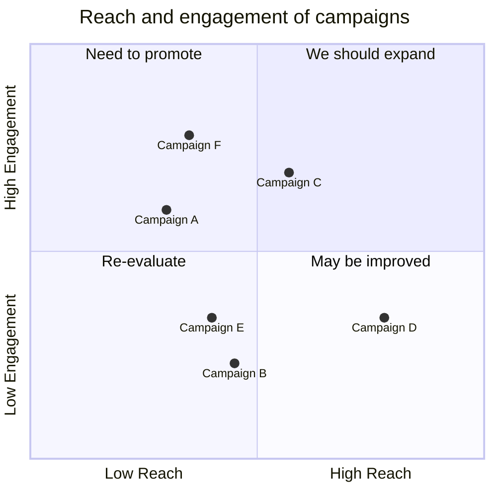

# [Meltdown: Why Our Systems Fail and What We Can Do About It](https://www.amazon.com/Meltdown-Systems-Fail-What-About/dp/0735222630/)

This book is divided into two main parts.  The first part explores why our systems fail.  The second looks at solutions.

The underlying reasons for most system failures have similar underlying causes, even though the specifics of the system and its failures may be very different.

## Part 1

### Chapter 1 - The Danger Zone

> The failure was driven by the *connections* between different parts, rather than the parts themselves.

Two factors make systems susceptible to catastrophic failures.

#### First factor
The first factor is in how the different parts interact with one another.
- **Linear** - like an assembly line where things proceed through a predictable sequence.  In these systems, the different parts interact mostly in visible and predictable ways.
- **Complex** - more like a web than an assembly line.  Many parts can affect each other, even seemlingly unrelated parts.  Determining what is wrong is much more difficult because you can't peer into the system.

> ... the difference between complex and linear systems isn't sophistication

The difficulty with complex systems is that you are piecing together a view from many little slices of information.  
- The example given is a nuclear power plant. You can't look at the core directly, but rely on a plethora of sensors.  
- A diagnosis can be wrong if the sensors are not behaving correctly

#### Second Factor
The second factor is how much slack there is in a system.  
> When a system is tightly coupled, there is little slack or buffer among its parts

### Chapter 2 - Deep Waters, New Horizons

### Chapter 3 - Hacking, Fraud, and All the News That's Unit to Print

