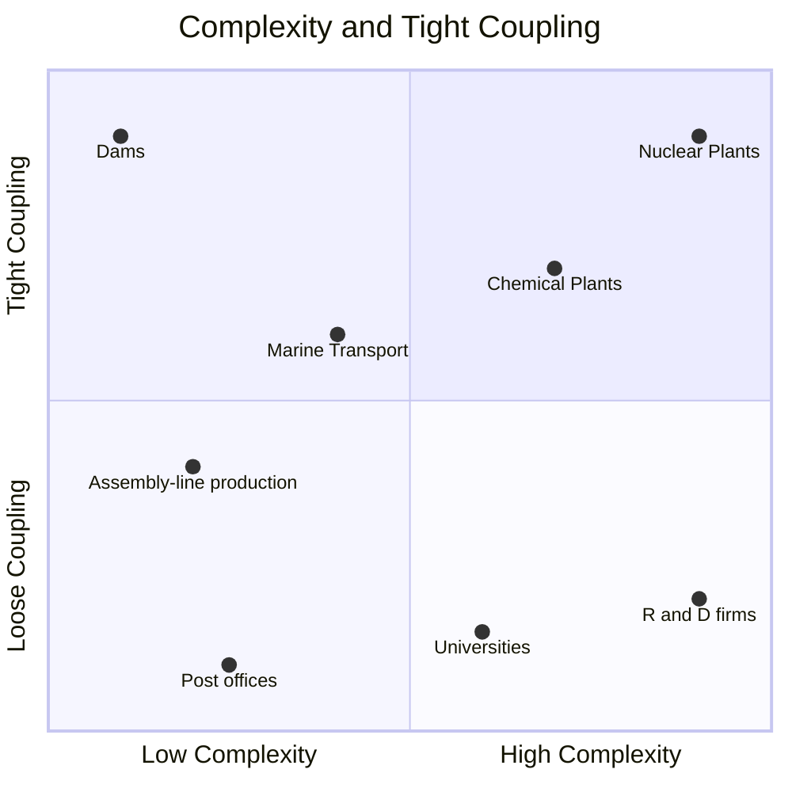

# [Meltdown: Why Our Systems Fail and What We Can Do About It](https://www.amazon.com/Meltdown-Systems-Fail-What-About/dp/0735222630/)

This book is divided into two main parts.  The first part explores why our systems fail.  The second looks at solutions.

The underlying reasons for most system failures have similar underlying causes, even though the specifics of the system and its failures may be very different.  In other words, they have the same DNA.

Example stories: 
- Train 112 - failure of automated sensors made Train 112 accelerate when in fact it should have slowed because a train stopped ahead.
- ValuJet Flight 592 - chemical oxygen generators were mislabeled confusing "expired" and "expended".  Caps were not set and were unsafely transported.

## Part 1

### Chapter 1 - The Danger Zone

Three Mile Island
- Started as a simple plumbing problem
- Routine maintenance on a non-nuclear part of the plant was being performed
- The set of pumps that normally send water to the steam generator shut down.  
- With no water flowing, the system couldn't remove heat from the reactor core so the temperature increased
- In response, a small pressure-relief valve automatically opened.  
- When pressure returned to normal, it failed to close.  This caused water that is supposed to be cooling the core to escape
- An indicator light in the control room led operators to believe the valve was closed... but it was incorrect.  The light only shows that it was *told* to close, not that it *had* closed.
- There was no instrumentation on the water level at the core, so they had to measure indirectly through the pressurizer
- Since water was escaping, the water in the pressurizer seemed to be rising, even as it was falling in the core
- Operators assumed there was too much water when in fact it was the opposite
- It took hours for them to figure it out because all the signals were pointing at the wrong thing

The actual chain of events that caused the failure happened in *thirteen seconds*.

- The operators were powerless to address the problem because all of their instrumentation was leading them down the wrong path

> The failure was driven by the *connections* between different parts, rather than the parts themselves.

Two factors make systems susceptible to catastrophic failures.

#### First factor
The first factor is in how the different parts interact with one another.
- **Linear** - like an assembly line where things proceed through a predictable sequence.  In these systems, the different parts interact mostly in visible and predictable ways.
- **Complex** - more like a web than an assembly line.  Many parts can affect each other, even seemlingly unrelated parts.  Determining what is wrong is much more difficult because you can't peer into the system.

> ... the difference between complex and linear systems isn't sophistication

The difficulty with complex systems is that you are piecing together a view from many little slices of information.  
- The example given is a nuclear power plant. You can't look at the core directly, but rely on a plethora of sensors.  
- A diagnosis can be wrong if the sensors are not behaving correctly

#### Second Factor
The second factor is how much slack there is in a system.  
> When a system is tightly coupled, there is little slack or buffer among its parts

Perrow calls the upper-right quadrant the "danger zone" and is where what he calls *normal accidents* happen

> "A normal accident is where everyone tries very hard to play safe, but unexpected interaction of two or more failures (because of interactive complexity) causes a cascade of failures (because of tight coupling)"

Stories
    - Starbucks and their #SpreadTheCheer campaign
        - Failure in the content filter caused all messages to go through which ended up as a PR nightmare

Complexity and coupling play a part in many places and at all levels, from corporations down to thanksgiving dinner.
    - A thanksgiving turkey's small plastic button that is supposed to pop when it's ready can fail causing a nightmare.

### Chapter 2 - Deep Waters, New Horizons

Stories
    - Yale University Halloween costume fiasco
        - what is surprising about this story is not the content of the debate, but how quickly it moved into the national spotlight
        - smartphones connect things in unexpected ways, which creates complexity

Dams used to be designed simply.  A dam operator when having to open the dam physically pressed a button and he was able to see and confirm that the system was operating as expected.

In contrast, modern dams are operated remotely.  
    - A California dam had an incident because the position switch fell off the gate.  The remote operators were confused about the gate's position and didn't realize how much water they were releasing.  A small failure caused large consequences.

Knight Capital story
    - modernizing trading allowed for faster and more efficient trading
    - as the speed of trading increased, so did the complexity of managing the software
    - a minor failure in deployment (and bad software practices) ultimately led to their bankruptcy

BP Oil Spill
    - BP failed due to managing the complexity of its well, not to a failure of a specific part
    - BP couldn't observe what was going on inside the well
    - Their system's emergency systems were too complex and overwhelming
> *They spent more time worrying about coffee spills than oil spills*

### Chapter 3 - Hacking, Fraud, and All the News That's Unit to Print

### Chapter 4 - Out of the Danger Zone

#### 89th Academy Awards
    - The wrong winner was announced at the Oscars
    - PwC had safeguards in place to mitigate risks
        - redundancy by having 2 sets of envelopes in their own briefcases arriving separately at the awards show
        - all winners are memorized in every category
        - nothing is written down or typed into a computer to avoid lost slips or breaches of security
    - One of the partners at PwC were distracted and mistakenly handed the wrong envelope
    - The complexity is 
        - the winners are kept secret right up until the end
        - there is a high-profile audience and live television which makes things *tightly coupled*
    - Weaknesses
        - Category names were hard to read
        - A chaotic backstage where attention must be kept but distractions were plenty
        - The redundancy in the briefcases actually caused more moving parts and things to keep track of
> Safety systems are the biggest single source of catastrophic failure in complex, tightly coupled systems

Safety systems can cause problems
    - too many alerts can cause people to ignore them
    - there should be a hierarchy of alerts

#### Airbus 
-  Airbus's sleek new ergonomic design in their cockpit was the cause of failures
    - Pilots did not get the clear feedback as the flight sticks were separated
    - The classic design tied the two flight sticks together so that both pilots are aware of manuevers and can correct errors
#### Jeep 
Anton Yelchin of Star Trek was killed by his own Jeep 
    - the new monostable gearshift removed the physical feedback of putting the car in gear
    - when Yelchin *parked*, the Jeep was actually just in neutral or reverse

#### Mountain Climbing
- the interaction of many small failures are the real danger of mountain climbing
- simple logistical problems like delayed flights, customs issues, supply delivers, money disputes with local porters, respiratory and digestive ailments cause lots of complexity
    - remove the complexity by handling some things up front (like food and supply deliveries)
    - many of these details are mundane and boring

#### Thanksgiving Dinner
- a combination of small problems can lead to big failure
- address the mundane logistical problems such as cleaning the bathroom, raking the leaves, making sure you have not only the recipe ingredients, but also salt, oil, aluminum foil, etc

#### Bakery chain rollout
- owners wanted to open several new locations while also rolling out new menu offerings and a fresh look to their existing bakeries
    - doing this all at once puts this project into the danger zone
If it's impossible to reduce complexity, then we have to aim to make things more loosely coupled

### Chapter 5 - Complex Systems, Simple Tools

#### Fukushima Reactor
> *Dwellings built on high ground will ensure the peace and happiness of our descendants.*  
>
> *Remember the calamity of the great tsunami.*
>
> *Do not build homes below this point.*

These were messages on rock slabs after devastating tsunamis his in the 1890s and 1930s.

The main failures of Fukushima occurred due to the tsunami.  In contrast, the Onagawa reactor was perfectly find. 
The main difference was found to be the height of the walls.

The engineers who built Fukushima did not consider information they already had.  They didn't anticipate the risk.

How to forecast certainty?
- gut based forecasts that estimate 90% confidence are found to be correct less than 50% of the time

SPIES framework - Subjective Probability Interval Estimates
> Instead of just thinking about the two endpoints, you estimate the probability of several possible outcomes, several intervals within the entire range of possible values.

By forcing us to consider the full range of possibilities, SPIES reduces our overconfidence.  In case of TEPCO, this may have forced them to consider history and notice the rock slabs.

<dl>
    <dt>wicked environment</dt>
    <dd>an environment where it's hard to check how good our predications and decisions are</dd>
</dl>

Examples of failures in wicked environments
- immigration officers fail to identify ID photos that didn't match the person they were looking at *one in seven times*
    - the surprise is that experienced and new officers perform *the same*
- cops are not good at detecting lies
- judges grant parole more often right after lunch.  right before a break, the rate was near 0.
- Expertise doesn't mean much if there is no feedback

#### Doctors misdiagnosing fractured ankles
- doctors would frequently misdiagnose a fractured ankle
    - pressure to avoid expensive X-ray costs if it wasn't necessary
    - symptoms that didn't matter were considered
    - eventually a simple study corrected this by identifying 3 criteria
        1. age 55 or greater
        2. unable to bear weight
        3. bone tenderness

#### Identifying specific criteria
Identifying specific criteria and giving it a score range is much better than treating all things as a binary choice.

Examples given are when buying a home or selecting an employee for a specific project.

When in a wicked environment, breaking things down into specific criteria is very important.

#### Target Canada

Target's rollout to Canada was a massive $2 billion failure due to unforeseen complexity in IT systems, the metric system, Canadian dollar, and French language characters.
- Target's failure was in looking at generic factors such as promotional programs, store remodeling, and employee recruitment

<dl>
    <dt>pre-mortem</dt>
    <dd>the practice of assuming failure has already happened and diagnosing what caused it</dd>
</dl>

### Chapter 6 - Reading the Writing on the Wall

#### Flint Michigan water crisis
- Government officials decided to get their water from the Flint River 
    - when complaints of bad taste and foul odor of the water started pouring in
    - they used fire hydrants to flush some of Flint's aging pipes
    - tests showed there wasn't enough disinfectant and so E. Coli started to grow
    - chlorine was added to counteract this however too much was added
    - byproducts overtreatment rose and caused Legionnaire's disease
    - citizens complained of lead in the water, and city officials blamed the local house pipes
    - only after continued complains did Flint officials replace the aged pipe that connected her house to the water main
- their testing and sampling procedures actually avoided getting proper feedback
    - steps to run water continuously before sampling actually flushed out the lead
    - sample bottles were too small and residents couldn't turn their taps all the way to take samples, this caused a weaker flow which dislodged less lead from the pipes
    - the water utiility sampled houses that didn't have any lead pipes or lead service lines instead of focusing on high-risk homes
    - officials decided that measurements from LeeAnne's house were invalid because she had a water filter installed, which didn't technically adhere to federal standards
- the main problem sourced from the fact that state officials decided to forgo treating the water with chemicals to control corrosion
    - this saved them $60 per day or $20k per year for a system that costs $5 million to run each year
    - Flint officials also did not have a good map of the city's pipes which means many houses they took samples from didn't even have lead pipes

#### Washington DC Metro
- In the 1970s, a feature was designed that automatically tracked a train's location
    - the system was divided into blocks of varying length 
    - each block had an independent circuit that would detect when a train was present
- In 2005, when Metro started replacing old components, the system couldn't track the location of a specific train, only that it was occupied
    - this complication almost caused a tragedy where 3 trains had almost collided
    - manual intervention by the train conductors saved the day
- Engineers figured out the problem, which was a short circuit
    - they replaced all the components for the affected areas
    - they also developed a testing procedure to detect issues going forward
    - *they had figured it out*
- In June of 2009, as part of an upgrade program, workers replaced some of the components in track segment B2-304.  
    - the work didn't go well and the block's detection circuit didn't work consistently
    - although the issue was communicated to the operations center, an open work order was left pending
    - for days, trains would disappear from that section and reappear after they passed the section
- On June 22, 2009, Train 214's driver decided to slow down because he wanted to control precisely where the train would stop on the track
    - the train did not have enough momentum to carry through the block
    - the train *disappeared* to the system
    - Train 112's automated system thought the track was clear and began to accelerate

#### Commercial airlines - TWA 514
- Flight 514 crashed into Mount Weather because of incomplete information and assumptions
    - Flight was redirected due to weather and didn't fly normal course and there was low visibility
    - Normal flight path avoids Mount Weather with assumed approach of 3400 ft, but this flight was coming directly to the airport
    - Info given to the pilot was to approach at 1800 ft from 6 miles away
    - Crew didn't get info on when they could descend to 1800 ft, and so flew at 1800 ft way too early
- Two months before this crash, another flight (United) and crew made almost the *exact same mistake*
    - the near miss resulted in a report submitted by the crew for review
    - this report ended up in United's safety and awareness program but didn't go out to the FAA
    - the pilots at TWA or any other airline were unaware of the issue

<dl>
    <dt>anomalizing</dt>
    <dd>the learning process of learning from small lapses and near misses</dd>
</dl>

Steps
1. Gather the data
2. Fix the immediate issue
3. Find the root causes
4. Share the information
5. Audit
    
### Chapter 7 - The Anatomy of Dissent

#### Semmelweiss 
- Before microbiology was understood, Ignac Semmelweis (a recent medical school graduate) noticed that many more women died after soon after giving birth at the First Clinic (where the doctor's were delivering babies) as compared to the Second Clinic (where midwives delivered babies).
- Despite many attempts to understand why, he hit roadblocks.  He got a clue when one of his colleagues had died when one of the students accidentally pricked his colleague's finger.  This gave a clue to small infectious particles.  
- This led him to understand that the major difference between the First and Second clinics was the autopsies being performed at the First Clinic.  He thought about the "cadaverous smell" given off by his hands and eventually implemented a hand washing routine.  
- The results of implementing this routine were drastic as the death rate went way down.
- When Semmelweis reported his findings to the institutions however, the old guard would not accept it.

Dissent is psychologically difficult for humans.  When the group sees things a certain way, our psychology actually changes the way we perceive things.  Our brains aren't wired for dissent.

Power is also corrupting.  Psychological experiments show that even at the slightest hint of power, they are more likely to misunderstand, dismiss, or interrupt others.

Lesson 1 : Charm School
It's important to encourage dissenting opinions.  This means that all participants at all levels should be empowered to voice their concerns.  

> Passengers were safer when the less experienced pilot was flying the plane

> Learning to embrace dissent is hard

Lesson 2 : Soften Power Cues
    - sit eye to eye (ER doctor improving bedside manner)
    - admit failures (pilots admitting to never having a perfect flight)
    - don't separate yourself into and add layers between you and your team (Lehman Bros)

Lesson 3 : Leaders Speak Last
    - empower the team to come up with their ideas first
    - put the problem on the agenda and ask for solutions

### Chapter 8

### Chapter 9

### Chapter 10

