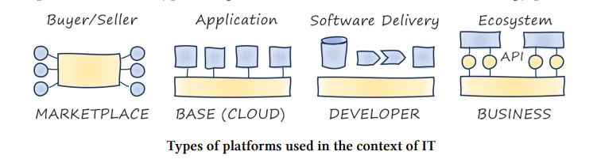

# Platform Strategy
## Innovation Through Harmonization

What is a platform?
- A platform in general terms is something that elevates you.  It is also something to build upon.
- Going along with this definition, when standing on a platform, it allows you to see further.

> Platforms generate value through the interaction between their participants.

- A platform is meant to connect various participants to build and interact with each other.  

Platforms enable, democratize, self-perpetuate, accelerate, and don't constrain.

* Interesting note: business applications are best when constraints are there... but platforms go the other way reducing constraints.

#### An analogy
- A supermarket is NOT a platform because the supermarket controls the inventory and sales
- A farmer's market however connects various sellers and buyers together.  

Platforms are largely invisible and enable connectivity.  

Examples of platforms

- Media Platforms like Facebook, Netflix, TikTok, etc
- Cloud Platforms like AWS, GCP, Azure
- Business Platforms like SAP and SalesForce

## Chapter 3 - The Fab Four of Technology Platforms

1. *Marketplaces* - facilitate transactions between customer groups such as buyers and sellers of physical goods, or consumers of services like media, car sharing, or accomodation

- Common Use Cases
    - The platform hanldes search, advertising, reviews, ranking, fraud detection, and even payment services.

- Interaction
    - Participants interact with the marketplace via web browser, mobile app, or APIs.
    - Marketplace platforms allow sellers to build their own storefronts, often without knowing how to code
    - Thus reducing friction and barrier to entry

- Implementation
    - The platforms are usually custom built and proprietary.  
    - The primary reason is because of the sheer scale and transaction volume that the platform must handle
    - Sometimes however they result in open-source projects based on their in-house development

2. *Base Platforms* - provides technical products and services to support developers and IT departments

- Common Use Cases
    - All major cloud providers provide services that traditionally would be done in house, like server provisioning, storage, and network hardware.
    - These platforms are not a single product per se, but a collection of technical services that a customer can build applications on top of

- Interaction
    - Online consoles - like AWS console 
    - Command-line (CLI) - supports direct interaction or scripting for automated execution
    - Web APIs - that can be called from applications
    - Cloud platform languages - CDK, Terraform, Pulumi, etc

    - Base platforms aim for feature parity across these channels

- Implementation
    - Propietary implementations due to the scale and complexity of provisioning resources
    - Levels of customization down to selection of hardware like CPUs

- Considerations
    > How users access your platform is at least as important as what's inside.
    - Cloud providers initially offered virtual machines, storage, and queue services... which isn't new
    - What was new however is the way those services would be consumed

