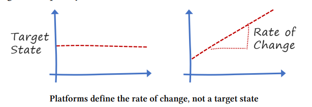
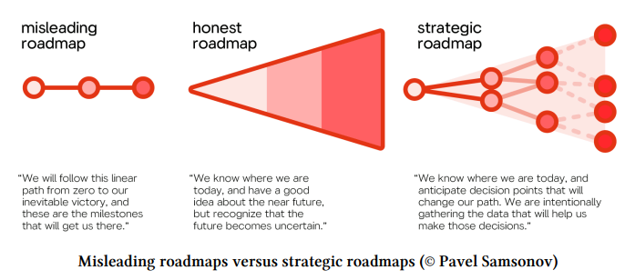
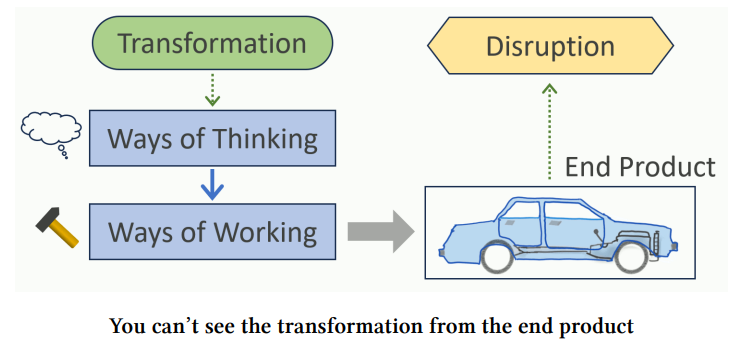
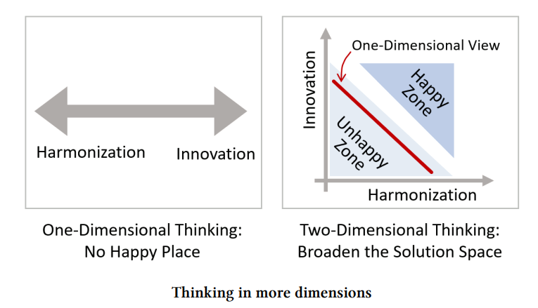
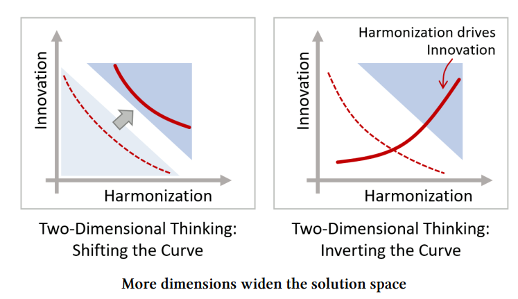
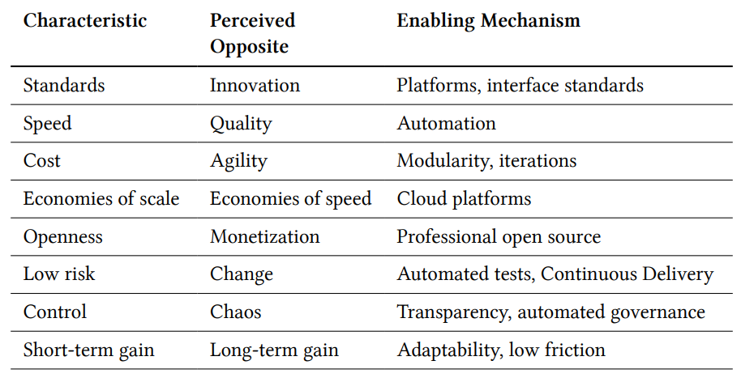
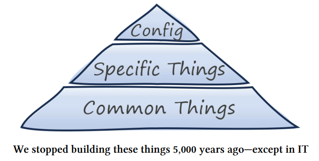

# Platform Strategy

## Innovation Through Harmonization

#### What is a platform?

- A platform in general terms is something that elevates you.  It is also something to build upon.
- Going along with this definition, when standing on a platform, it allows you to see further.

> Platforms generate value through the interaction between their participants.

Platforms enable, democratize, self-perpetuate, accelerate, and don't constrain.

* Interesting note: business applications are best when constraints are there... but platforms go the other way reducing constraints.

#### An analogy
- A supermarket is NOT a platform because the supermarket controls the inventory and sales
- A farmer's market however connects various sellers and buyers together.  

Platforms are largely invisible and enable connectivity.  

#### Examples of platforms

- Media Platforms like Facebook, Netflix, TikTok, etc
- Cloud Platforms like AWS, GCP, Azure
- Business Platforms like SAP and SalesForce

### Chapter 3 - The Fab Four of Technology Platforms

1. *Marketplaces* - facilitate transactions between customer groups such as buyers and sellers of physical goods, or consumers of services like media, car sharing, or accomodation

- Common Use Cases
    - The platform handles search, advertising, reviews, ranking, fraud detection, and even payment services.

- Interaction
    - Participants interact with the marketplace via web browser, mobile app, or APIs.
    - Marketplace platforms allow sellers to build their own storefronts, often without knowing how to code
    - Thus reducing friction and barrier to entry

- Implementation
    - The platforms are usually custom built and proprietary.  
    - The primary reason is because of the sheer scale and transaction volume that the platform must handle
    - Sometimes however they result in open-source projects based on their in-house development

2. *Base Platforms* - provides technical products and services to support developers and IT departments

- Common Use Cases
    - All major cloud providers provide services that traditionally would be done in house, like server provisioning, storage, and network hardware.
    - These platforms are not a single product per se, but a collection of technical services that a customer can build applications on top of

- Interaction
    - Online consoles - like AWS console 
    - Command-line (CLI) - supports direct interaction or scripting for automated execution
    - Web APIs - that can be called from applications
    - Cloud platform languages - CDK, Terraform, Pulumi, etc

    - Base platforms aim for feature parity across these channels

- Implementation
    - Propietary implementations due to the scale and complexity of provisioning resources
    - Levels of customization down to selection of hardware like CPUs

- Considerations
    > How users access your platform is at least as important as what's inside.
    - Cloud providers initially offered virtual machines, storage, and queue services... which isn't new
    - What was new however is the way those services would be consumed

3. Developer Platforms - built by IT departments to provide reuse of common IT services, boost developer productivity, and to ensure compliance with operational guidelines

- Common Use Cases

- Interaction
    - app devs interact with in-house platforms similar to base platform
    - however there may not provide feature parity across web consoles, command lines, and APIs

- Implementation
    - typically built on top of a cloud base platform
    - it can span public cloud and on-premises data centers

- Considerations
    - in-house platform teams are focused on internal customers
    - even though their platforms are not on the "free-market", they may still need an internal marketing, consulting, and support teams

4. Business Capability Platforms - exposes functions from the business domain
    - examples are digital identity services and payment APIs

- Common Use Cases

- Interaction
    - APIs are the key enabler for business capability platforms

- Implementation
    - like regular products but have additional provisions for external usage such as public APIs, multi-tenancy, or scalability

- Considerations
    - 

## Part 2: A Strategy for PLatforms

- Building a platform of any kind reduces complexity by solving alot of common problems, all the while reducing cost
- Building a platform however is not purely an IT exercise.  It requires significant investment in both technology and organizational change

## Chapter 3 - Formulating a Strategy

> "Strategy is the difference between making a wish and making it come true"

> "Strategy is not complex.  But it is hard.  It's hard because it forces people and organizations to make specific choices about their future - something that doesn't happen in most companies."

### Think in the First Derivative
    - Platforms enable faster delivery
    - Rolling out a platform is not drive by the wish to achieve a predefined, static target state.  
    - Rather, it allows the organization to grow or change more quickly

A platform strategy, should think in the first derivative, which is the rate of change.

### Documenting a Strategy
- aim for emphasis over completeness

- a good strategy will cover 3 dimensinos
1. A point: where do you want to go
2. A path: how will you get there?
3. The Terrain: What happens when you step off that path?

The shape of the terrain represents the strategy's risk profile.  The shortest and quickest path may be very risky.

Strategy Is a Winding Road

- Strategy defines overall direction, but not the exact steps
- Tactics to implement the strategy may not line up exactly
    - the concept of a hiker using switchbacks
    - few people walk up a hill in a straight line
- However strategy and tactics do need to have a proper linkage

## Chapter 4 - Becoming a Platform Company

#### Transformation can't be understood from the end product.

- The US automobile market was disrupted by Japanese automakers who excelled in every category.
- The US automakers weren't simply able to reverse engineer the product and figure out why it's better.  
    - The reason why they were better is because of lots of work and decisions made far upstream.
    - In the US, quality assurance was the last step.  It was "a euphemism for rework".  
    - Japanese manufacturers on the other hand, addressed quality up front.  When there was an issue, the product line was stopped, investigation start, the problem fixed, and then production was resumed.  In other words, quality was built in, not added on.

- Companies can't simply replicate other companies' success without understanding why they are successful to begin with.  
    - Many companies may add pressure to a improve a specific metric and ultimately cause a failure.
    - You can't optimize the way you are currently working

> This happened at Almac.  Throwing more people at a problem doesn't work.

> Disruption means that someone has changed the rules of the game.  Those who play by the old rules have already lost.

### Harmonization and Innovation are not necessarily opposites

It's common to think of these things as opposing forces, but that's when viewed in a single dimension.

Thinking in two-dimensions makes things that were seemingly opposite, become two independent dimensions.

## Chapter 5 - The Platform Paradox

- Agreeing on interface standards is harmonization that becomes an innovation booster
    - The HTTP protocol is a good example.  It's ubiquitous and works with all browsers and devices.

- Common APIs can achieve the same thing
> By constraining—for example, by demanding common data formats and authentication mechanisms—diverse components can now interact and are no longer constrained in the choice of programming language or underlying run time

### Platforms Aren't Pyramids

The image above is a common pattern in traditional IT.  

- What's the difference between harmonization in a platform and the above pyramid?  
    - Platforms don't try to anticipate every use case
    - Users build on top of a platform; they don't just set configuration bits

- Platforms leave room for users to innovate

#### How Platforms Break Barriers

**Componentization**
- breaking something complex into standardized and recombinable components speeds up innovation through recomposition
- Simon Wardley highlights that there is a linkage between commoditization (something becoming commonly available and undifferentiated) and componentization (the ability to assemble something new from pre-made parts)

**Separating commodify from differentiators**
- platforms bake widely used functions into a common layer (similar to the pyramid approach)
- drawing a line around what is common (the base layer) is a balancing act
    - **needs vary by user group**
    - **the boundary shifts**
    - **cohesion over precision** - users expect a uniform level of abstraction across platform services
    - **interaction matters** - how users access the platform is as valuable as what's inside it
- drawing the line between what goes inside the platform and what is left to the application requires fine-tuning based on feedback cycles

**Building Economies of Speed on Economies of Scale**
- building platforms is a scale business
- platforms hide the scale effects from their customers by allowing frictionless incremental usage

**Centralizing decentralization**
- platforms are central elements that foster autonomy and independent decision making
- provides a common safety net and necessary guardrails while supporting a decentralized organization
- > The most difficult step for organizations embarking on a platform journey is relinquishing control

## Chapter 6 - Mapping Platforms
> ### If you don't know where you are, a map won't help.

- This chapter is basically about Wardley Maps

## Chapter 7 - Addendum: "I ACED My Strategy"

- **Alignment**: An IT strategy must align with a business strategy
    - many IT strategies fail not because of poor execution, but because of poor misalignment with the business strategy
    - beware of vanity metrics!
- **Clarity**: A strategiy is meaningful only if it's easily understood by a broad audience
    - a successful strategy needs to apply across organization units, and therefore broadly applicable
    - one technique is to use conceptual models
    - another technique is to describe the strategy in horizontal layers
- **Evolution**: Although strategies are meant to last, they still need to evolve as opportunities come along, priorities shift, or existing constraints are removed
    - a strategy cannot predict the future... its main purpose is to help cope with uncertainty
    - a strategy can evolve by evolution of its elements OR
    - a strategy itself can evolve
- **Decisions**: A strategy that doesn't make decisions will sound like a list of wishes. And those rarely come true.
    - a strategy is defined by a series of meaningful decisions, those that require conscious trade-offs
    - choose to optimize for some options while forgoing others
    - > **Gregor's Law**: Excessive complexity is nature's punishment for organizations who can't make decisions

