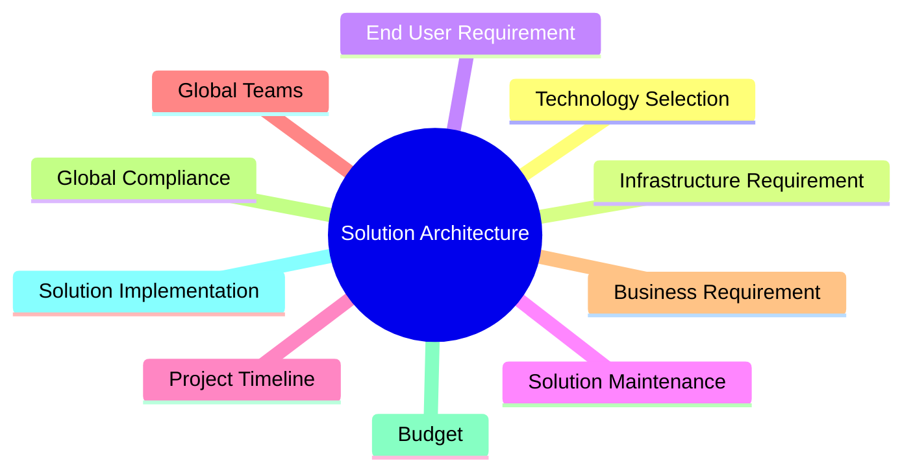
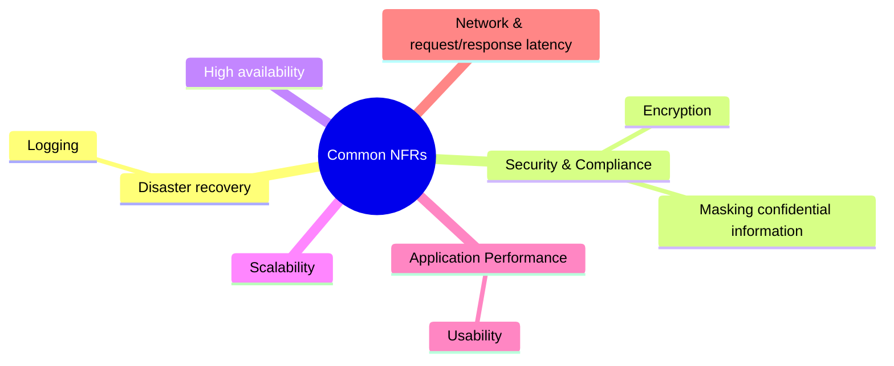

# [Solution Architect's Handbook](https://www.amazon.com/Solutions-Architects-Handbook-Kick-start-architecture/dp/1838645640)

## Chapter 1 - What is Solution Architecture?

<<<<<<< HEAD

Addressing business needs and quality of delivery
    - There will be competing objectives between various stakeholders
    - There will be various opinions on what is considered high priority
    - SAs will have to bridge the differences 
    - SAs would define the success criteria in the form of qualitative and quantitative outputs

Selecting the best technology platform
    - selection of the appropriate technology stack is vital to the successful implementation
    - SAs often have to create prototypes to prove a working model that meets the business reqs, agility, speed, and other NFRs

Addressing solution constraints 
    - Solutions are limited by various constraints and may encounter issues due to complexity or unforeseen risks
    - SAs need to balance multiple constraints such as resources, timeline, cost, quality, time to market, frequently changing reqs, etc
    - Projects will have critical paths that must be addressed.  This is a systematic approach to figure out tasks in sequential order so that the project can be carired out

Helping in resource and cost management
    - Provides the necessary guidance to manage priorities and timelines
    - Creates documentation for keeping the system up to date and develops runbooks to solve frequent issues
    - Considers extensibility, scalability, and other factors that matter to the development environment

Addressing non-functional reqs

=======
>>>>>>> ae39e303b1e47cb4e1bf1abf987ba31840e715d4
