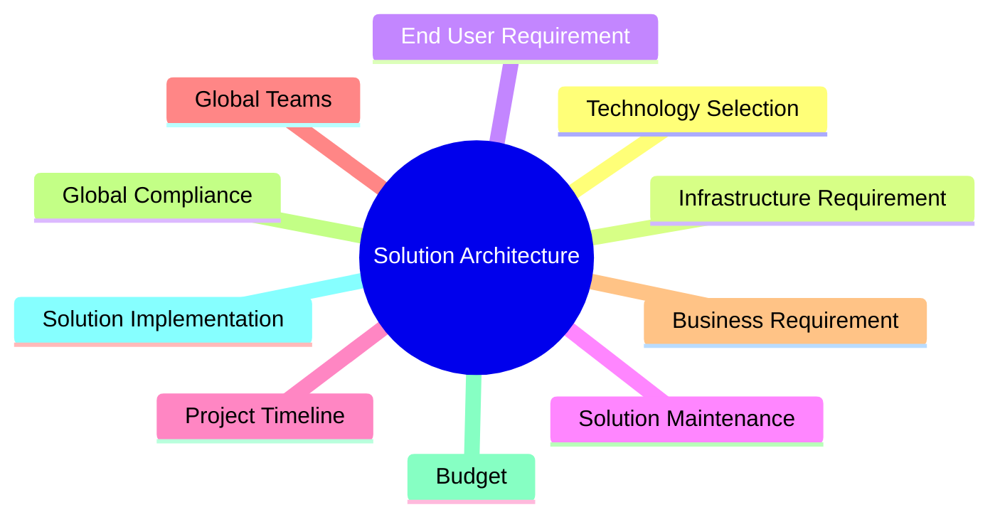

# [Solution Architect's Handbook](https://www.amazon.com/Solutions-Architects-Handbook-Kick-start-architecture/dp/1838645640)

## Chapter 1 - What is Solution Architecture?

```mermaid
mindmap
  root((Solution Architecture))
    Technology Selection
    Infrastructure Requirement
    End User Requirement
    Solution Maintenance
    Project Timeline
    Global Teams
    Business Requirement
    Global Compliance
    Budget
    Solution Implementation
```
