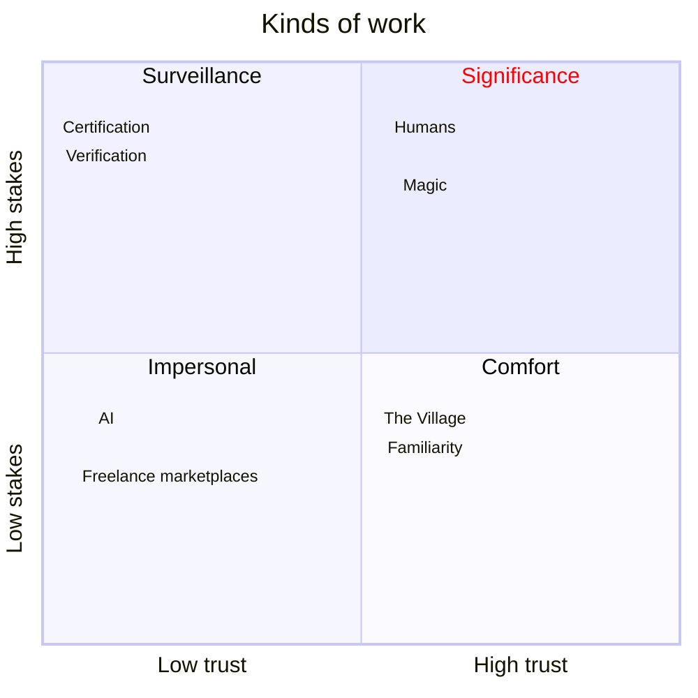

# [The Song of Significance](https://www.amazon.com/Song-Significance-New-Manifesto-Teams/dp/0593715543)

## Introduction

A survey conducted described the conditions at the best job they ever had.  The top 4 results were
1. I surprised myself with what I could accomplish
2. I could work independently
3. The team built something important
4. People treated me with respect

The next few were
5. I admired my coworkers
6. I surpassed expectations
7. It was difficult
8. I had more responsibility than I expected
9. There was useful and significant feedback

## Songs

1. The Song of Increase
- boldly going into the unknown where safety isn't guaranteed

2. The Song of Safety
> Until our existential needs are met, it's difficult to produce the emotional labor needed for progress and possibility.
Examples of this are in global recession and the pandemic

3. The Song of Significance
- Work that matters
- something we're proud of and proud of being a part

## Toward Significance

- Manual labor, after industrialization, isn't valued as much because it isn't in demand 
- computers and automation is only making this even more apparent

The things that are needed are *creativity* and *humanity*.

Industrial capitalism
: seeks to use power to create profits

Market capitalism
: seeks to solve problems to make a profit

In industrial capitalism, the human factor isn't really part of the equation.  Making things cheap and efficiently is all that matters.  
- there will always be a way to out-measure, out-standardize, and out-manage
- power is key in industrial capitalism.  
    - it's centrally controlled, monitored, and algorithmically managed

> Significance is inconvenient

Management style in market capitalism is very different as it's about solving a problem and not focusing on our own.  

> More != Better.  The goal is better.

---
Questions worth asking
- What's the specific change this team is going to make?
- What's my personal role in making that change happen?
- What do I need to learn to support or lead this change?
- Who needs to help me? Who needs my help?
- What is the risk - for us, for me, for the people we serve?
- What's the timing of this project?
- What's the budget?
- What am I afraid of?
- What is the benefit to each party involved?

Questions to ask after we're done
- Did we ship on time?
- Did we make big promises (to our customers, sure, but also to our coworkers) and keep them?
- Did we relentlessly make the work better?
- Did we seek discomfort in the process of stretching to innovate?
- Is our theory of change, process, and creation improving?
- Did we ask hard questions that led to new insights?
- Have we surfaced useful metrics for how to do better next time?
- Did we build a system that is resilient enough to help us produce even more value?
- How have we grown as an organization and as individuals? What did we learn?

---

### Before We Begin

Create 2 documents
- The pre-mortem
- The rave

Imagine the project fails.  Make a list in advance of all the things that went wrong.  What didn't work?  Who didn't understand what was being promised? What was risky?

At the same time, what does the best feedback look like?  What resonated with them?  Now that we've succeeded, what does the customer say?

---

## What happened to management?

Amazon had a big problem with employee retention.  

Their model for work was of an industrial mindset.  Follow instructions, measure output... there was little to no connection to the work.

Valuing things cheap and fast alone has a cost.

### Stakes and Trust

**High-stakes, low-trust** work is industrialist
- meeting specs, test, measure, surveillance

**Low-stakes, low-trust** work is easily outsourced.  
- shouldn't take this work seriously or personally

**Low-stakes, high-trust** work
- culture of creation and community
- affected deeply by the pandemic

**High-stakes, high-trust** work is significant
- important work, work on the edge
- creates human value

You can't force high-stakes, high-trust work to an industrialized model, because it once again joins the race to the bottom.

