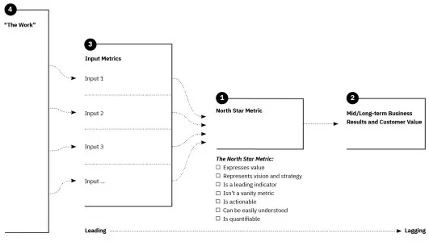

# [The Value Flywheel Effect](https://www.amazon.com/Value-Flywheel-Effect-Accelerate-Organization-ebook/dp/B09V1RLRGG)

> The inspiration for the Value Flywheel Effect comes from three sources: Amazon's Virtuous Cycle, James Collins's flywheel concept from Good to Great, and from our own experiences.

## The 4 phases of the Value Flywheel
1. Clarity of Purpose
    - clarify a purpose or "north star"
    - time to value is essential
    - what are your differentiators
    - do you understand the customer needs you are solving
2. Challenge & Landscape
    - question your organization's way of working
    - does challenge exist
    - is there psychological safety?
3. Next Best Action
    - build a technical strategy to improve time to value
    - code is a liability
    - remove friction
    - determine what is good and bad about the tech stack?
4. Long-term value
    - create a culture of problem prevention

## Wardley Mapping

The goal of Wardley Mapping is finding the story, not an accurate depiction.  
- This is a more loosely defined map that teams can create together in collaboration

### How is it's configured

Divides a [value chain](https://www.investopedia.com/terms/v/valuechain.asp) into 4 stages on the x-axis
1. Genesis
2. Custom
3. Product
4. Commodity

The y-axis is broken up into in order of **visibility** to the user
1. Visible - Nearest to the user; component is visible to user
2. Aware - The user may be aware of this component
3. Unaware - The user is likely unaware of the component
4. Invisible - the user has no visibility, nor knowledge, of the component

3 styles of mapping in general
- Mapping the stack
- Mapping the organization
- Mapping the market

# Phase 1 - Clarity of Purpose

## Finding your North Star

The **North Star** is your purpose and vision.  If this isn't clear, everything else you do doesn't matter and will ultimately fail.

#### [North Star Framework](https://amplitude.com/books/north-star/about-the-north-star-framework)

The North Star framework ensures that the 3 different languages are in alignment.
1. Language of the customer (needs, goals, experiences, delight)
2. Language of the product (features, workflows, releases)
3. Language of the business (vision, differentiation, revenue, growth)

This framework outlines the following sequence: 

1. What is your North star metric?
   - Neither a leading or lagging metric... it's in the middle
   - It's an actionable metric that is important to the business
   - This must be defined clearly
2. Mid/long-term value
   - How does pursuing this metric might affect the business
   - How does it realize more value for the business?
   - Put a timebox of 3-5 years around this to encourage creative thinking 
3. Input metrics
   - Identify metrics that will help drive the north star metric
   - These should be leading metrics
4. The work
   - This is the least important step and is optional
   - Current work and effort is already under way. Does it drive the North Star metric?

>This combination of metric and inputs serves three critical purposes in any company:
>
>    - It helps prioritize and accelerate informed but decentralized decision-making.
>    - It helps teams align and communicate.
>    - It enables teams to focus on impact and sustainable, product-led growth.

#### The North Star metric should be a leading indicator of long-term (sustainable) business value

The framework should meet this checklist.
1. It expresses value
2. It represent vision and strategy
3. It's an indicator of success and predicts future results
4. It's actionable
5. It's understandable and non-technical
6. It's measurable
7. It's not a vanity metric

JTBD - jobs to be done
    - what is the customer need?

## Obsess over time to value

Innovation is not the goal, **value** is.

Innovation has to be tied to value and also to the purpose.  Don't fall prey to innovation theater.

### Rate of Turn

Rate of Turn - measures the time it takes to decide on a change before making that change within the organization

Two ways to measure this: 
1. Change from the top down
2. Change from the bottom up

### Time to Value

> The challenge for companies now is not delivery but value realization

Time to value is NOT: 
- completing an epic or delivering to the test team
- how quickly an idea flows from the executive team to the engineering team
- how quickly an idea flows from engineering team to production

Time to value IS: 
- end to end
- a test of organizational effectiveness
- measured by how long it took to see customer feedback from the day the CEO first heard this idea

## Chapter 9 - Environment for success

Team antipatterns
- rock star
- tiny team
- huge team
- Bob's team - we tend to do this alot
- My work
- Johnny's bonus
- The magic manager

Work Level mismatches
- Execution level - keep the manager happy
- Impact level - product centric approach
- Optics level - we don't look bad

> We are trying to move to a product-centric (which inherently means customer-centric) view

Psychological safety
- failing fast
- ethics
- diversity

Western Org Culture
- Pathological
- Bureaucratic
- Generative

Felt that mapping psychological safety was a bit of a stretch

Chapter 10 - A Sociotechnical system for change

- Sociotechnical
    - Socio - people in the system must have a mindset of contribution, collaboration, and enablement
- Technical
    - technology fits the purpose (north star metric)
- Problem prevention
- Time to value

Time to Value
- Ship --> Sense --> Respond

Intersection of People and Technology
- take an outside in approach
- correct tech choices will prevent teams from being slowed down by legacy decisions
- good tech leadership will apply standards and good practice to prevent bad things from happening
- a drive for improved time to value keeps things connected to business outcomes
- lack of legacy tech means more time to focus
- lightweight governance and standards 

Purpose vs Function (DP1 and DP2)
- redundancy of parts

## Chapter 11 - Map your org capability

## Chapter 12 - Case Study - Work grid

## Chapter 13 - The Serverless-First Edge

What is the simplest thing that you can do *right now* to deliver value?

The technology industry is full of overused terms (e.g. services) and buzzwords.  No one seems to know what these mean anymore.

### The Modern Cloud
Aspects of applications built on the modern cloud
- Microservices - applications are broken into components that are deployed separately containing the data that they need
- Loosely coupled and scalable - ideally built on event-driven architecture
- Cloud native - software is ephemeral and infrastructure as code
- Abstracted - software is abstracted away from the OS
- Pay per use - only pay for what you need
- Low operational overhead - no need to log into a computer and configure/install something
- Leverage the provider - use the services that the cloud provider offers

#### Modern Cloud Interia Points
- Legacy Cloud
- Lack of Business Alignment
- Fear of Vendor Lock-In
- Serverless Is Not the Point
    - the point is focus

## Chapter 14 - The Frictionless Dev Experience

- The tradeoff for being fast or safe doesn't have to exist with software.
- Emphasis on code is a liability

- The Miner's Canary

- Remove Friction with Automation

- Tie CT waiting too long to a culture of learning 
    - software is never done

## Chapter 15 - Mapping the Stack

- Exercise was useful

## Chapter 16 - Case Study - Liberty Mutual Insurance

