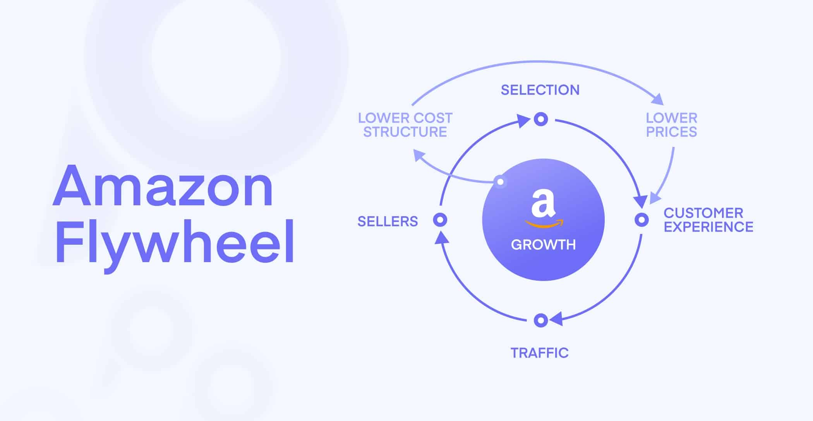
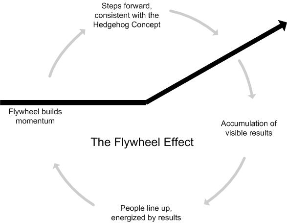

[The Value Flywheel Effect](https://www.amazon.com/Value-Flywheel-Effect-Accelerate-Organization-ebook/dp/B09V1RLRGG)

> The inspiration for the Value Flywheel Effect comes from three sources: Amazon's Virtuous Cycle, James Collins's flywheel concept from Good to Great, and from our own experiences.

The 4 phases of the Value Flywheel
1. Clarity of Purpose
    - clarify a purpose or "north star"
    - time to value is essential
    - what are your differentiators
    - do you understand the customer needs you are solving
2. Challenge & Landscape
    - question your organization's way of working
    - does challenge exist
    - is there psychological safety?
3. Next Best Action
    - build a technical strategy to improve time to value
    - code is a liability
    - remove friction
    - determine what is good and bad about the tech stack?
4. Long-term value
    - create a culture of problem prevention

## Wardley Mapping
Divides a [value chain](https://www.investopedia.com/terms/v/valuechain.asp) into 4 stages on the x-axis
1. Genesis
2. Custom
3. Product
4. Commodity

The y-axis is broken up into in order of visibility
1. Visible - Nearest to the user; component is visible to user
2. Aware - The user may be aware of this component
3. Unaware - The user is likely unaware of the component
4. Invisible - the user has no visibility, nor knowledge, of the component

3 styles of mapping
Mapping the stack
Mapping the organization
Mapping the market

